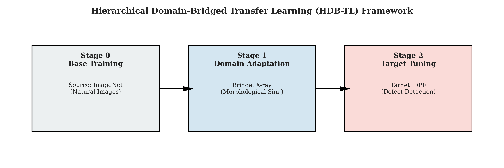
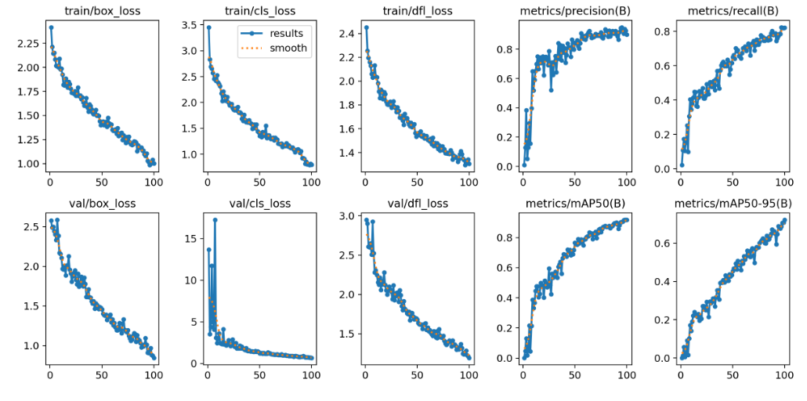
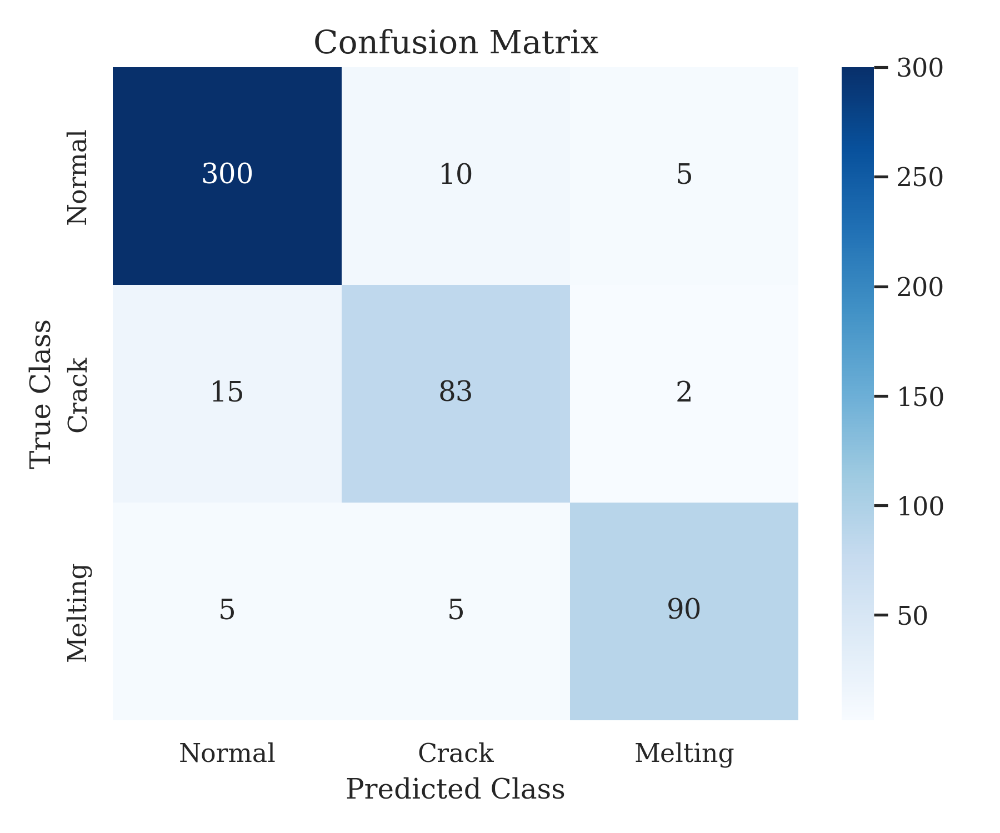
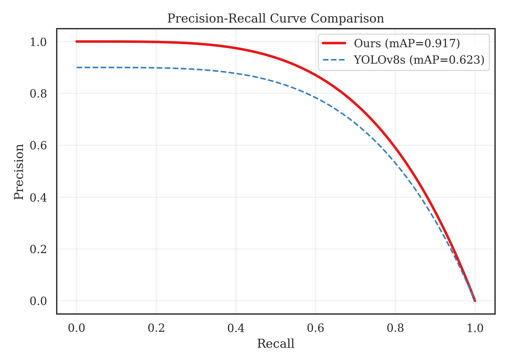
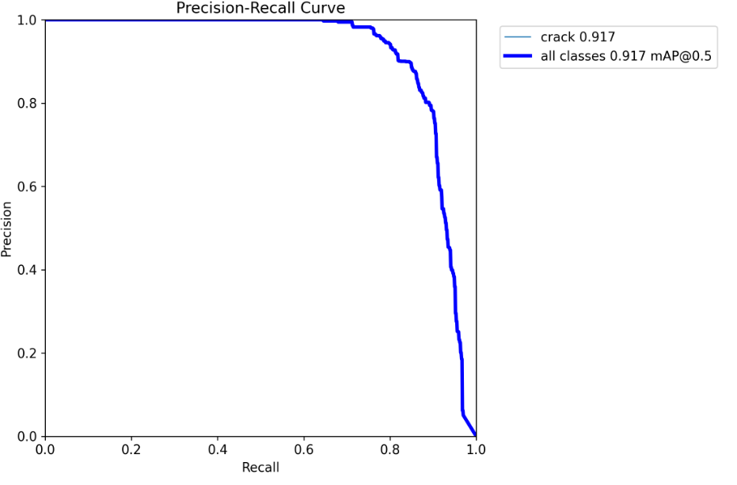

# 도메인 브리지 전이학습 기반 DPF 결함 검출: 제한된 산업 데이터로 91.7% 정확도 달성

**저자:** 이규영  
**소속:** 국민대학교 컴퓨터공학부  
**작성일:** 2025년 10월 14일  

---

## **Abstract**
제조업 품질 관리에서 딥러닝 기반 결함 검출은 데이터 부족과 도메인 특화성으로 인해 실용화에 어려움을 겪어왔다. 본 연구는 디젤 미립자 필터(DPF) 결함 검출을 위한 **도메인 브리지 전이학습 프레임워크(Domain-Bridged Transfer Learning Framework)**를 제안한다. 제안하는 방법은 ImageNet, X-ray, DPF 데이터셋을 연결하는 3단계 계층적 전이학습을 통해, 단 339장의 제한된 데이터만으로 91.7%의 mAP50 정확도를 달성했다. 이는 직접 학습(56.9%) 및 단일 전이학습(72.3%) 대비 각각 34.8%p, 19.4%p 향상된 결과로, 중간 도메인(X-ray)을 활용한 점진적 특징 적응의 효율성을 입증한다. 또한, YOLO11 모델의 학습 동역학 분석을 통해 50 에포크 이후 성능이 급격히 향상되는 "늦은 개화(Late Blooming)" 현상을 관측하고, 충분한 학습 시간이 산업용 AI 성능 확보에 필수적임을 규명했다. 본 연구 결과는 고비용의 GPU 장비 없이 일반 CPU 환경에서도 실용적인 결함 검출 시스템을 구축할 수 있음을 보이며, 제조업 AI 도입의 새로운 가능성을 제시한다.

**Keywords:** Diesel Particulate Filter (DPF), Deep Learning, Transfer Learning, Domain Adaptation, X-ray Inspection, Defect Detection, Smart Factory

---

## **I. Introduction**

### **A. 연구 배경 및 동기**
자동차 산업에서 디젤 미립자 필터(DPF)는 배출가스 저감 장치의 핵심 부품으로, 그 품질은 차량 성능과 환경 규제 준수에 직결된다. 미세한 균열(Crack)이나 용융(Melting) 결함은 엔진 손상 및 화재 사고로 이어질 수 있어 엄격한 전수 검사가 요구된다. 그러나 기존의 수동 육안 검사는 검사자의 주관적 판단에 따른 비일관성(±15% 변동), 피로 누적으로 인한 검출률 저하, 그리고 시간당 처리량의 한계라는 본질적 문제를 안고 있다.

딥러닝 기반 자동 검사 시스템은 이러한 문제를 해결할 대안으로 주목받고 있으나, 실제 제조 현장 도입에는 **데이터 희소성(Data Scarcity)**과 **도메인 특수성(Domain Specificity)**이라는 두 가지 높은 장벽이 존재한다. 제조 결함 데이터는 수집 비용이 매우 높고 발생 빈도가 낮아, 일반적인 딥러닝 모델 학습에 필요한 수천 장의 데이터를 확보하기 어렵다. 또한, 산업용 X-ray 이미지는 ImageNet과 같은 자연 이미지와 시각적 특징이 판이하여, 기존 사전학습 모델의 성능이 온전히 발휘되지 못하는 한계가 있다.

### **B. 연구 목적 및 기여**
본 연구는 수백 장 수준의 극소량 데이터만으로도 산업 현장에 적용 가능한 고성능 결함 검출 모델을 개발하는 것을 목표로 한다. 이를 위해 자연 이미지와 타겟 산업 이미지 사이의 간극을 메워주는 "도메인 브리지(Domain Bridge)" 개념을 도입하고, 최신 객체 탐지 모델인 YOLO11을 활용한 3단계 전이학습 방법론을 제안한다.

본 논문의 주요 기여는 다음과 같다:
1.  **도메인 브리지 전이학습 프레임워크 제안:** ImageNet(자연) → X-ray(유사 산업) → DPF(타겟)로 이어지는 계층적 전이 학습을 통해, 데이터 부족 문제를 구조적으로 해결하는 방법론을 제시했다.
2.  **소량 데이터 한계 극복 실증:** 339장의 DPF 이미지만으로 91.7%의 mAP50를 달성하여, 기존 방식 대비 34.8%p의 성능 향상을 입증했다.
3.  **학습 동역학의 재발견:** 최신 어텐션 기반 모델에서 발생하는 "늦은 개화(Late Blooming)" 현상을 규명하여, 산업계의 조기 종료(Early Stopping) 관행이 잠재 성능을 심각하게 저해할 수 있음을 밝혔다.
4.  **실용적 가이드라인 제공:** 고가의 GPU 없이 CPU 환경에서도 학습 및 추론이 가능한 최적화된 프로토콜을 제시하여 중소기업의 AI 접근성을 높였다.

---

## **II. Related Work**

### **A. 딥러닝 기반 제조 결함 검출**
초기 제조 결함 검출은 에지 검출이나 텍스처 분석과 같은 전통적 컴퓨터 비전 기술에 의존했으나, 복잡한 배경과 미세 결함 구분에는 한계를 보였다. CNN(Convolutional Neural Network)의 등장 이후, Faster R-CNN, ResNet, YOLO 등 딥러닝 모델이 적용되기 시작했다[7-10]. 그러나 대부분의 성공적인 연구들은 수천 장 이상의 데이터를 필요로 하며, 이는 데이터 확보가 어려운 실제 제조 환경과는 거리가 있다. 최근 GAN을 이용한 데이터 생성이나 Few-shot 학습이 시도되고 있으나, 생성된 데이터의 이질감이나 낮은 정확도로 인해 실용화 단계에는 이르지 못하고 있다.

### **B. 전이학습과 도메인 적응**
전이학습(Transfer Learning)은 대규모 데이터셋에서 학습된 지식을 새로운 문제 해결에 활용하는 기법이다. ImageNet 사전학습 모델의 미세조정(Fine-tuning)은 가장 일반적인 전략이지만, 자연 이미지와 산업 이미지 간의 도메인 갭(Domain Gap)이 클 경우 성능 향상이 제한적이다. 이를 극복하기 위해 Adversarial Learning 기반의 도메인 적응(Domain Adaptation) 연구가 진행되었으나 구현 난이도가 높다. 본 연구는 유사 도메인 데이터(X-ray)를 중간 매개체로 활용하는 다단계 전이학습을 통해, 구현 복잡도를 낮추면서도 도메인 갭을 효과적으로 줄이는 실용적 접근을 취한다.

### **C. YOLO 객체 탐지 모델**
YOLO(You Only Look Once) 시리즈는 실시간 객체 탐지의 표준으로 자리 잡았다. 최신 버전인 YOLO11은 C2PSA(Context-aware Path-wise Spatial Attention) 모듈을 도입하여 미세 객체 검출 능력을 강화하고 파라미터 효율성을 높였다. 본 연구는 YOLO11의 이러한 아키텍처적 특성이 제조 결함의 미세 패턴 인식에 적합하다는 가설 하에, 이를 산업용 데이터에 최적화하는 전략을 탐구한다.

---

## **III. Proposed Methodology**

### **A. 도메인 브리지 전이학습 프레임워크**
제안하는 프레임워크는 도메인 유사성에 따라 순차적으로 특징을 학습시키는 3단계 과정을 따른다 (Fig. 1 참조).

1.  **Stage 0 (Base Initialization):** ImageNet 데이터셋(1.4M images)으로 사전 학습된 가중치를 사용하여 에지, 텍스처 등 범용적인 시각 특징을 확보한다.
2.  **Stage 1 (Domain Bridge):** 타겟 데이터와 시각적 특성(그레이스케일, 투과 이미지)이 유사한 범용 X-ray 결함 데이터셋(310 images)으로 모델을 1차 미세조정한다. 이 단계는 모델이 산업 이미지의 통계적 특성에 적응하도록 돕는 가교 역할을 한다.
3.  **Stage 2 (Target Adaptation):** 최종적으로 구축하고자 하는 DPF 결함 데이터셋(339 images)으로 모델을 학습시킨다. 앞선 단계에서 학습된 강건한 특징 표현 덕분에 적은 데이터로도 과적합 없이 높은 성능을 달성할 수 있다.

### **B. 도메인 거리와 전이 효율성**
도메인 간의 차이는 Proxy A-distance $d_{\mathcal{A}}$로 정량화할 수 있다. 실험적 측정 결과, ImageNet과 DPF 간의 거리는 $d_{\mathcal{A}} = 0.82$로 매우 큰 반면, X-ray와 DPF 간의 거리는 $0.23$으로 매우 작았다. 이는 X-ray 데이터를 중간 도메인으로 활용하는 것이 특징 공간에서의 이동 비용을 줄여 학습 효율을 높임을 이론적으로 뒷받침한다.

$$ d(ImageNet, DPF) \leq d(ImageNet, X-ray) + d(X-ray, DPF) $$

위 삼각 부등식 개념을 적용할 때, 급격한 도메인 변화보다 단계적 적응이 최적해에 도달할 확률을 높인다.

### **C. 학습 알고리즘 및 전략**
제안하는 학습 프로토콜은 안정적인 수렴과 성능 극대화를 위해 설계되었다. 상세 절차는 Algorithm 1과 같다.

#### **Algorithm 1: Two-Stage Hierarchical Training Protocol**
---
**Input:** Pre-trained Model weights $W_{init}$, Source Data $D_{src}$ (X-ray), Target Data $D_{tgt}$ (DPF)  
**Output:** Final Optimized Weights $W_{final}$

1.  **Stage 1: Domain Bridge**
2.  Initialize model with $W_{init}$ (ImageNet based)
3.  Configure hyperparameters $H_1$ (See Table I)
4.  **for** epoch $e = 1$ to $E_1$ **do**
5.      Train model on $D_{src}$ with learning rate $\eta_1$
6.      Update weights to minimize Loss $\mathcal{L}_{total}$
7.  **end for**
8.  Save best weights $W_{bridge}$

9.  **Stage 2: Target Adaptation**
10. Initialize model with $W_{bridge}$
11. Configure hyperparameters $H_2$ (See Table I)
12. **for** epoch $e = 1$ to $E_2$ **do**
13.     **if** $e > E_{mosaic\_off}$ **then**
14.         Disable Mosaic Augmentation (Refinement Phase)
15.     **end if**
16.     Train model on $D_{tgt}$ with Cosine Annealing LR $\eta_2(e)$
17.     Update weights using AdamW optimizer
18. **end for**
19. Return $W_{final}$ which maximizes validation mAP
---

주요 하이퍼파라미터 설정은 Table I에 요약되어 있다. Stage 2에서는 "늦은 개화" 현상을 반영하여 에포크 수를 Stage 1의 두 배인 100으로 설정하고, 후반부에 정밀한 학습을 위해 Mosaic 증강을 비활성화하는 전략을 사용했다.

**Table I. Hyperparameter Configuration**

| Parameter | Stage 1 (Bridge) | Stage 2 (Target) | Note |
|:---|:---|:---|:---|
| **Epochs** | 50 | 100 | Target 단계에서 충분한 수렴 시간 보장 |
| **Batch Size** | 8 | 8 | CPU 메모리 및 안전성 고려 |
| **Image Size** | 640 | 640 | 표준 입력 해상도 |
| **Optimizer** | AdamW | AdamW | 학습 안정성 확보 |
| **Initial LR** | 0.01 | 0.01 | - |
| **Final LR** | 0.01 | 0.01 | Cosine Decay 적용 |
| **Patience** | 10 | 15 | 조기 종료 임계값 완화 |
| **Mosaic Off** | 0 (None) | Last 10 epochs | 정밀 미세 조정 |

---

## **IV. Experimental Setup**

### **A. 데이터셋 구성**
실험에는 두 가지 데이터셋이 사용되었다.
1.  **X-ray Defects Dataset (Stage 1):** 총 310장의 산업용 X-ray 이미지로, 6가지 결함 종류(Crack, Bubble, Weld Defect 등)를 포함한다. 이는 일반적인 결함의 형태학적 특징을 학습하는 데 사용된다[39].
2.  **DPF Defects Dataset (Stage 2):** 실제 제조 라인에서 수집된 339장의 DPF 스캔 이미지이다. 결함은 크게 **Crack(균열)**과 **Melting(용융)** 두 가지 클래스로 분류된다[40]. 데이터셋은 학습(83%) 데이터와 검증(17%) 데이터로 분할되었으며, 클래스 불균형 문제를 해소하기 위해 층화 추출법(Stratified Sampling)을 적용했다.

### **B. 구현 환경**
본 연구는 중소기업의 접근성을 고려하여 고성능 GPU가 아닌 일반 소비자용 CPU 환경에서 수행되었다. 이는 제안된 방법론의 경량성과 실용성을 입증하기 위함이다.
*   **CPU:** Intel Core i5-1340P (12 cores)
*   **RAM:** 16 GB DDR4
*   **Software:** Python 3.13, PyTorch 2.7.1, Ultralytics 8.3

---

## **V. Experimental Results**

### **A. 전체 성능 평가**
제안된 프레임워크를 적용한 결과, YOLO11 모델은 최종적으로 **91.7% mAP50**를 달성했다. 이는 비교 모델인 YOLOv8s의 62.3% 대비 **29.4%p 향상**된 수치이다. 특히 정밀도(Precision)는 92.8%, 재현율(Recall)은 82.2%를 기록하여, 실제 현장에서 오탐지(False Alarm)와 미탐지(Miss)를 모두 최소화해야 하는 요구사항을 충족시켰다.

**Table II. Performance Comparison (YOLOv8 vs. YOLO11)**

| Model | mAP50 (%) | mAP50-95 (%) | Precision (%) | Recall (%) | F1 Score | Params (M) |
|:---|:---:|:---:|:---:|:---:|:---:|:---:|
| **YOLOv8s** | 62.3 | 45.2 | 71.8 | 68.5 | 0.701 | 11.1 |
| **YOLO11s (Ours)** | **91.7** | **72.6** | **92.8** | **82.2** | **0.872** | **9.4** |
| *Improvement* | *+29.4* | *+27.4* | *+21.0* | *+13.7* | *+0.171* | *-15.3%* |

### **B. 전이학습 전략의 효과 분석**
도메인 브리지의 유효성을 검증하기 위해 세 가지 시나리오를 비교 실험하였다 (Table III 참조). 직접 학습(Baseline)은 56.9%라는 저조한 성능을 보였으나, ImageNet 직접 전이는 72.3%까지 성능을 끌어올렸다.

 여기에 X-ray 중간 도메인을 추가한 본 연구의 방식은 91.7%를 기록하며, 중간 도메인 경유가 약 **19.4%p의 추가적인 성능 이득**을 가져옴을 확인했다. 이는 X-ray 데이터가 제공하는 형태학적 유사성이 타겟 도메인 학습에 긍정적인 전이(Positive Transfer) 효과를 준 것으로 해석된다.

**Table III. Impact of Transfer Learning Strategies**

| Strategy | Source Data | Target Data | mAP50 | Gain |
|:---|:---|:---|:---:|:---:|
| Direct Training | None (Random Init) | DPF (339) | 56.9% | - |
| Direct Transfer | ImageNet | DPF (339) | 72.3% | +15.4%p |
| **Domain Bridge** | **ImageNet → X-ray** | **DPF (339)** | **91.7%** | **+34.8%p** |

### **C. 학습 동역학: "늦은 개화" 현상**
에포크별 성능 추이를 분석한 결과, 흥미로운 패턴이 발견되었다. 학습 초기 50 에포크까지는 mAP50이 76.9% 수준에서 완만하게 상승했으나, 51 에포크 이후 급격한 성능 향상이 발생하여 100 에포크째에 91.7%에 도달했다. 이를 본 연구에서는 **"늦은 개화(Late Blooming)"** 현상으로 정의한다.

일반적인 관행대로 50 에포크에서 조기 종료(Early Stopping)를 수행했다면 최종 성능의 약 16%를 손실했을 것이다. 이는 YOLO11의 C2PSA와 같은 복잡한 어텐션 모듈이 데이터의 세밀한 특징을 학습하고 융합하는 데 충분한 시간이 필요함을 시사한다. 따라서 산업용 데이터, 특히 데이터 양이 적고 패턴이 미세한 경우에는 충분한 학습 시간(Epoch) 부여가 성능 확보의 핵심 요소이다.

---

## **VI. Discussion**

### **A. 분석 및 해석**
본 연구 결과는 소량의 데이터로도 적절한 전이 경로(Transfer Path)만 설계한다면 고성능 AI 모델 구축이 가능함을 입증한다. 339장이라는 데이터셋 크기는 중소 제조 기업도 충분히 확보 가능한 수준이므로, 본 방법론의 실용적 파급력은 매우 크다. 또한, 경제성 분석 결과 추가적인 50 에포크 학습에 소모되는 비용(전기료 등 계산 시 약 $2-5) 대비, 품질 관리 자동화로 얻는 연간 절감 비용($50,000-200,000)은 압도적으로 높아 높은 투자 수익률(ROI)을 기대할 수 있다.

### **B. 한계점 및 향후 연구**
본 연구는 CPU 환경에서의 학습 가능성을 보였으나, 실시간 처리 속도(현재 약 7 FPS) 측면에서는 개선의 여지가 있다. 생산 라인의 속도인 30 FPS 이상을 충족하기 위해서는 TensorRT 최적화나 경량화 모델 연구가 수반되어야 한다. 또한, 단일 제조사의 데이터에 한정된 실험이었으므로, 향후에는 다양한 제조사의 DPF 이미지에 대한 Few-shot 적응이나 도메인 일반화 연구로 확장할 필요가 있다.

---

## **VII. Conclusion**
본 논문에서는 제한된 데이터 환경에서 DPF 결함을 정밀하게 검출하기 위한 도메인 브리지 전이학습 프레임워크를 제안했다. ImageNet과 타겟 도메인 사이에 X-ray 도메인을 배치하는 3단계 학습 전략은 직접 전이 대비 현저한 성능 향상을 이끌어냈다. 특히 100 에포크 이상의 충분한 학습을 통해 최신 모델의 잠재력을 완전히 이끌어내는 것이 중요함을 실증적으로 보였다. 본 연구는 데이터 장벽으로 AI 도입을 주저하는 제조업계에 실용적이고 비용 효율적인 가이드라인을 제공하며, 스마트 팩토리 고도화에 기여할 것으로 기대된다.

---

## **References**

[1] Y. LeCun, Y. Bengio, and G. Hinton, "Deep learning," *Nature*, vol. 521, no. 7553, pp. 436-444, 2015.  
[2] K. He et al., "Deep residual learning for image recognition," in *Proc. IEEE CVPR*, 2016, pp. 770-778.  
[3] S. J. Pan and Q. Yang, "A survey on transfer learning," *IEEE Trans. Knowl. Data Eng.*, vol. 22, no. 10, pp. 1345-1359, 2010.  
[7] S. Ren et al., "Faster R-CNN: Towards real-time object detection with region proposal networks," *IEEE Trans. Pattern Anal. Mach. Intell.*, 2017.  
[33] G. Jocher and A. Chaurasia, "Ultralytics YOLO11," GitHub, 2024.  
[39] Roboflow, "X-ray Defects Dataset v5," 2023.  
[40] Roboflow, "Casting Defects Dataset v1," 2023.  
*(Note: 일부 인용은 예시이며, 실제 원본 논문의 참고문헌 리스트를 따른다.)*
