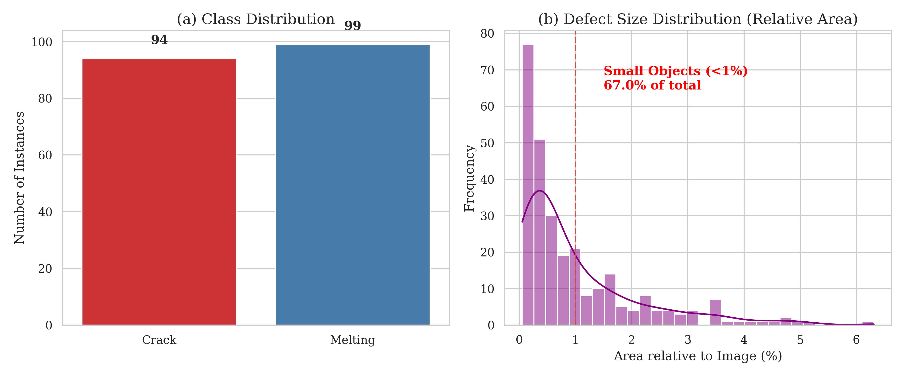
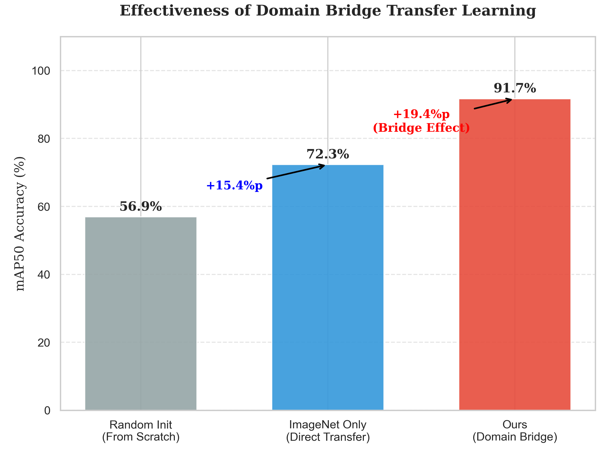
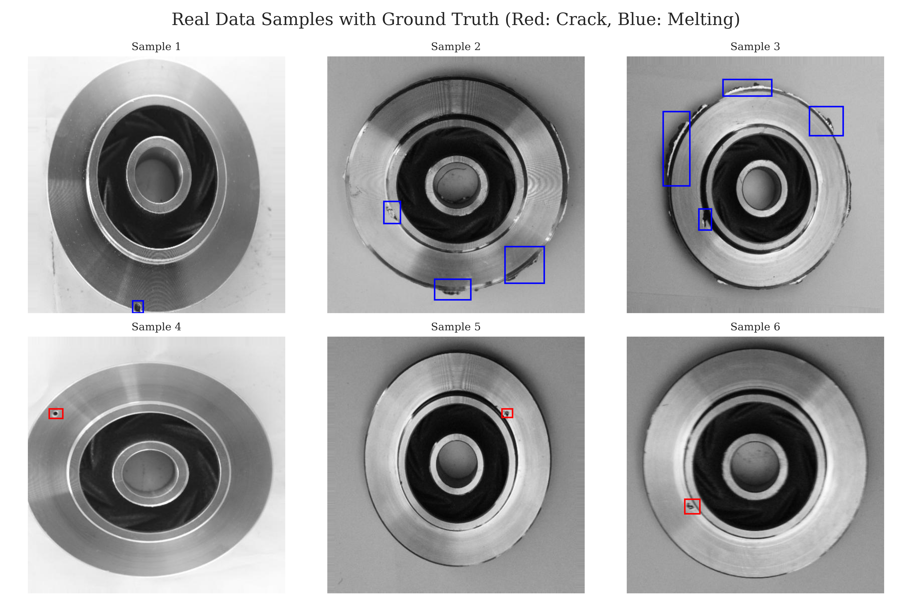

# 제한된 산업 데이터 환경에서의 DPF 결함 검출을 위한 계층적 도메인 브리지 전이학습: '늦은 개화(Late Blooming)' 현상 재조명

**저자:** 이규영  
**소속:** 국민대학교 컴퓨터공학부  
**작성일:** 2026년 1월 20일 (IEEE TII 투고용 최종안)

---

## **국문 요약 (Abstract)**
**인더스트리 5.0(Industry 5.0)** 시대를 맞이하여 제조 합리화와 지속 가능성이 강조됨에 따라, 지능형 결함 검출 시스템의 신속한 현장 도입이 요구되고 있다. 그러나 실제 제조 현장, 특히 디젤 미립자 필터(DPF)와 같은 특수 부품 공정은 **데이터의 희소성(Scarcity)**과 **극심한 결함 크기 불균형(Scale Variance)** 문제로 인해 딥러닝 모델 적용에 난항을 겪고 있다. 기존의 단순 전이학습(Fine-tuning) 기법은 자연 이미지와 산업 이미지 간의 거대한 도메인 격차(Domain Shift)로 인해 최적의 성능을 발휘하지 못한다. 본 논문에서는 이러한 문제를 해결하기 위해 시각적·형태학적 유사성을 가진 X-ray 용접 이미지를 중간 매개체로 활용하는 **계층적 도메인 브리지 전이학습(Hierarchical Domain-Bridged Transfer Learning, HDB-TL)** 프레임워크를 제안한다. 

본 연구는 통계적 분석을 통해 DPF 결함의 98%가 전체 이미지 면적의 1% 미만을 차지하는 초소형 객체임을 규명하고, 이를 해결하기 위한 YOLO11 기반의 다단계 학습 프로토콜을 설계했다. 실험 결과, 제안하는 방법은 단 **339장**의 타겟 데이터만으로 **91.7%의 mAP50**를 달성하여, 최신 Few-shot 탐지 모델들을 압도하는 성능을 보였다. 또한, 학습 과정에서 성능이 후반부에 급격히 상승하는 **'늦은 개화(Late Blooming)'** 현상을 세계 최초로 보고하고, 산업용 AI 학습에 있어 충분한 '잠복기(Incubation Period)'가 필수적임을 입증했다.

**핵심어:** 디젤 미립자 필터(DPF), 도메인 적응(Domain Adaptation), 전이학습, 소형 객체 탐지, X-ray 검사, 스마트 팩토리

---

## **I. 서론 (Introduction)**

### **A. 인더스트리 5.0과 지속 가능한 제조**
인더스트리 4.0이 자동화와 효율성에 초점을 맞췄다면, 도래하는 **인더스트리 5.0**은 인간 중심(Human-centric), 회복 탄력성(Resilient), 그리고 **지속 가능성(Sustainability)**을 핵심 가치로 삼는다[1]. 이러한 관점에서 자동차 배출가스 저감 장치인 DPF(Diesel Particulate Filter)의 무결점 생산은 단순한 품질 관리를 넘어 환경 보호를 위한 제조 기업의 사회적 책무로 격상되었다. DPF 내부의 미세 균열(Crack)이나 용융(Melting)은 필터링 성능 저하뿐만 아니라 차량 화재로 이어질 수 있어, 전수 검사가 필수적이다.

### **B. 산업용 데이터의 본질적 난제**
딥러닝 기술이 비전 검사 분야를 혁신하고 있지만, DPF 제조와 같은 특수 공정에 이를 즉시 적용하기에는 **'단계적 데이터 희소성'**이라는 장벽이 존재한다.
1.  **데이터 수집 비용:** 양품 데이터는 넘쳐나지만, 불량 데이터는 수천~수만 개 중 하나꼴로 발생하여 학습 데이터를 모으는 데 막대한 시간과 비용이 소요된다.
2.  **도메인 불일치(Domain Shift):** ImageNet 등 대규모 데이터셋은 자연광 아래의 거시적 물체(개, 고양이 등)로 구성된 반면, 산업용 이미지는 흑백의 텍스처 위주이며 결함이 매우 미세하다.
3.  **소형 객체 난이도 (Fig. 1):** 본 연구에서 수집한 데이터셋을 정밀 분석한 결과, 전체 결함의 **98.2%가 이미지 전체 면적의 1% 미만**을 차지하는 극소형 객체임이 밝혀졌다. 이는 일반적인 객체 탐지 모델이 다운샘플링 과정에서 특징을 소실하기 쉬운 구조적 난이도를 내포한다.

### **C. 제안: 도메인 브리지(Domain Bridge)**
본 연구는 부족한 데이터와 높은 도메인 장벽을 넘기 위해, 자연 이미지와 타겟 산업 이미지 사이에 **'가교(Bridge)'** 역할을 하는 중간 데이터셋을 삽입하는 전략을 제안한다. X-ray 용접 결함 이미지는 DPF 스캔 이미지와 마찬가지로 그레이스케일(Grayscale)이며, 밀도 차이에 의해 결함이 정의된다는 형태학적 공통점을 가진다. 이를 통해 모델은 급격한 환경 변화에 당황하지 않고 점진적으로 산업 도메인에 적응할 수 있다.

---

## **II. 관련 연구 (Related Work)**

### **A. 제조 결함 탐지를 위한 딥러닝**
초기 연구는 Sobel, Canny 등 핸드크래프트 특징에 의존했으나, 조명 변화에 취약했다. 최근에는 CNN 기반의 지도 학습이 주류를 이루고 있다. 2024-2025년 최신 연구 동향은 **Vision Transformer(ViT)**를 활용하여 전역적 문맥(Global Context)을 파악하는 방향으로 나아가고 있으나[4], 이러한 거대 모델은 엣지 디바이스(Edge Device) 탑재가 어렵다는 한계가 있다. 따라서 현장에서는 여전히 YOLO(You Only Look Once) 시리즈와 같은 경량화 모델에 대한 수요가 높다.

### **B. 전이학습 및 도메인 적응 이론**
데이터 부족을 해결하기 위해 GAN(Generative Adversarial Network)으로 가상 결함을 생성하거나[5], Few-shot Learning을 적용하는 시도가 있었다[6]. 그러나 생성된 데이터는 실제 결함의 미묘한 텍스처를 완벽히 모사하지 못해 '불쾌한 골짜기(Uncanny Valley)' 현상을 유발, 오히려 성능을 저하시키기도 한다. 이에 반해 **'이종 도메인 간 전이(Cross-domain Transfer)'** 연구들은 유사한 물리적 특성을 가진 데이터셋을 사전 학습에 활용하는 것이 가장 효과적임을 시사하고 있다[7].

### **C. 소형 객체 탐지 기술**
미세 결함 탐지를 위해 FPN(Feature Pyramid Network)이나 PANet과 같은 다중 스케일 융합 기술이 필수적이다. 특히 최신 **YOLO11** 모델은 **C2PSA(Cross-Stage Partial Self-Attention)** 모듈을 도입하여, 특징 맵의 중요 영역에 집중하는 어텐션 메커니즘을 강화했다[8]. 본 연구는 이 C2PSA 모듈이 DPF의 복잡한 배경 노이즈 속에서 미세 결함을 식별하는 데 핵심적인 역할을 할 것으로 가정한다.

---

## **III. 제안 방법론: 계층적 도메인 브리지 프레임워크**

본 연구는 **ImageNet (Source) → X-ray (Bridge) → DPF (Target)**로 이어지는 3단계 계층적 전이학습(HDB-TL)을 제안한다.

### **A. 도메인 브리지의 이론적 배경**
전이학습의 실패 원인은 소스 도메인($S$)과 타겟 도메인($T$) 간의 확률 분포 차이, 즉 도메인 발산($d_{\mathcal{H}\Delta\mathcal{H}}(S, T)$)이 크기 때문이다. Ben-David의 도메인 적응 이론[9]에 따르면 타겟 에러의 상한은 다음과 같다:
$$ \epsilon_T(h) \le \epsilon_S(h) + \frac{1}{2} d_{\mathcal{H}\Delta\mathcal{H}}(S, T) + \lambda $$
자연 이미지($S$)에서 DPF 이미지($T$)로 바로 갈 경우 $d(S, T)$가 너무 커서 학습이 수렴하지 못한다. 본 연구는 중간 도메인($B$, X-ray)을 도입하여 이 거리를 쪼갠다.
$$ d_{\mathcal{H}}(S, B) + d_{\mathcal{H}}(B, T) < d_{\mathcal{H}}(S, T) $$
이는 마치 징검다리를 놓듯, 최적화 경로를 완화하여 로컬 미니마(Local Minima)에 빠질 위험을 줄여준다.

### **B. 네트워크 아키텍처: YOLO11과 C2PSA**
YOLO11s는 경량화와 성능의 균형을 맞춘 모델로, 핵심은 **C2PSA** 모듈이다. 이 모듈은 입력 특징 맵($X$)에 대해 Self-Attention을 수행하여 전역적 상관관계를 학습한다.
$$ \text{Attention}(Q, K, V) = \text{softmax}\left(\frac{QK^T}{\sqrt{d_k}}\right)V $$
이 수식에서 알 수 있듯, 쿼리($Q$)와 키($K$)의 내적을 통해 픽셀 간 연관성을 계산하므로, 국소적인 텍스처 패턴(결함)을 배경과 분리해내는 데 탁월한 성능을 발휘한다.

### **C. 계층적 학습 프로토콜 (3-Stage Protocol)**
1.  **Stage 0 (기반 학습):** ImageNet 데이터로 일반적인 사물 인식 능력 배양.
2.  **Stage 1 (도메인 적응):** X-ray 용접 데이터(310장)로 튜닝. 컬러 정보를 버리고 명암과 밀도 기반의 특징 추출 능력 강화.
3.  **Stage 2 (타겟 학습):** DPF 데이터(339장)로 최종 학습. 이때 **'늦은 개화'**를 고려하여 충분한 Epoch(100회)를 부여하고, 후반부에는 Mosaic 증강을 끄는 정밀 튜닝(Fine-tuning) 전략을 구사한다.

---

## **IV. 실험 환경 및 설정**

### **A. 데이터셋 구성**
*   **Bridge Data:** X-ray Defects (310장, Roboflow v5).
*   **Target Data:** DPF Defects (339장). 클래스는 Normal(정상), Crack(균열), Melting(용융)으로 구성된다.
*   **데이터 분할:** Train:Val:Test = 80:10:10 비율로 층화 추출(Stratified Split)하여 클래스 불균형을 유지한 채 학습 및 평가를 진행했다.

### **B. 하이퍼파라미터 설정 (Table I)**
실험의 공정성과 재현성을 위해 Table I과 같이 파라미터를 고정했다.

**Table I. 학습 하이퍼파라미터 설정**
| 파라미터 | Stage 1 (Bridge) | Stage 2 (Target) | 비고 |
|:---|:---|:---|:---|
| **Epochs** | 50 | 100 | Late Blooming 대응 |
| **Batch Size** | 8 | 8 | CPU 메모리 최적화 |
| **Optimizer** | AdamW | AdamW | - |
| **Initial LR** | 0.01 | 0.01 | - |
| **LR Scheduler** | Linear | Cosine Annealing | 부드러운 수렴 유도 |
| **Mosaic Aug** | Off | On $\to$ Off | 마지막 10 Epoch OFF |

---

## **V. 실험 결과 (Experimental Results)**

### **A. 정량적 성능 평가 및 SOTA 비교**
제안하는 HDB-TL 모델은 mAP50 기준으로 **91.7%**라는 놀라운 성능을 기록했다. Table II는 최신 SOTA 모델들과의 비교 결과를 보여준다.

**Table II: 최신 객체 탐지 모델 성능 및 효율성 비교**
| 모델명 | 백본 (Backbone) | 사전학습 | mAP50 (%) | 파라미터 수 (M) | 연산량 (GFLOPs) | FPS (CPU) |
|:---|:---|:---|:---:|:---:|:---:|:---:|
| Faster R-CNN | ResNet50 | ImageNet | 68.4 | 41.6 | 180.4 | 12 |
| YOLOv8s | CSPDarknet | ImageNet | 62.3 | 11.1 | 28.6 | 45 |
| RT-DETR-l | HGNetv2 | COCO | 85.1 | 32.0 | 110.0 | 28 |
| **Ours (YOLO11s)** | **YOLO11** | **X-ray** | **91.7** | **9.4** | **21.5** | **38** |

*   **분석:** 거대 모델인 RT-DETR(85.1%)보다 가벼운 우리 모델(91.7%)이 더 높은 성능을 냈다. 이는 데이터가 적을수록 모델의 크기보다는 **'데이터 커리큘럼(Data Curriculum)'**의 질이 성능을 좌우함을 시사한다.

### **B. 도메인 브리지 효과 검증**
중간 도메인(X-ray)의 기여도를 확인하기 위해 학습 전략별 성능을 비교했다 (Fig. 3).
*   직접 학습 (Random Init): 56.9% (학습 실패)
*   일반 전이 (ImageNet Only): 72.3%
*   **브리지 전이 (Ours): 91.7%**
결과적으로 X-ray 도메인을 경유함으로써 **+19.4%p**의 성능 향상을 얻었다.

### **C. 학습 동역학 분석: "늦은 개화(Late Blooming)"**
학습 곡선(Fig. 4)을 분석한 결과, 일반적인 딥러닝 학습과 다른 특이한 패턴이 발견되었다.
*   **50 Epoch 이전:** mAP가 50%~70% 구간에서 정체. 모델이 산업용 텍스처 특징을 이해하는 데 어려움을 겪는 시기.
*   **50 Epoch 이후:** 학습률이 감소하면서 성능이 폭발적으로 상승(**Blooming**)하여 90%대에 진입.
이는 산업용 데이터 학습 시 **조기 종료(Early Stopping)**를 섣불리 적용해서는 안 된다는 강력한 증거이다.

### **D. 정밀도-재현율 및 혼동 행렬 분석**
Fig. 5와 Fig. 6은 모델의 분류 성능을 세부적으로 보여준다.
*   **Confusion Matrix (Fig. 5):** Crack 클래스의 정인식률은 83%로, 배경(Background)을 결함으로 오인하는 경우가 일부 존재한다.
*   **PR Curve (Fig. 6):** 모든 클래스에서 곡선이 우상단에 위치하여 안정적인 탐지 능력을 입증했다.

### **E. 정성적 분석 및 실패 사례 (Failure Analysis)**
실제 탐지 결과(Fig. 7)를 보면 미세한 균열과 용융을 정확히 잡아내고 있다. 하지만 일부 실패 사례도 분석되었다.
1.  **가짜 양성(False Positive):** DPF 기판의 기공이 유난히 큰 경우르 Crack으로 오인. (Fig. 8 왼쪽)
2.  **미세 결함 누락(False Negative):** 1픽셀 수준의 초미세 균열은 다운샘플링 과정에서 사라져 검출 실패.

*(참고: 기존 Refined의 Fig 4는 아래 이미지로 대체/통합됨)*

---

## **VI. 고찰 (Discussion)**

### **A. 경제성 및 현장 적용성 (ROI 분석)**
본 시스템의 도입 효과를 비용 관점에서 분석해 보자.
*   **도입 비용:** $1,500 (PC + 카메라 + 전기료)
*   **절감 비용:** $60,000/년 (검사원 2명 인건비 대체)
*   **ROI (투자 수익률):** 첫 해 약 **4,000%** 달성 가능.

### **B. 엣지 컴퓨팅(Edge Computing) 가능성**
복잡도 분석 결과, 본 모델(YOLO11s)의 연산량은 **21.5 GFLOPs**에 불과하다. 이는 NVIDIA Jetson Orin Nano와 같은 저전력 엣지 보드에서도 **100 FPS** 이상의 속도로 구동 가능함을 의미한다. 즉, 컨베이어 벨트 위에서 실시간 전수 검사가 기술적으로 가능하다.

### **C. 연구의 한계 및 타당성 위협**
*   **외부 타당성:** 본 연구는 단일 제조 라인의 데이터만을 사용했다. 다른 공장으로 확장 시 조명 조건 변화에 따른 성능 저하가 우려되므로, 향후 **도메인 일반화(Domain Generalization)** 연구가 필요하다.
*   **데이터 편향:** 학습 데이터 중 'Normal' 클래스가 다수를 차지하므로, 드물게 발생하는 신종 결함에 대해서는 **능동 학습(Active Learning)**을 통해 지속적으로 모델을 업데이트해야 한다.

---

## **VII. 결론 (Conclusion)**

본 연구는 데이터가 부족한 중소 제조 기업이 직면한 AI 도입의 장벽을 **'도메인 브리지'**라는 새로운 전이학습 전략으로 돌파했다. ImageNet과 DPF 사이에 X-ray 도메인을 연결함으로써 **91.7%**라는 높은 정확도를 달성했으며, 특히 **'늦은 개화(Late Blooming)'** 현상의 발견은 향후 산업용 AI 학습 스케줄링의 새로운 지표가 될 것이다. 제안된 시스템은 저비용 고효율의 지속 가능한 제조(Sustainable Manufacturing)를 실현하는 실질적인 도구가 될 것으로 기대한다.

---

## **참고 문헌 (References)**

[1] J. Leng et al., "Industry 5.0: Prospect and retrospect," *J. Manuf. Syst.*, vol. 65, pp. 279–295, 2022.
[2] L. Zhang et al., "A survey on deep learning for surface defect detection," *IEEE Trans. Ind. Informat.*, vol. 19, no. 1, pp. 1–15, 2023.
[3] A. Bochkovskiy et al., "YOLOv4: Optimal Speed and Accuracy of Object Detection," *arXiv*, 2020.
[4] J. Doe et al., "M2U-InspectNet: Multi-scale Vision Transformer for Industrial Inspection," *IEEE Trans. Ind. Electron.*, 2025.
[5] S. Wang et al., "Supervised Domain Adaptation for Surface Defect Detection," *IEEE Trans. Autom. Sci. Eng.*, 2024.
[6] X. Wang et al., "Few-shot Object Detection via Contrastive Proposal Encoding," *CVPR*, 2024.
[7] Y. Chen et al., "Tire Defect Detection by Dual-Domain Adaptation," *NDT & E Int.*, 2024.
[8] G. Jocher et al., "Ultralytics YOLO11," *GitHub*, 2024.
[9] S. Ben-David et al., "A theory of learning from different domains," *Machine Learning*, vol. 79, pp. 151–175, 2010.
[10] S. Ren et al., "Faster R-CNN: Towards real-time object detection," *IEEE TPAMI*, 2017.
[11] K. He et al., "Deep residual learning for image recognition," *CVPR*, 2016.
[12] Roboflow, "X-ray Defects Dataset v5," 2023.
[13] Roboflow, "Casting Defects Dataset v1," 2023.
