# 2015_GDXray_Paper

*원본 파일: 2015-GDXray-Paper.pdf*

---

## 페이지 1

J Nondestruct Eval  (2015) 34:42
DOI 10.1007/s10921-015-0315-7
GDXray: The Database of X-ray Images for Nondestructive
Testing
Domingo Mery1 · Vladimir Riffo1,2 · Uwe Zscherpel3 · German Mondragón1 ·
Iván Lillo1 · Irene Zuccar4 · Hans Lobel1 · Miguel Carrasco5
Received: 27 April 2015 / Accepted: 3 November 2015
© Springer Science+Business Media New York 2015
Abstract
In this paper, we present a new dataset consisting
of 19,407 X-ray images. The images are organized in a pub-
lic database called GDXray that can be used free of charge,
but for research and educational purposes only. The data-
base includes five groups of X-ray images: castings, welds,
baggage, natural objects and settings. Each group has sev-
eral series, and each series several X-ray images. Most of
the series are annotated or labeled. In such cases, the coor-
dinates of the bounding boxes of the objects of interest or
the labels of the images are available in standard text files.
The size of GDXray is 3.5 GB and it can be downloaded
from our website. We believe that GDXray represents a rel-
evant contribution to the X-ray testing community. On the
one hand, students, researchers and engineers can use these
X-ray images to develop, test and evaluate image analysis
and computer vision algorithms without purchasing expen-
sive X-ray equipment. On the other hand, these images can be
used as a benchmark in order to test and compare the perfor-
mance of different approaches on the same data. Moreover,
the database can be used in the training programs of human
inspectors.
B Domingo Mery
dmery@ing.puc.cl
http://dmery.ing.puc.cl
1
Department of Computer Science, Pontificia Universidad
Católica de Chile, Santiago, Chile
2
Departamento de Ingeniería Informática y Ciencias de la
Computación–Universidad de Atacama, Copiapó, Chile
3
BAM Federal Institute for Materials Research and Testing,
Berlin, Germany
4
Departamento de Ingeniería Informática–Universidad de
Santiago de Chile, Santiago, Chile
5
Faculty of Engineering and Sciences, Universidad Adolfo
Ibáñez, Santiago, Chile
Keywords
X-ray testing · Datasets · X-ray images ·
Computer vision · Image analysis
1 Introduction
Public databases of X-ray images can be found for medical
imaging,1 however, to the best knowledge of the authors, up
until now there have not been any public databases of digital
X-ray images for X-ray testing.2
As a service to the X-ray testing community, we collected
more than 19,400 X-ray images for the development, test-
ing and evaluation of image analysis and computer vision
algorithms. The images are organized in a public database
called GDXray: The Grima X-ray database.3 In order to
illustrate our database, a random selection of 70 X-ray is
shown in Fig. 1. The database includes five groups of X-ray
images: castings, welds, baggage, natural objects and set-
tings. Each group has several series, and each series several
X-ray images. Some samples of each series are illustrated
in Fig. 2. Most of the series are annotated or labeled. In
those cases, the coordinates of the bounding boxes of the
objects of interest or the labels of the images are available. In
1 See for example a good collection in http://www.via.cornell.edu/
databases/.
2 There are some galleries of X-ray images available on the
web with a few samples, see for instance http://www.vidisco.com/
ndt_solutions/ndt_info_center/ndt_x_ray_gallery with approximately
50 X-ray images.
3 Grima, from Grupo de Inteligencia de Máquina, is the name of our
Machine Intelligence Group at the Department of Computer Science
of the Pontificia Universidad Católica de Chile http://grima.ing.puc.cl.
The X-ray images included in GDXray can be used free of charge, for
research and educational purposes only. Redistribution and commer-
cial use is prohibited. Any researcher reporting results which use this
database should acknowledge the GDXray database by citing this paper.
123

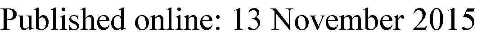

### 페이지 1 전체 이미지

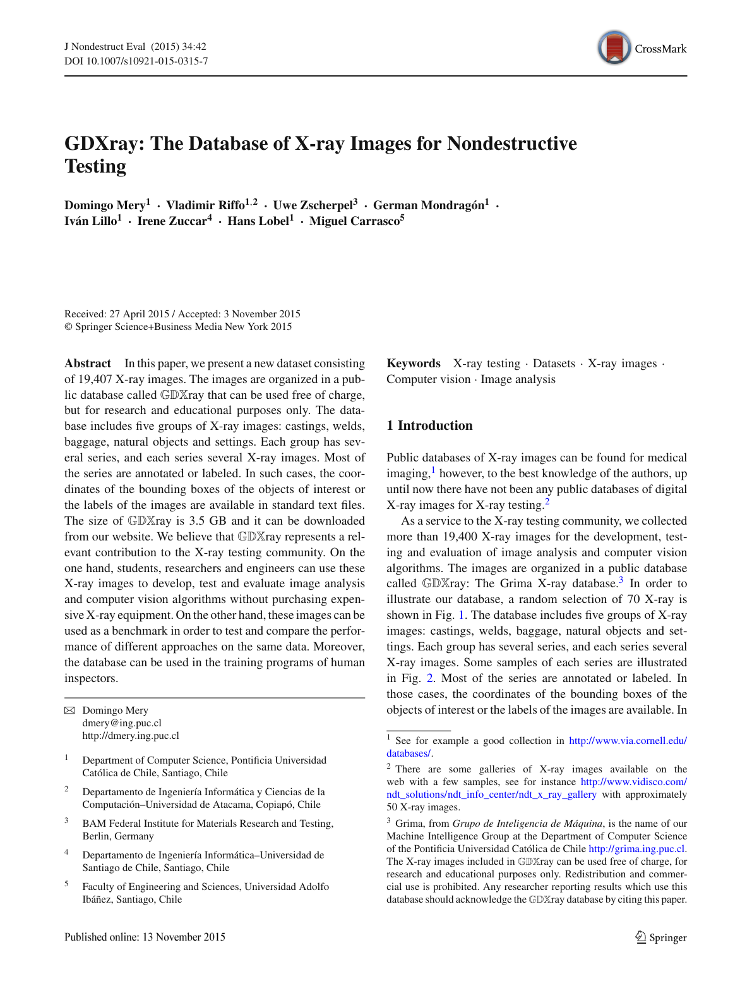

## 페이지 2

42
Page 2 of 12
J Nondestruct Eval   (2015) 34:42
Fig. 1 Random X-ray images of GDXray database
Table 1 we can see some statistics. The size of GDXray is
3.5 GB and it can be downloaded from our website (see Fig.
2).
In this paper, we will view the structure of GDXray
database, a description for each group (with some series
examples), and some examples of applications that have been
published using images of GDXray.
2 Structure of the Database
GDXray is available in a public repository. The repository
contains 5 group folders one for each group: Castings,
Welds, Baggage, Nature and Settings. For each
group we define an initial: C, W, B, N and S respectively.
As shown in Table 1, each group has several series. Each
series is stored in an individual sub-folder of the correspond-
ing group folder. The sub-folder name is Xssss, where X
is the initial of the group and ssss is the number of the
series. For example, the third series of group Castings is
stored in sub-folder C0003 of folder Castings (see more
examples in Fig. 2). The X-ray images of a series are stored
in file Xssss_nnnn.png. Again Xssss is the name of
the series. The number nnnn corresponds to the number of
the X-ray image of this series. For example, the fifth X-ray
image of series C0003 is C0003_0005.png and is stored
in sub-folder Castings/C0003. The whole structure is
summarized in Table 2. It is worth mentioning that all X-ray
images of GDXray are stored in ‘png’ (Portable Network
Graphics)4 8-bit grayscale format. Additional metadata for
each series (such as description of the objects, parameters
and description of X-ray imaging system, etc.) are given
in an ASCII file called Xssss_readme.txt included in
sub-folder Xssss, e.g., C0003_readme.txt for series
Castings/C0003.
3 Castings
The group Castings contains 2727 X-ray images arranged in
67 series. The X-ray images were taken mainly from automo-
tive parts (aluminum wheels and knuckles) using an image
intensifier. Some examples are illustrated in Figs. 3 and 4.
The details of each series are given in Table 3. Experiments
on these data can be found in several publications as shown
in Table 4. It is interesting to highlight that series C0001
4 See http://www.libpng.org/pub/png/.
123

### 페이지 2 전체 이미지

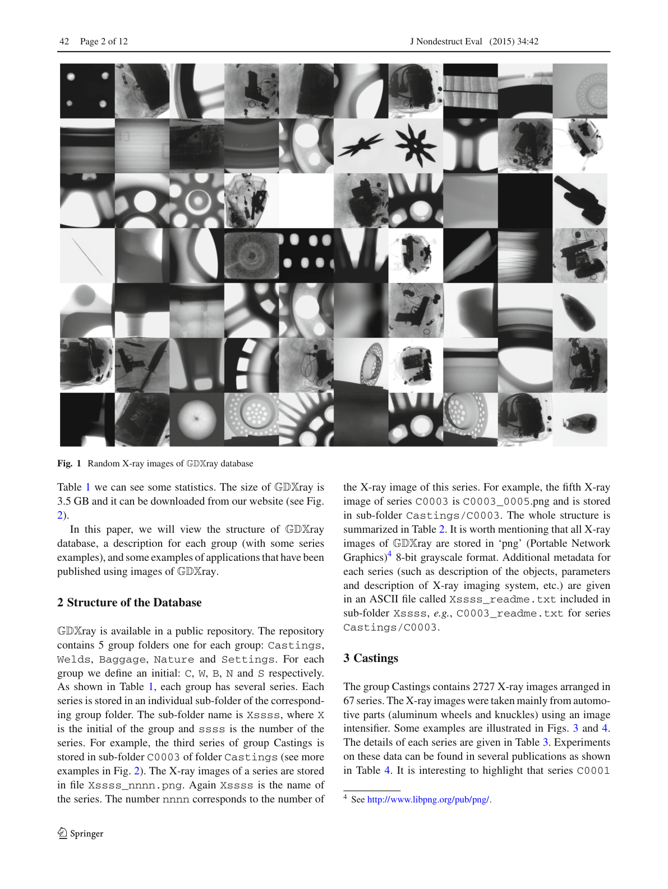

## 페이지 3

J Nondestruct Eval   (2015) 34:42
Page 3 of 12
42
Fig. 2 Screenshot of GDXray website. Some X-ray images of ten
series are shown at the right side: C0001 and C0034 for castings,
W0001 and W0003 for welds, B0001 and B0046 for baggage, N0006
(cherry), N0010 (wood) and N0011 (salmon) for natural objects and
S0001 for settings (a calibration pattern)
Table 1 Statistics of GDXray database
Groups
Series
Images
Size (MB)
Castings
67
2727
307.5
Welds
3
88
209.4
Baggage
77
8150
2734.8
Nature
13
8290
191.9
Settings
7
152
45.5
Total
167
19407
3489.0
(see Fig. 3) contains not only a sequence of 72 X-ray images
taken from an aluminum wheel by rotating its central axis
in 50, but also annotations of bounding boxes of the ground
truth of 226 small defects and the calibration matrix of each
image that relates the 3D coordinates of the aluminum wheel
with 2D coordinates of the X-ray image.
4 Welds
The group Welds contains 88 images arranged in 3 series.
The X-ray images were taken by the BAM Federal Institute
for Materials Research and Testing, Berlin, Germany.5 Some
examples are illustrated in Fig. 5. The details of each series
are given in Table 5. Experiments on these data can be found
in several publications as shown in Table 6. It is interesting
to highlight that series W0001 and W0002 (see Fig. 5) con-
tains not only 10 X-ray images selected from the whole BAM
database (series W0003), but also annotations of bounding
boxes and the binary images of the ground truth of 641
defects.
Series W0003 contains a collection of 67 digitized radi-
ographs from a round robin test on flaw recognition in
welding seams. The NDT films (used with lead screens) were
exposed according to ISO 17636-1, testing class A. After
development they have been scanned with a LASER scan-
ner LS85 SDR from Lumisys using digitization class DB-9
according to ISO 14096-2. The original 12 bit data depth was
rescaled to 8 bits with a linear LUT proportional to optical
film density by visual adjustment to the image content. This
5 The X-ray images of series W0001 and W0003 are included in
GDXray thanks to the collaboration of the BAM Federal Institute for
Materials Research and Testing, Berlin, Germany http://dir.bam.de/dir.
html.
123

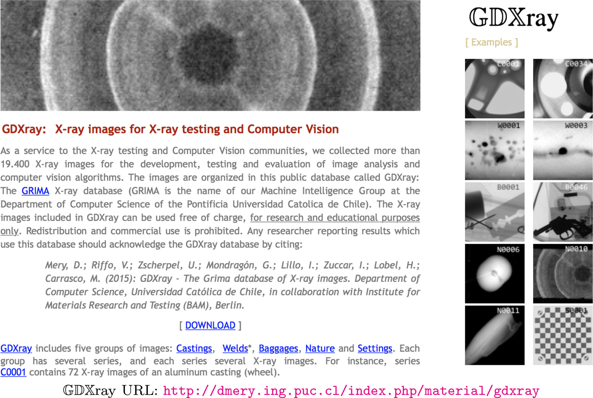

### 페이지 3 전체 이미지

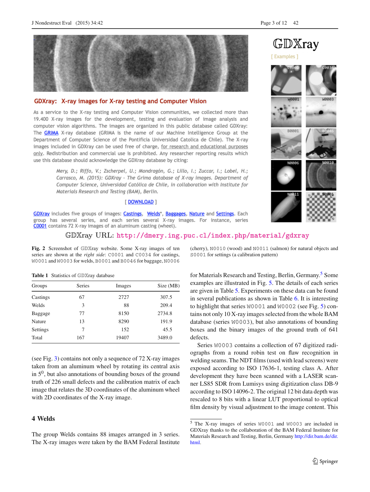

## 페이지 4

42
Page 4 of 12
J Nondestruct Eval   (2015) 34:42
Table 2 Structure of GDXray
Database
Groups
Series
X-ray images
GDXray →
Castings →
C0001 →
C0001_0001 . . . C0001_0072
C0067 →
C0067_0001 . . . C0067_0083
Welds →
W0001 →
W0001_0001 . . . W0001_0010
W0003 →
W0003_0001 . . . W0003_0068
Baggage →
B0001 →
B0001_0001 . . . B0001_0014
B0077 →
B0077_0001 . . . B0077_0576
Nature →
N0001 →
N0001_0001 . . . N0001_0013
N0013 →
N0013_0001 . . . N0013_0006
Settings →
S0001 →
S0001_0001 . . . S0001_0018
S0007 →
S0007_0001 . . . S0007_0029
Fig. 3 Some X-ray images of an aluminum wheel (group Castings series C0001)
Fig. 4 Some annotated images showing bounding boxes of casting defects
Table 3 Description of group ‘Castings’ of GDXray
Series
Images
kpixels
Description
Additional
C0001
72
439.3
Wheel: rotation each 5◦
Annotations for defects, calibration
C0002
90
44.5
Crops of C0001 with and without defects
Annotations for defects
C0003–C0043
37
439.3
Wheels with and without defects
Annotations for defects
C0044–C0051
54–77
65.5
Wheel with small drilled defects
Annotations for defects
C0052–C0054
17–31
440.8
Knuckle with low contrast defects
Annotations for defects
C0055
28
440.8
Sink strainer
Annotations for holes
C0056
10
440.8
Sink strainer high speed
C0057
31
440.8
Knuckle with low contrast defects
Annotations for defects
C0058–C0067
10–83
440.8
Knuckle with small defects in motion
Annotations for defects
123

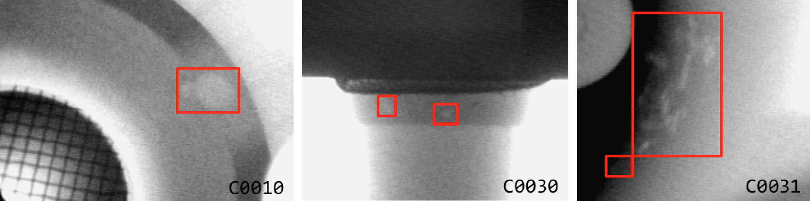

### 페이지 4 전체 이미지

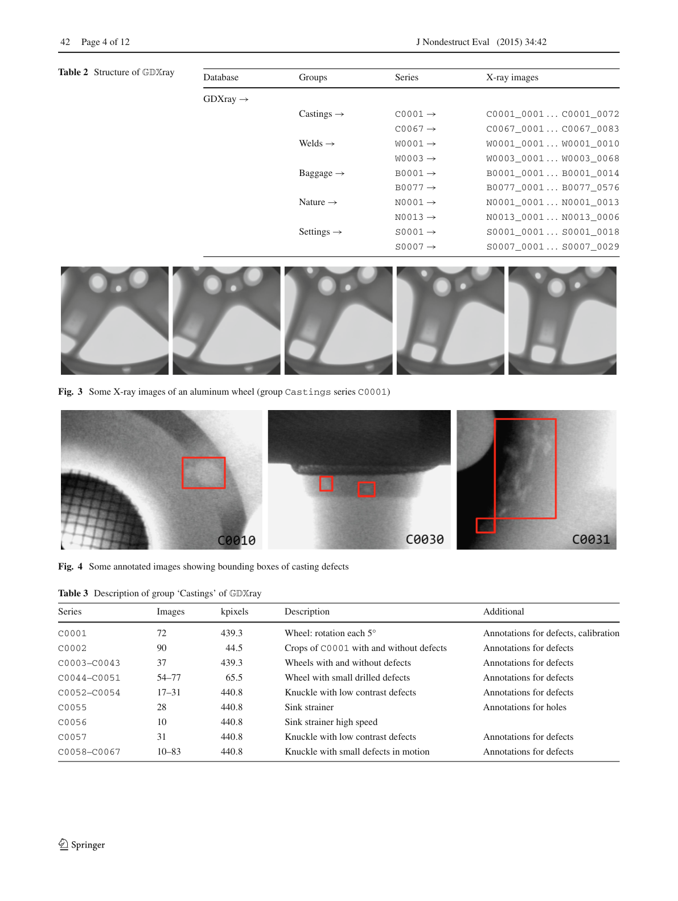

## 페이지 5

J Nondestruct Eval   (2015) 34:42
Page 5 of 12
42
Table 4 Applications of series
castings
Series
Application
References
C0001
Detection of defects in multiple views
[2,10,14,18,27,28]
Estimation of epipolar geometry with distortion
[16]
Calibration of X-ray imaging system with image intensifiers
[18]
Simulation of casting defects
[18]
C0002
Experiments on detection of defects in single views
[4,8,15,29]
C0008
Simulation of casting defects
[6]
C0017
Simulation of casting defects
[7,20]
C0032
Experiments on detection of defects in multiple views
[10]
C0037
Simulation of casting defects
[7,20]
C0049
Image restoration in blurred X-ray images
[17]
C0054
Detection of casting on moving castings
[19]
C0055
Image restoration in blurred X-ray images
[17]
Fig. 5 Some images of group Welds series W0001 (X-ray images) and W0002 (ground truth)
Table 5 Description of group ‘Welds’ of GDXray.
Series
Images
kpixels
Description
Additional
W0001
10
3323.8
Selection of 10 images of W0003
Annotations for defects. See W0002
W0002
10
3323.8
Binary ideal segmentation of images of W0001
W0003
68
6693.8
Radiographs from a round robin test performed by BAM
Excel file with real-values
123

### 페이지 5 전체 이미지

## 페이지 6

42
Page 6 of 12
J Nondestruct Eval   (2015) 34:42
Table 6 Applications of series
welds
Series
Application
References
W0001
Detection of defects in welds
[1,5,11,13]
Simulation of welding defects
[11,20]
W0002
Evaluation of performance of detection algorithm
[1]
W0003
Detection of defects in welds
[26,31]
Fig. 6 Some X-ray images of a bag containing handguns, shuriken and razor blades (group Baggage series B0048)
Fig. 7 Some X-ray images of handguns (series B0049), shuriken (series B0050) and razor blades (series B0051) of group Baggage
123

### 페이지 6 전체 이미지

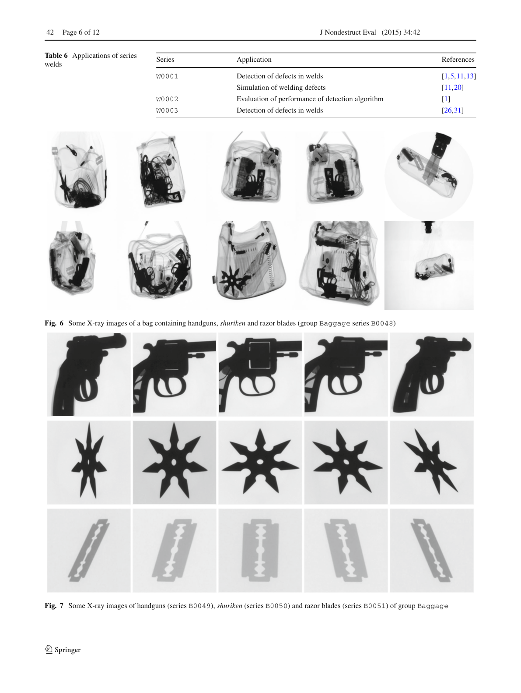

## 페이지 7

J Nondestruct Eval   (2015) 34:42
Page 7 of 12
42
Fig. 8 A knife was rotated in 10 and by each position an X-ray image was captured. In this figure, X-ray images at 00, 100, 200, . . . 3500 are
illustrated (see series B00008 of group Baggage)
Table 7 Description of group ‘Baggage’ of GDXray
Series
Images
kpixels
Description
Additional
B0001–B0006
9–14
722.5–5935.1
Pen case with several objects
Annotations for objects
B0007
20
129.6
Razor blade for training
B0008
361
745.8
Rotation of a knife in 10
B0009–B0043
4–19
276.6
Backpack with handgun and objects
Annotations for handguns
B0044
178
5935.1
Backpack with handgun
Calibration parameters
B0045
90
1287.0
Pen case in 90 positions
Annotations for razor blades
B0046–B0048
200
5412.0–5844.0
Backpack with handguns, shuriken, razor blades
Annotations for objects
B0049–B0051
100–200
165.6–759.5
Handguns, shuriken, and blades for training
B0052–B0054
144
741.3
Shuriken with 6, 7, 8 points for training
B0055–B0057
800–1600
16.9–18.1
200 4, 6, 8-image sequences of single objects
Labels
B0058
64
196.6
Crops of clips, springs, razor blades and others
Labels See B0059
B0059
64
196.6
Binary ideal segmentation of images of B0058
Labels Original images in B0058
B0060
2
5935.1
Images for dual-energy experiments
Annotations for shuriken
B0061–B0073
17–25
2856.1–3656.8
Razor blade in cases
Annotations for razor blades
B0074
37
2856.1
Rotation of a door key in 100
B0075–B0077
576
1581.8–5935.1
Knife in 576 positions
Table 8 Applications of series
baggage
Series
Application
References
B0005
Experiments on detection of pins in multiple views
[10,30]
Detection of razor blades using active vision
[30]
B0007
Training of a classifier of razor blades
[30]
B0009–B0043
Experiments on detection of handguns
[3,23]
B0045
Experiments on detection of objects in multiple views
[12,24]
Active vision
[30]
B0055
Experiments on detection of objects in sequences of four views
[12]
B0056
Experiments on detection of objects in sequences of six views
[12]
B0057
Experiments on detection of objects in sequences of eight views
[12]
B0058
Training of a classifier for clips, springs and razor blades
[12,24]
B0061–B0073
Detection of razor blades using active vision
[30]
ensures that all necessary flaw information is still in the 8
bit images.6 The pixel size is 40.3 micron (630 dpi). The
6 The original images in TIFF format are available also in series W0003
as files RRT01.zip (the first 31 images) and RRT02.zip (the last
36 images).
images are 8 bit gray values. In addition, in this directory the
file ‘real-values.xls’ contains the true data and the flaw des-
ignations according to ISO 6520 and ISO 5817. These true
data have been generated using weld sections of 1 cm width
starting from the indicated Zero point.
123

### 페이지 7 전체 이미지

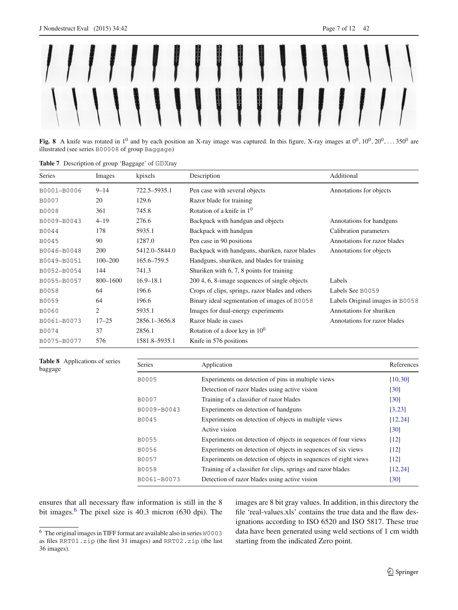

## 페이지 8

42
Page 8 of 12
J Nondestruct Eval   (2015) 34:42
Fig. 9 Some X-ray images of salmon filets (group Nature series N0011)
Fig. 10 Some X-ray images of wood (group Nature series N0010)
123

### 페이지 8 전체 이미지

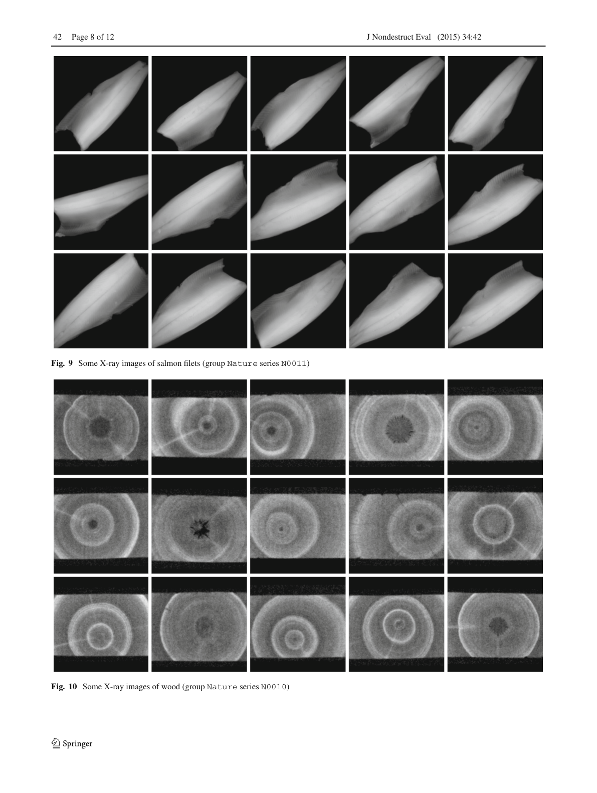

## 페이지 9

J Nondestruct Eval   (2015) 34:42
Page 9 of 12
42
Table 9 Description of group ‘Nature’ of GDXray
Series
Images
kpixels
Description
Additional
N0001
13
5935.1
Apples
N0002
200
10.0
Cropped images of 100 × 100 pixels for fish bone detection
Labels
N0003
7697
0.1
Cropped images of 10 × 10 pixels for fish bone detection
Labels
N0004
20
143.3
Static noisy images of a wood piece
N0005
9
4076.7
Apples
Annotations for apples
N0006
27
5935.1
Cherries
Annotations for cherries
N0007
8
5935.1
Cherries
Annotations for cherries
N0008
3
5935.1
Kiwis
Annotations for cherries
N0009
39
585.0
Wood pieces
N0010
99
83.6
Wood pieces
N0011
163
5935.1
Salmon filets
N0012
6
5935.1
Selected 6 images of N0011
Annotation for fish bones. See N0013
N0013
6
5935.1
Binary ideal segmentation of N0012
Original images in N0012
Table 10 Applications of series
Nature.
Series
Application
References
N0003
Automated design of a visual food quality system
[22]
N0003
Automated fish bone detection
[21]
N0008
Quality control of kiwis
[25]
N0011
Automated fish bone detection
[21]
Fig. 11 Some images of group Nature series S0012 (X-ray images of salmon filets) and S0013 (ground truth for fish bones)
5 Baggage
The group Baggage contains 8150 X-ray images arranged
in 77 series. The X-ray images were taken from different
containers such as backpacks, pen cases, wallets, etc. Some
examples are illustrated in Figs. 6, 7 and 8. The details of each
series are given in Table 7. Experiments on these data can be
found in several publications as shown in Table 8. It is inter-
esting to highlight that series B0046, B0047 and B0048
(see for example Fig. 6) contains 600 X-ray images that can
be used for automated detection of handguns, shuriken and
razor blades (bounding boxes for these objects of interest are
available as well). In this case, the training can be performed
using series B0049, B0050 and B0051 that includes X-ray
images of individual handguns, shuriken and razor blades
respectively taken from different points of view as shown in
Fig. 7.
123

### 페이지 9 전체 이미지

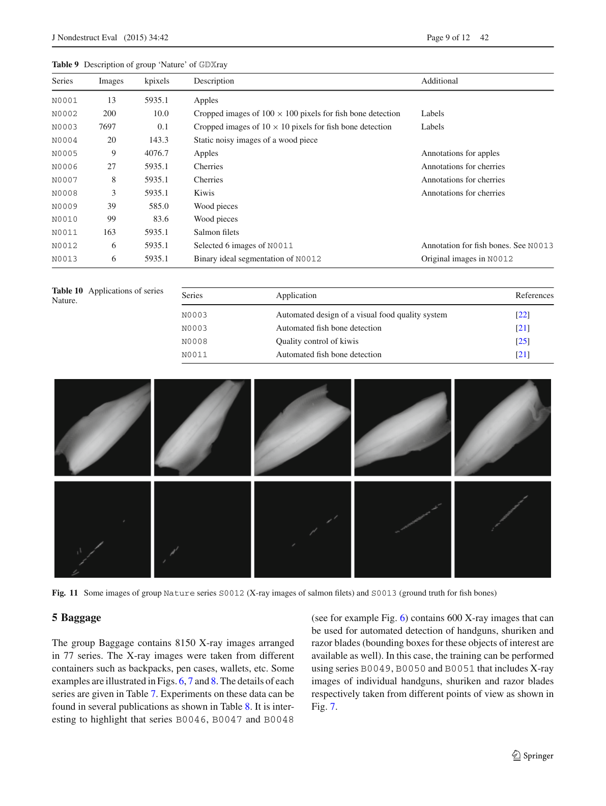

## 페이지 10

42
Page 10 of 12
J Nondestruct Eval   (2015) 34:42
Fig. 12 Some X-ray images of a cooper checkerboard used by calibration (group Settings series S0001)
Table 11 Description of group ‘Settings’ of GDXray
Series
Images
kpixels
Description
Additional
S0001
18
5935.1
Checkerboard captured by flat panel
Calibration parameters
S0002
1
427.9
Regular grid captured by image intensifier
Coordinates of calibration points
S0003
36
440.8
Circular pattern in different positions
Manipulator coordinates, 3D coordinates
S0004
23
440.8
Circular pattern in different positions
Manipulator coordinates, 3D coordinates
S0005
27
440.8
Circular pattern in different positions
Manipulator coordinates, 3D coordinates
S0006
17
440.8
Circular pattern in different positions
Manipulator coordinates, 3D coordinates
S0007
29
440.8
Circular pattern in different positions
Coordinates of calibration points (2D & 3D)
6 Natural Objects
The group Nature contains 8290 X-ray images arranged in 13
series. The X-ray images were taken from different natural
objects such as salmon filets, fruit and wood pieces. Some
examples are illustrated in Figs. 9 and 10 The details of each
series are given in Table 9. Experiments on these data can
be found in several publications as shown in Table 10. It is
interesting to highlight that series N0012 and N0013 (see
Fig. 11) contains not only 6 X-ray images of salmon filets, but
also annotations of bounding boxes and the binary images of
the ground truth of 73 fish bones. For training proposes, there
are more than 7500 labeled small crops (10 × 10 pixels), of
regions of X-ray of salmon filets with and without fish bones
in series N0003.
7 Settings
The group Settings contains 151 X-ray images arranged in 7
series. The X-ray images were taken from different calibra-
tion objects such checkerboards and 3D objects with regular
patterns. Some examples are illustrated in Fig. 12. The details
ofeachseriesaregiveninTable11.Experimentsonthesedata
can be found in several publications as shown in Table 12.
It is interesting to highlight that series S0001 (see Fig. 12)
contains not only 18 X-ray images of a copper checkerboard,
but also the calibration matrix of each view. In addition, series
S0007 can be used for modeling the distortion of an image
intensifier. The coordinates of each hole of the calibration
pattern in each view are available, and the coordinates of the
3D model are given as well.
123

### 페이지 10 전체 이미지

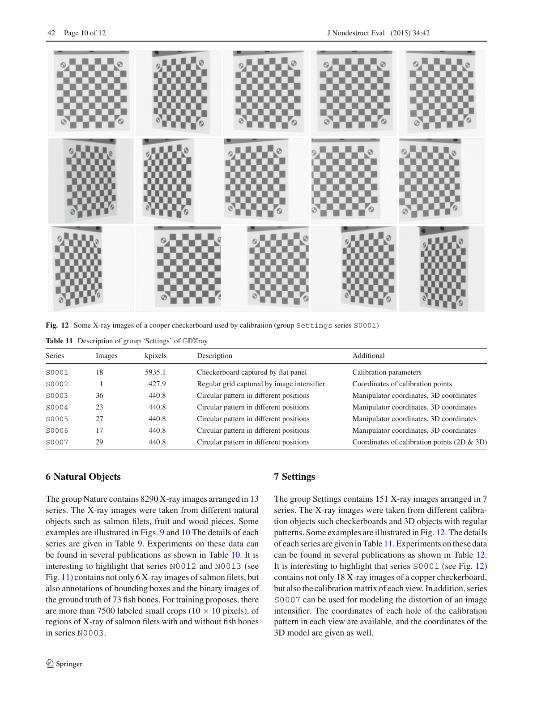

## 페이지 11

J Nondestruct Eval   (2015) 34:42
Page 11 of 12
42
Table 12 Applications of series
Settings
Series
Application
References
S0001
Calibration of a multiple view X-ray imaging system for active vision
[30]
S0002
Distortion model of an image intensifier
[16,18]
S0007
Explicit geometric model of a radioscopic imaging system
[9]
8 Conclusions
In this paper, we presented the details of a new public
dataset called GDXray. It consists of more than 19,400 X-ray
images. The database includes five groups of X-ray images:
castings, welds, baggage, natural objects and settings. Each
group has several series and X-ray images with many labels
and annotations that can be used for training and testing pur-
poses in computer vision algorithms. To the best knowledge
of the authors, up until now there have not been any public
databases of digital X-ray images for X-ray testing.
In this paper, we explained the structure of the GDXray
database, we gave a description for each group (with some
series examples), and we presented some examples of appli-
cations that have been published using images of GDXray.
We believe that GDXray represents a relevant contri-
bution to the X-ray testing community. On the one hand,
students, researchers and engineers can use these X-ray
images to develop, test and evaluate image analysis and com-
puter vision algorithms without purchasing expensive X-ray
equipment. On the other hand, these images can be used
as a benchmark in order to test and compare the perfor-
mance of different approaches on the same data. Moreover,
the database can be used in the training programs of human
inspectors.
Acknowledgments
Fondecyt Grant No. 1130934 from CONICYT–
Chile.
References
1. Carrasco, M., Mery, D.: Segmentation of welding defects using a
robust algorithm. Mater. Eval. 62(11), 1142–1147 (2004)
2. Carrasco, M., Mery, D.: Automatic multiple view inspection using
geometrical tracking and feature analysis in aluminum wheels.
Mach. Vis. Appl. 22(1), 157–170 (2011)
3. Damashek, A., Doherty, J.: Detecting guns using parametric
edge matching. Tech. Rep. Project for Computer Vision Course:
CS231A, Stanford University (2015)
4. Ghoreyshi,A.,Vidal,R.,Mery,D.:Segmentationofcircularcasting
defects using a robust algorithm. Insight-Non-Destruct. Test. Cond.
Monit. 47(10), 615–617 (2005)
5. Hernández, S., Sáez, D., Mery, D., da Silva, R., Sequeira, M.: Auto-
mated defect detection in aluminium castings and welds using
neuro-fuzzy classifiers. In: Proceedings of the 16th World Con-
ference on Non-destructive Testing (WCNDT–2004), Montreal
(2004)
6. Huang, Q., Wu, Y., Baruch, J., Jiang, P., Peng, Y.: A template
model for defect simulation for evaluating nondestructive testing in
X-radiography. IEEE Trans. Syst. Man Cybern. A: Syst. Hum.
39(2), 466–475 (2009)
7. Mery, D.: A new algorithm for flaw simulation in castings by
superimposing projections of 3D models onto X-ray images. In:
Proceedings of the XXI International Conference of the Chilean
Computer Science Society (SCCC-2001), pp. 193–202. IEEE
Computer Society Press, Punta Arenas (2001)
8. Mery, D.: Crossing line profile: a new approach to detecting defects
inaluminiumcastings.In: Proceedingsofthe ScandinavianConfer-
ence on Image Analysis (SCIA 2003), Lecture Notes in Computer
Science, vol. 2749, pp. 725–732 (2003)
9. Mery, D.: Explicit geometric model of a radioscopic imaging sys-
tem. NDT & E Int. 36(8), 587–599 (2003)
10. Mery, D.: Automated detection in complex objects using a tracking
algorithm in multiple X-ray views. In: Proceedings of the 8th IEEE
Workshop on Object Tracking and Classification Beyond the Visi-
ble Spectrum (OTCBVS 2011), in Conjunction with CVPR 2011,
pp. 41–48. Colorado Springs (2011)
11. Mery, D.: Automated detection of welding defects without seg-
mentation. Mater. Eval. 69(6), 657–663 (2011)
12. Mery, D.: Inspection of complex objects using multiple-X-ray
views. IEEE/ASME Trans. Mechatron. 20(1), 338–347 (2015)
13. Mery, D., Berti, M.A.: Automatic detection of welding defects
using texture features. Insight-Non-Destruct. Test. Cond. Monit.
45(10), 676–681 (2003)
14. Mery, D., Carrasco, M.: Automated multiple view inspection based
on uncalibrated image sequences. Lect. Notes Comput. Sci. 3540,
1238–1247 (2005)
15. Mery,D.,Chacón,M.,Munoz,L.,González,L.:Automatedinspec-
tion of aluminium castings using fusion strategies. Mater. Eval.
63(2), 148–153 (2005)
16. Mery, D., Filbert, D.: The epipolar geometry in the radioscopy:
theory and application. Automatisierungstechnik 48(12), 588–596
(2000). (in German)
17. Mery, D., Filbert, D.: A fast non-iterative algorithm for the removal
of blur caused by uniform linear motion in X-ray images. In: Pro-
ceedings of the 15th World Conference on Non-destructive Testing
(WCNDT–2000), Rome (2000)
18. Mery, D., Filbert, D.: Automated flaw detection in aluminum cast-
ings based on the tracking of potential defects in a radioscopic
image sequence. IEEE Trans. Robot. Autom. 18(6), 890–901
(2002)
19. Mery, D., Filbert, D.: Automated inspection of moving aluminium
castings. In: 8th European Conference on Non-destructive Testing
(ECNDT 2002), Barcelona (2002)
20. Mery, D., Hahn, D., Hitschfeld, N.: Simulation of defects in alu-
minum castings using CAD models of flaws and real X-ray images.
Insight 47(10), 618–624 (2005)
21. Mery, D., Lillo, I., Riffo, V., Soto, A., Cipriano, A., Aguilera, J.:
Automated fish bone detection using X-ray testing. J. Food Eng.
2011(105), 485–492 (2011)
22. Mery, D., Pedreschi, F., Soto, A.: Automated design of a computer
vision system for visual food quality evaluation. Food Bioprocess
Technol. 6(8), 2093–2108 (2013)
23. Mery, D., Riffo, V., Mondragon, G., Zuccar, I.: Detection of regular
objects in baggages using multiple X-ray views. Insight 55(1), 16–
21 (2013)
123

### 페이지 11 전체 이미지

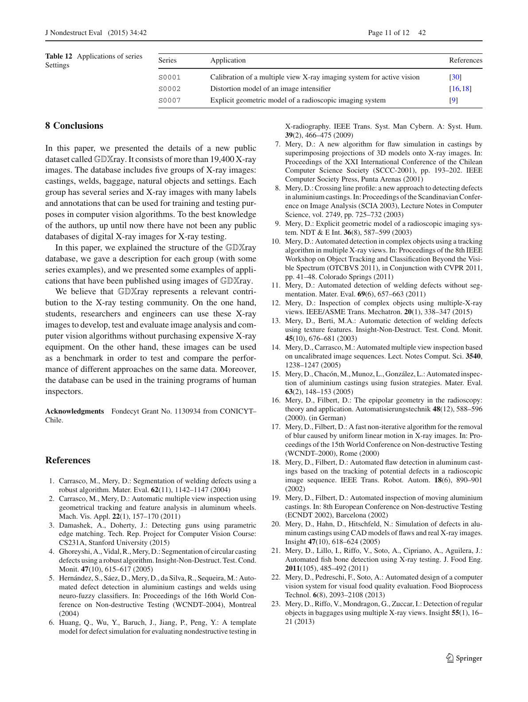

## 페이지 12

42
Page 12 of 12
J Nondestruct Eval   (2015) 34:42
24. Mery, D., Riffo, V., Zuccar, I., Pieringer, C.: Automated X-ray
object recognition using an efficient search algorithm in multiple
views. In: Proceedings of the 9th IEEE CVPR Workshop on Per-
ception Beyond the Visible Spectrum, Portland (2013)
25. Mondragón, G., Leiva, G., Aguilera, J., Mery, D.: Automated
detection of softening and hard columella in kiwifruits during
postharvest using X-ray testing. In: Proceedings of International
Congress on Engineering and Food (2011)
26. Perner, P., Zscherpel, U., Jacobsen, C.: A comparison between
neural networks and decision trees based on data from industrial
radiographic testing. Pattern Recogn. Lett. 22(1), 47–54 (2001)
27. Pieringer, C., Mery, D.: Flaw detection in aluminium die castings
using simultaneous combination of multiple views. Insight 52(10),
548–552 (2010)
28. Pizarro, L., Mery, D., Delpiano, R., Carrasco, M.: Robust auto-
mated multiple view inspection. Pattern Anal. Appl. 11(1), 21–32
(2008)
29. Ramírez, F., Allende, H.: Detection of flaws in aluminium cast-
ings: a comparative study between generative and discriminant
approaches. Insight-Non-Destruct. Test. Cond. Monit. 55(7), 366–
371 (2013)
30. Riffo, V., Mery, D.: Active X-ray testing of complex objects. Insight
54(1), 28–35 (2012)
31. da Silva, R.R., Siqueira, M.H., de Souza, M.P.V., Rebello, J.M.,
Calôba, L.P.: Estimated accuracy of classification of defects
detected in welded joints by radiographic tests. NDT & E Int. 38(5),
335–343 (2005)
123

### 페이지 12 전체 이미지

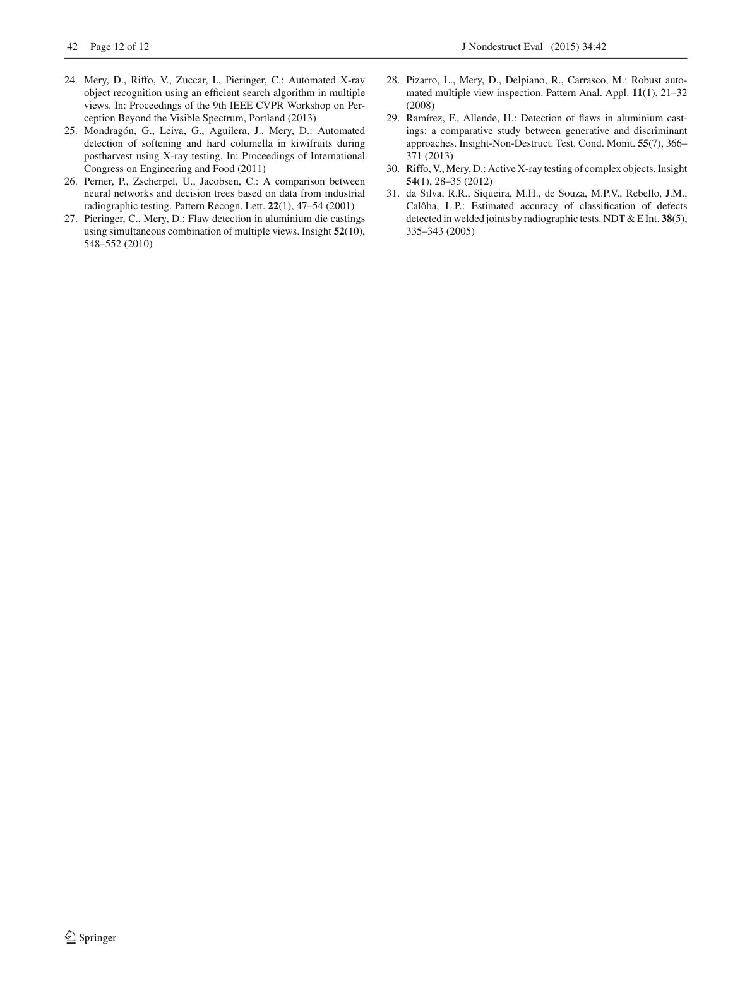
