# 2408_11250v2

*원본 파일: 2408.11250v2.pdf*

---

## 페이지 1

CNN-based Labelled Crack Detection for
Image Annotation
Mohsen Asghari Ilani1,*, Leila Amini2, Hossein Karimi3, Maryam Shavali Kuhshuri4
Abstract
Numerous image processing techniques (IPTs) have been employed to detect crack defects, offering an
alternative to human-conducted onsite inspections. These IPTs manipulate images to extract defect features,
particularly cracks in surfaces produced through Additive Manufacturing (AM). This article presents a
vision-based approach that utilizes deep convolutional neural networks (CNNs) for crack detection in AM
surfaces. Traditional image processing techniques face challenges with diverse real-world scenarios and
varying crack types. To overcome these challenges, our proposed method leverages CNNs, eliminating the
need for extensive feature extraction. Annotation for CNN training is facilitated by LabelImg without the
requirement for additional IPTs. The trained CNN, enhanced by OpenCV preprocessing techniques,
achieves an outstanding 99.54% accuracy on a dataset of 14,982 annotated images with resolutions of 1536
× 1103 pixels. Evaluation metrics exceeding 96% precision, 98% recall, and a 97% F1-score highlight the
precision and effectiveness of the entire process.
Keywords: Image Processing, Additive Manufacturing, LabelImg, Convolutional Neural Network (CNN), Object
Detection.
1. Introduction
Alloys and superalloys often exhibit susceptibility to crack defects, particularly when processed through
thermally affected manufacturing methods like laser-based additive manufacturing (AM). These defects
encompass solidification cracks, liquation cracks, strain-age cracks, ductility-dip cracks, and cold cracks,
as illustrated in Figure 1. The first two are liquid cracks, requiring the presence of liquid films, while the
latter three are solid cracks. Due to the intricate thermal history during AM, distinguishing between
liquation cracks and solidification cracks, as well as between ductility-dip cracks and strain-age cracks,
poses challenges [1]. In our focus on this study, solidification cracks, also known as "hot tears," are
emphasized. They are known to occur within the solidifying melt pool or mushy zone when the material is
in a semisolid state. Dendrite structures formed during the solidification process impede the flow of
remaining liquid in the interdendritic regions, concentrating solidifying stress and leading to the formation
of solidification cracks [1, 2]. These cracks exhibit a typical dendritic structure due to the solidification of
the liquid, as observed by Carter et al. [3] and Cloots et al. [4]. Figure 1(a-f) displays the morphological
*  Mohsen Asghari Ilani
Mohsenasghari1990@ut.ac.ir
1 School of Mechanical Engineering, College of Engineering, University of Tehran, Tehran, Iran
2 Department of Information Systems and Business Analytics, College of Business Florida International University, Miami, FL 33199, USA
3 Department of Computer and Information Technology Engineering, Qazvin Branch, Islamic Azad University, Qazvin, Iran
4 Department of Electrical Engineering, Faculty of Engineering, University of Isfahan, Isfahan, Iran

### 페이지 1 전체 이미지

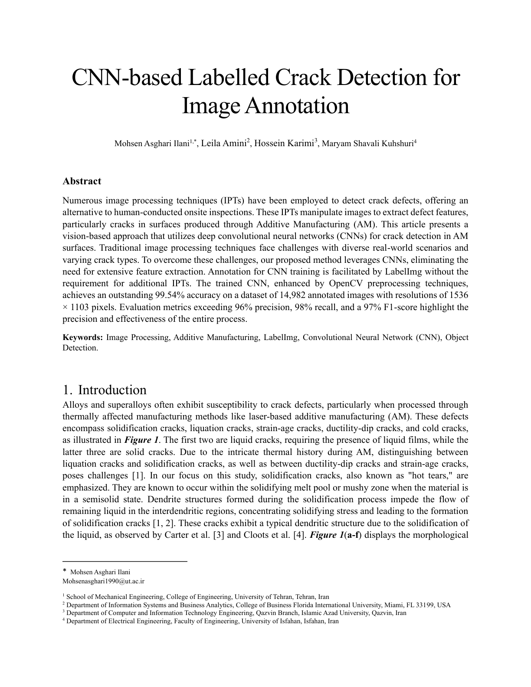

## 페이지 2

characteristics of solidification cracks in PBF-L fabricated Hastelloy X samples, surrounded by grains with
different solidification features.
Research by Han et al. [5] indicates that these cracks typically initiate between grains and propagate across
pre-solidified layers. Electron backscatter diffraction (EBSD) micrographs reveal crack distribution along
paths with high misorientation, particularly high angle grain boundaries (HAGB) exceeding 15°. The
solidification behavior of alloys and superalloys with various elements is closely tied to the temperature
ranges of their liquidus and solidus temperatures. The critical temperature range (CTR) describes the trend
of solidification cracking during the rapid AM solidification process, as depicted in Figure 1 (g). Alloy
elements become inhomogeneous within the CTR, resulting in the formation of low-melting films around
emerging grains. Marchese et al. [6] observed bright phases along cracks rich in Mo, indicating the
formation of Mo-rich carbides and local solute enrichment at grain boundaries. These low-melting liquid
films lower the solid–liquid interface energy, promoting cracks through extensive wetting of solid dendrites
during the last stage of solidification [7, 8].
Figure 1. Solidification cracks exhibit specific characteristics, as illustrated by various microscopy images. Scanning electron
microscopy (SEM) micrographs (a, b) and electron backscatter diffraction (EBSD) micrographs (c, d) capture cracks in a Hastelloy
X sample fabricated through Powder Bed Fusion with L-PBF technology [5]. Additionally, backscattered electron (BSE) imagery
and energy-dispersive X-ray spectroscopy (EDS) results of a crack in PBF-fabricated Hastelloy X samples are presented in (e, f)
[6]. The initiation mechanism of solidification cracks in PBF-fabricated Inconel 738 samples is depicted in (g) [4], while the
cracking mechanism in a PBF-processed Hastelloy X sample is outlined in (h) [9].
As the solidus temperature decreases, brittle grain boundaries may fail to transmit residual tensile stresses
or accommodate shrinkage from cooling melt, leading to the separation of adjacent grains and the formation
of solidification cracks (crack type II in Figure 1 (g)). Pre-existing solidification cracks can also serve as
nuclei for continuous crack growth when partially remelted. Additionally, the liquid pressure drops at the
dendrite root, due to insufficient liquid feeding to compensate for solidification shrinkage and deformation,
is associated with the formation of solidification cracks (Figure 1 (h)). Bridging between secondary
dendrite arms during the critical temperature range impedes liquid feeding, causing solidification cracks to
form.

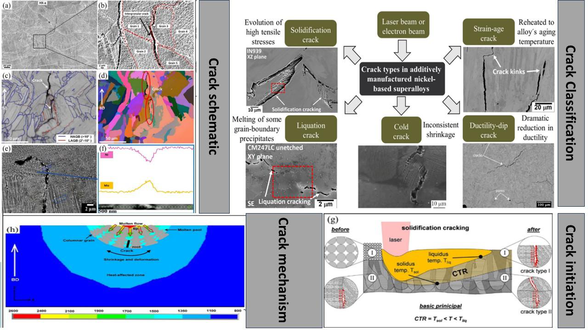

### 페이지 2 전체 이미지

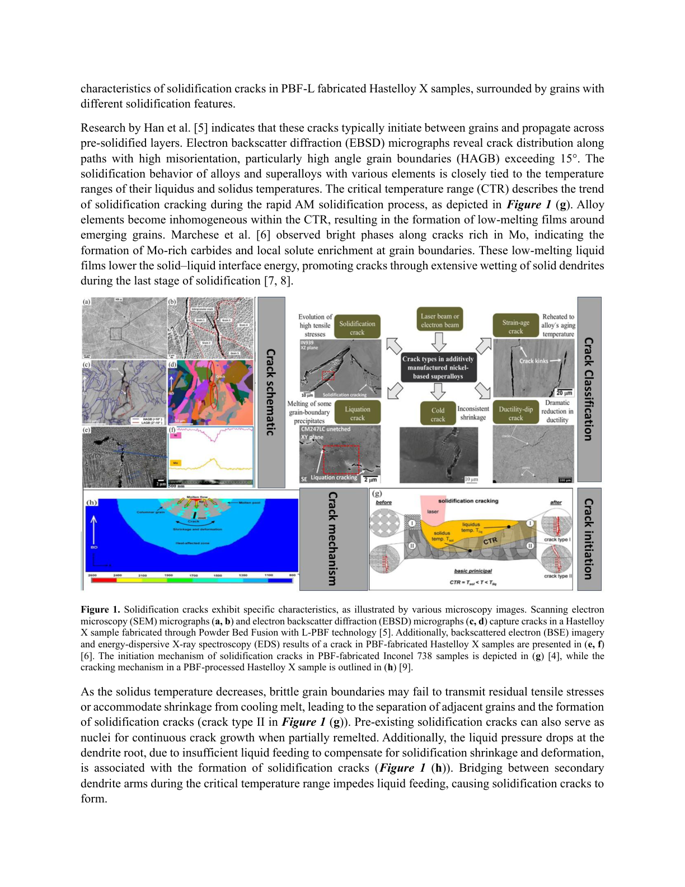

## 페이지 3

The convolutional neural network (CNN) stands out among existing image processing methods as one of
the most capable and promising deep learning approaches for surface classification. Researchers have
commonly employed a CNN-based laser crack detection strategy, integrating it into various applications.
Notably, the selection of polishing parameters has been informed by predictions of surface conditions made
using CNN models. Zhang et al. [10] demonstrated the effectiveness of CNN in predicting and classifying
additive manufacturing (AM) surface images. Their work involved classifying surfaces based on the quality
of hatch line overlaps to ensure the production of high-quality surfaces. Weimer et al. [11] took a similar
approach, developing a deep CNN to automate the detection and classification of defects on machined
surfaces. In this case, the CNN systematically extracted relevant features from the training data, allowing
for accurate prediction of surface defects with minimal human intervention. The study also compared the
performance of various CNN architectures concerning accuracy and computational runtime. Ahmadi et al.
[13] developed a supervised machine learning architecture for digital twin applications, focusing on terrain
segmentation in coastal regions. By leveraging USGS data and deep learning techniques, this research
segments Florida's coastal terrain into distinct classes,a such as water, grassland, and forest, enhancing
digital twin models for better environmental monitoring and urban planning.
Building upon the successes of previous CNN-based techniques, it is acknowledged that these methods
typically demand a considerable amount of labeled image data for accurate predictions. In response to this
challenge, Xiang et al. [12] delved into the development of a semi-supervised CNN model. This innovative
approach is tailored to function effectively even when confronted with limited and low-quality labeled data,
providing a potential solution to challenges linked to data availability and quality, particularly in certain
applications. In the context of this endeavor, the utilization of LabelImg is highlighted as a facilitator in the
process. LabelImg plays a crucial role in simplifying the annotation of images, thereby enhancing the
understanding of objects in the detection process. Additionally, it contributes to the precise weighting of
the region of interest (ROI), enabling a more refined and accurate delineation of the critical elements within
the images. This strategic use of LabelImg contributes to overcoming limitations associated with data
constraints, ultimately bolstering the performance of the semi-supervised CNN model in scenarios where
labeled data is scarce or of lower quality. Ahmadi et al. [24] evaluated SAM and U-Net deep learning
models for detecting concrete cracks. SAM effectively identifies longitudinal cracks through image
segmentation, while U-Net accurately detects spalling cracks by analyzing pixel characteristics. Using both
models together enhances crack detection, which is vital for concrete infrastructure safety and durability.
The primary aim of this study is to utilize LabelImg to annotate objects on surfaces featuring numerous
defects. The selection of LabelImg as the annotation tool is based on its lightweight design and user-friendly
interface, which streamlines the process of labeling object bounding boxes in images. This article provides
an overview of LabelImg, highlighting its utility, and offers guidance on annotating images with ease (as
shown in Figure 2). Recognizing the critical role of image annotation software in computer vision
applications, the guide is structured to aid in the evaluation process, assisting in the identification of the
most suitable software for both current and future projects. We also reviewed and investigated the
application of the segment anything model for defect detection [25], a deeply supervised neural network
for classification [26], nanotechnology for material enhancement [27], and behavior detection using
trajectory data [28]. Furthermore, we explored stochastic methods for environmental event assessment [29],
gradient-based optimization for surface analysis [30], and logistic regression models for drought
characterization [31].
The study specifically concentrates on developing a Convolutional Neural Network (CNN) classifier for
categorizing additive manufacturing (AM) components based on their surface images [14]. This approach
offers a more straightforward and convenient means of automatically identifying surface conditions,
providing valuable insights for decisions regarding crack conditions. While existing polishing methods have

### 페이지 3 전체 이미지

## 페이지 4

proven effective in improving the surface quality of metal AM components, they face inherent limitations,
primarily related to challenges in controlling the polishing process. To address these challenges, LabelImg
is employed in this study to label images based on their geometrical shape, enabling the optimal selection
of bounding boxes and annotation labels. This decision is motivated by the complex shapes and varying
quantities of defects on the surface, each exhibiting different types. Convolutional Neural networks (CNN)
model is used to train and validate the labelled images based on their annotation, bounding boxes and labels.
Figure 2. LabelImg Approach in Training and Sending Feedback.
2. Materials and methods
Convolutional Neural Networks (CNN)
Compared to other machine learning models, a convolutional neural network (CNN) is better equipped for
AM surface classification due to its better efficiency, robustness, and generalization capabilities. CNN is a
deep learning method which uses inter-connected neurons to classify the images into various groups or
categories [15–18]. Each neuron is a computational unit which passes its output to the next layer and so on.
Each inter-neuron connection will have a weight and bias associated with it which are tuned during the
training phase to maximize the classification accuracy [10, 19]. A significant challenge when working with
high-resolution images in CNNs is the demand for higher RAM and the preference for GPU or TPU over
CPU. To address this issue, we initially used LabelImg to extract image annotations based on bounding
boxes and labels (as depicted in Fig). This step reduces dimensionality for CNN usage. Subsequently, the
model was executed on Kaggle utilizing a GPU to accelerate training and leverage a 30GB RAM capacity.
As shown in Figure 2,the extracted annotations, post image preprocessing using OpenCV, incorporate
features such as bounding boxes and label names in the images, preparing them for training and testing
split. Additionally, an image generator function is applied to introduce features in various directions and
conditions, enhancing accuracy in the results. In our tailored architecture, the process of feature extraction
is directed towards the CNN model, depicted in Figure 4. The initial convolution consists of a single layer

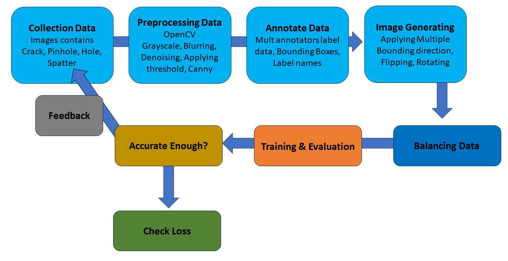

### 페이지 4 전체 이미지

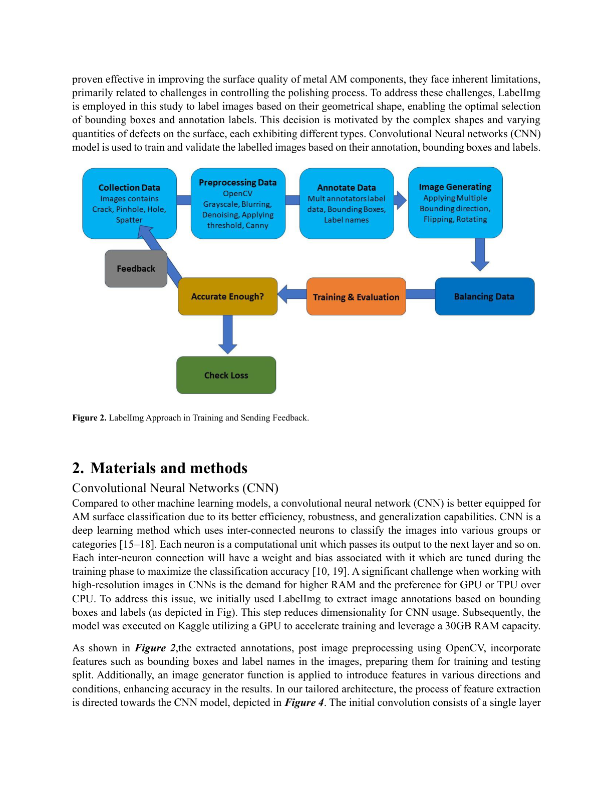

## 페이지 5

that takes the input image. Subsequently, four convolutional layers follow with layer sizes of 64, 512, 512,
and 256, respectively, concluding with a Maxpool layer. These convolutional layers are succeeded by a
maximum pooling layer and a fully connected layer. Each layer utilizes distinct sets of kernels or filters—
matrices that traverse the input data to extract relevant features through dot product operations.
Figure 3. Extracting Annotation by LabelImg (Bounding Boxes + Label).
The input image is resized to 80-by-120 pixels. The final activation layer of the CNN structure employs a
SoftMax function. This function predicts a multinomial probability distribution based on inputs received
from preceding layers. The SoftMax function is expressed as [20]:
𝜎(𝑧⃗)𝑖=
𝑒𝑧𝑖
∑
𝑒𝑧𝑗
𝑘
𝑗=1
where 𝑘 represents the number of classes and 𝑧 is the input to the final layer.
A cross-entropy loss function is employed for training the neural network. If 𝑦̂𝑖 is the predicted class
probability, 𝑦𝑖 is the true class probability, and 𝑘 is the number of responses, the cross-entropy loss function
is defined as:
𝐿𝑜𝑠𝑠= −∑𝑦𝑖. log (𝑦̂𝑖)
𝑘
𝑖=1
The function attains its minimum value when the predicted class probabilities are equal to the true class
probabilities.
Cross-entropy stands out as the preferred loss function for image classification tasks, specifically when
predicting the probability of a class within a set of classes. Its computational efficiency makes it particularly

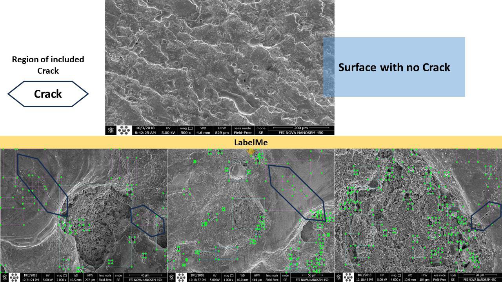

### 페이지 5 전체 이미지

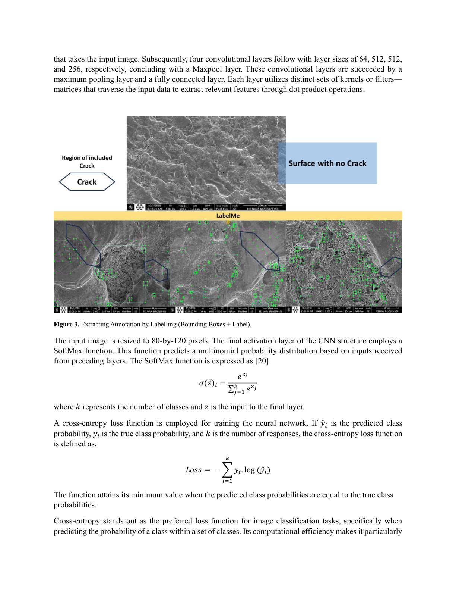

## 페이지 6

well-suited for effectively quantifying the difference between actual and predicted probabilities, even in the
context of large-scale deep networks. The stability of gradients during backpropagation is a crucial factor
in its favor, as incompatible loss functions might generate unstable gradients, leading to training failures.
Furthermore, the cross-entropy function is statistically stable, characterized by its convex nature with a
single minimum, making it robust against minor input noises. This stability contributes to its effectiveness
in training neural networks. The overall summary of the proposed approach is presented in Figure 4.
Figure 4. Schematic of CNN Architecture.
3. Results and Discussion
The assessment of surface crack detection performance in existing literature has primarily relied on private
datasets [17, 21–23]. Notably, there is a lack of a publicly available labeled surface crack dataset that
includes both bounding box and segmentation parameters. To address this gap, the effectiveness of the
proposed architecture is evaluated using a manually collected and labeled dataset specifically tailored for
the task of object detection and segmentation. The process involves the use of the "LabelImg" image
annotation tool to label cracks within images, storing the parameters of the bounding box and segmentation
mask in XML files. These images and associated XML files constitute the training data for the model.
The dataset creation involves the collection and annotation of images to identify surface cracks,
incorporating various elements such as lighting effects, shadows, color variations, and background noise.
OpenCV libraries are utilized to handle these image variations effectively. To enhance the model's
performance, the ImageDataGenerator from TensorFlow is integrated, contributing to a more
comprehensive understanding of crack detection. In total, 14,982 annotated images are gathered,

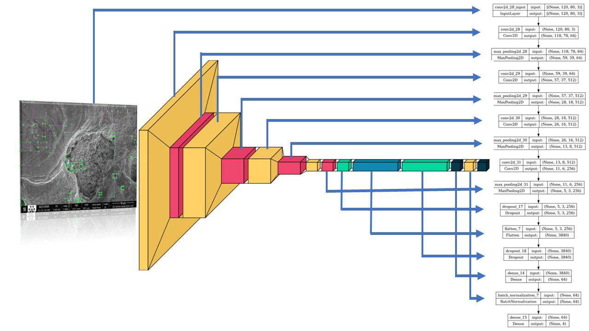

### 페이지 6 전체 이미지

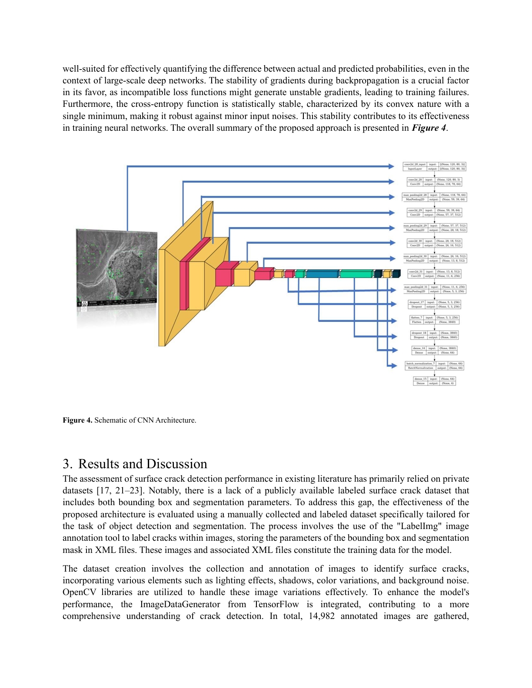

## 페이지 7

subsequently divided into training and test sets to facilitate the detection of surface cracks. This
comprehensive dataset aims to contribute to the advancement of surface crack detection methodologies by
providing a standardized and openly accessible benchmark for evaluating detection algorithms.
Figure 5. Training and Test Datasets.
In contrast to other image-based studies focused on crack detection in additive manufacturing (AM)-built
surfaces, this study eschews the need for explicit feature extraction techniques. This decision stems from
the inherent capability of Convolutional Neural Networks (CNNs) to autonomously learn features by
adjusting the weights of receptive fields during training (LeCun et al., 2012). However, a practical measure
is employed for efficient computation, involving the utilization of mean values from the training dataset
[23]. Furthermore, the study leverages labeled objects provided by LabelImg, facilitating a more accurate
identification of objects compared to relying solely on the model's training. Figure 4 provides a summary
of the training and validation results. The dataset maintains a balanced ratio of crack to intact images at 1:1,
with a training-validation split of 4:1. The training accuracy is calculated from a set of 6,742 images, while
the validation set comprises 20% of the training data. Remarkably, exceptional accuracy is achieved,
reaching the highest values of 99.54% at the 51st epoch for training and 97.95% at the 49th epoch for
validation. The use of two GPUs enhances the training speed, reducing the time required to reach the 100th
epoch by approximately 90 minutes. However, it's worth noting that the estimated running time on a CPU
alone exceeds 6 hours, underscoring the computational efficiency gained through GPU acceleration.
On the contrary, the training loss, as depicted in Figure 6, serves as an assessment of the model's adherence
to the training data, reflecting its capability to capture patterns within the dataset. In contrast, the validation
loss evaluates the model's generalization performance on new, unseen data. The reported values of 0.0033
and 0.0166 for training and validation losses, respectively, signify a heightened accuracy in the fitted
model's representation of the underlying patterns in the datasets. These low loss values indicate a robust
model that not only effectively learns from the training data but also demonstrates promising performance
on previously unseen data, reflecting a capacity for generalization.

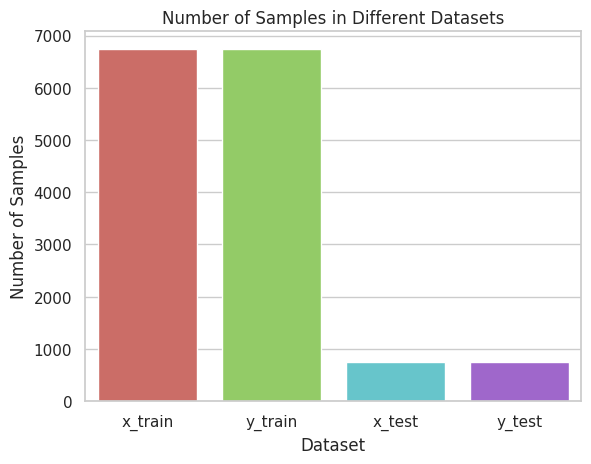

### 페이지 7 전체 이미지

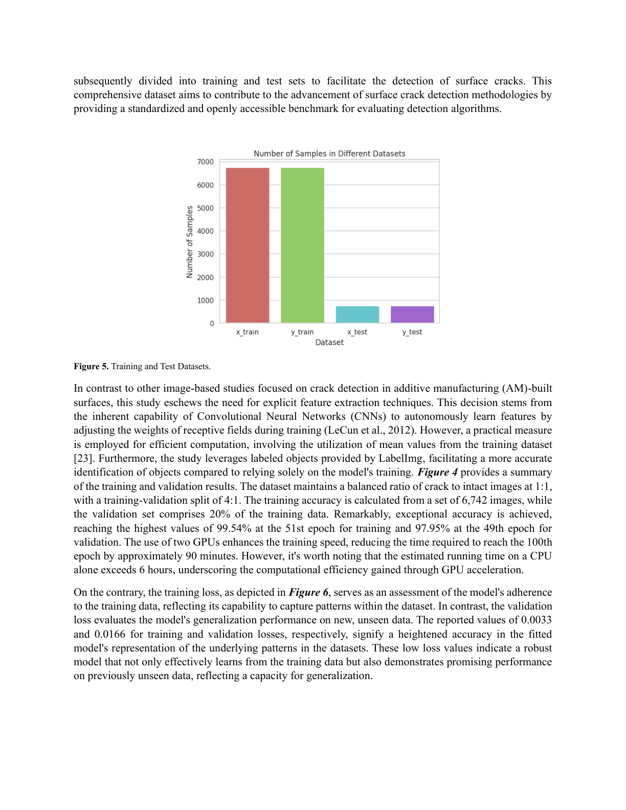

## 페이지 8

Figure 6. Training and Validation Accuracy and Loss per Epoch.
The obtained results from the CNN model demonstrate a highly efficient crack detection performance, as
evidenced by the precision, recall, and F1-score metrics for the "Crack" label, as Table 1. Specifically:
Precision: 0.96 indicates that 96% of instances predicted as "Crack" by the model were indeed true
positives, minimizing false positives.
Recall: 0.98 signifies that the model captured 98% of the actual "Crack" instances, minimizing false
negatives.
F1-score: 0.97, a balanced measure of precision and recall, reinforces the effectiveness of the model in
correctly identifying "Crack" instances.
These metrics collectively suggest that the CNN model excels in efficiently detecting and accurately
classifying of cracks within the dataset. The high precision indicates a low rate of false positives, while the
high recall underscores the model's ability to capture a significant portion of actual crack instances. The
F1-score reflects a harmonious balance between precision and recall, reinforcing the model's overall
efficiency in crack detection.
Table 1. Evaluation of CNN-based Model.
Label
Number
precision
Recall
F1-score
Support
Crack
0
0.96
0.98
0.97
50
Pinhole
1
0.99
1.00
1.00
124
Hole
2
0.99
0.99
0.99
258
Spatter
3
1.00
0.99
1.00
318
Accuracy
0.99
750
Micro Ave
0.99
0.99
0.99
0.99
750
Weighted Ave
0.99
0.99
0.99
0.99
750

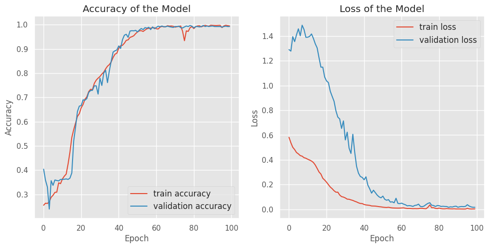

### 페이지 8 전체 이미지

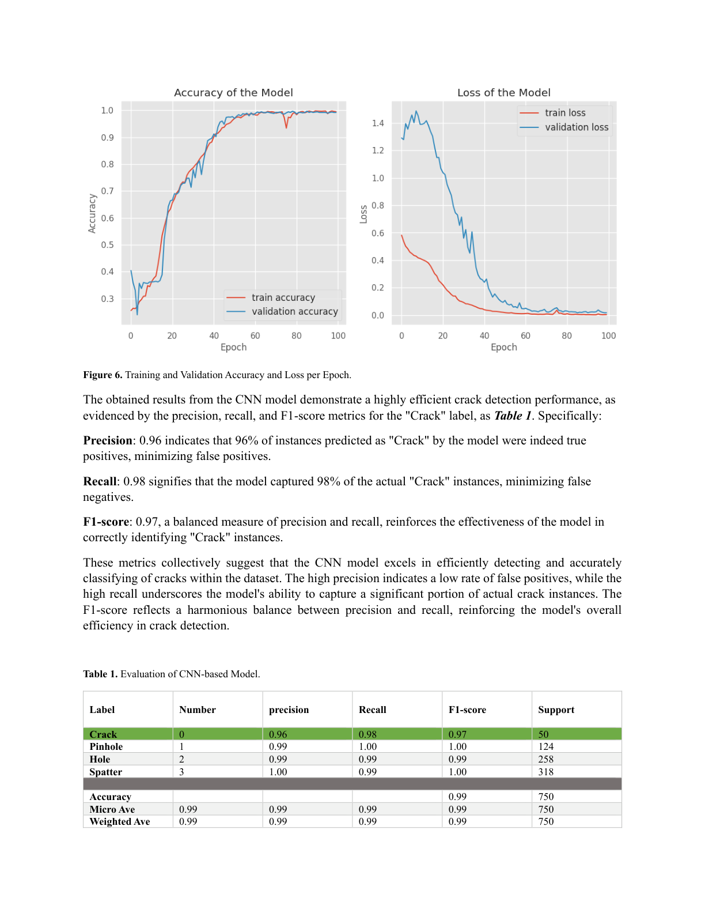

## 페이지 9

4. Conclusion
The study introduces an innovative LabelImg approach to enhance surface defect detection accuracy in
additively manufactured (AM) components using CNN-based intelligence. The Balling phenomena,
associated with crack defects, prompts the application of a CNN-based strategy. After defect labeling, the
annotation (bounding boxes and labels) is separated for training and testing, also serving as feedback for
refining preprocessing hyperparameters. The results emphasize the deep learning approach's effectiveness
in precisely categorizing AM-built surfaces, offering significant time and cost savings in industrial
applications.
a) Successfully training a CNN model to predict AM component surface categories with over 99%
accuracy.
b) The CNN-based model demonstrates complexity in crack types, achieving 96% precision, 98%
recall, and a 97% F1-score. Future investigations may explore crack type separation for enhanced
precision.
c) Balancing datasets substantially improves training and validation, elevating accuracy from 32% to
99%.
d) Evaluation metrics exceeding 96% precision, 98% recall, and a 97% F1-score highlight the
precision and effectiveness of the entire process.
e) LabelImg is recognized as a valuable tool for images with intricate details.
To address the complexity introduced by various crack types, an innovative approach is suggested—
recognizing cracks based on types and applying features and physics of the process. This includes
leveraging thermal energy emitted by lasers for material melting and vaporization, leading to a proposed
physics-informed CNN-based crack detection method for more precise identification. This forward-
thinking approach aims to enhance the model's capabilities and broaden its applicability.
Author contributions Mohsen Asghari Ilani- Design of manuscript, Writing a manuscript and software;
Leila Amini - Writing a manuscript; Hossein Karimi, Maryam Shavali Kuhshuri- Data analysis.
Funding There is no funding details to be mentioned in the manuscript.
Data availability There is no need to mention the availability of data and materials in the present study.
Declarations
Ethical approval There is no ethical approval needed in the present study.
Consent to participate There is no consent to participate needed in the present study.
Consent to Publish There is no consent to publish needed in the present study.
Competing Interests There is no competing interests to be mentioned in the present study.

### 페이지 9 전체 이미지

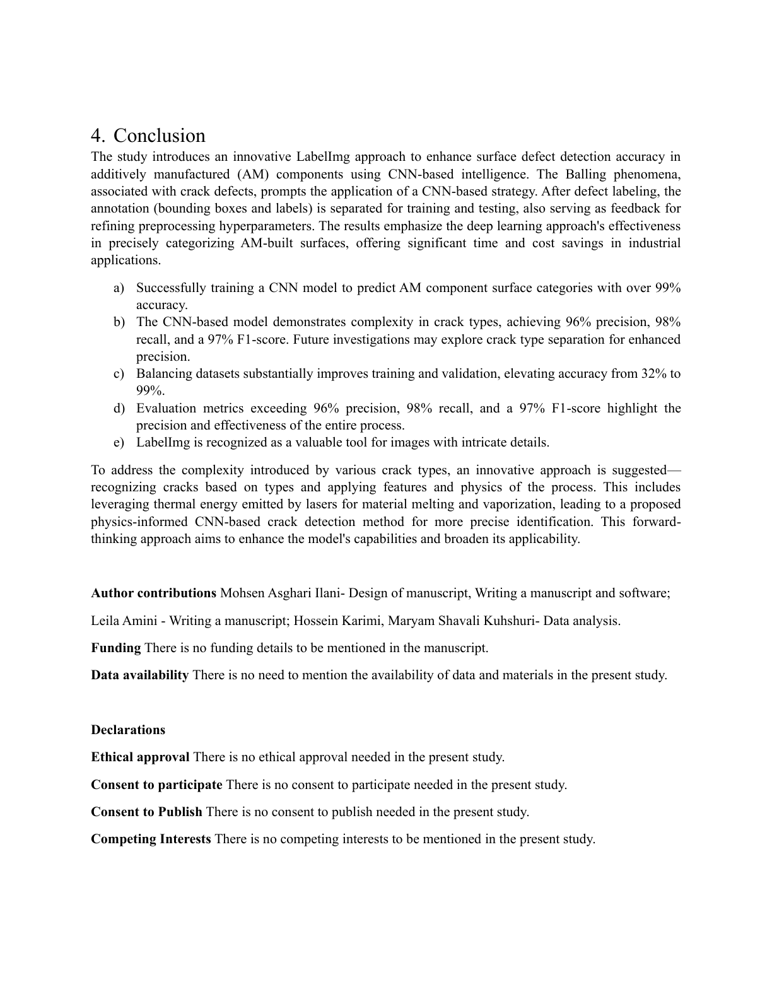

## 페이지 10

Reference
1.
Wei Q, Xie Y, Teng Q, Shen M, Sun S, Cai C. Crack Types, Mechanisms, and Suppression
Methods during High-energy Beam Additive Manufacturing of Nickel-based Superalloys: A
Review. Chinese Journal of Mechanical Engineering: Additive Manufacturing Frontiers.
2022;1:100055. https://doi.org/10.1016/J.CJMEAM.2022.100055.
2.
Ilani MA, Banad YM. Modeling Melt Pool Geometry in Metal Additive Manufacturing Using
Goldak’s Semi-Ellipsoidal Heat Source: A Data-driven Computational Approach. 2024.
3.
Carter LN, Attallah MM, Reed RC. Laser Powder Bed Fabrication of Nickel-Base Superalloys:
Influence of Parameters; Characterisation, Quantification and Mitigation of Cracking. Superalloys
2012. 2012;577–86. https://doi.org/10.1002/9781118516430.CH64.
4.
Cloots M, Uggowitzer PJ, Wegener K. Investigations on the microstructure and crack formation of
IN738LC samples processed by selective laser melting using Gaussian and doughnut profiles.
Mater Des. 2016;89:770–84. https://doi.org/10.1016/J.MATDES.2015.10.027.
5.
Han Q, Gu Y, Soe S, Lacan F, Setchi R. Effect of hot cracking on the mechanical properties of
Hastelloy X superalloy fabricated by laser powder bed fusion additive manufacturing. Opt Laser
Technol. 2020;124:105984. https://doi.org/10.1016/J.OPTLASTEC.2019.105984.
6.
Marchese G, Basile G, Bassini E, Aversa A, Lombardi M, Ugues D, et al. Study of the
Microstructure and Cracking Mechanisms of Hastelloy X Produced by Laser Powder Bed Fusion.
Materials 2018, Vol 11, Page 106. 2018;11:106. https://doi.org/10.3390/MA11010106.
7.
Ilani MA, Khoshnevisan M. Study of surfactant effects on intermolecular forces (IMF) in powder-
mixed electrical discharge machining (EDM) of Ti-6Al-4V. International Journal of Advanced
Manufacturing Technology. 2021;116:1763–82. https://doi.org/10.1007/S00170-021-07569-
3/FIGURES/30.
8.
Ilani MA, Khoshnevisan M. An evaluation of the surface integrity and corrosion behavior of Ti-
6Al-4 V processed thermodynamically by PM-EDM criteria. International Journal of Advanced
Manufacturing Technology. 2022;120:5117–29. https://doi.org/10.1007/S00170-022-09093-
4/FIGURES/18.
9.
Han Q, Mertens R, Montero-Sistiaga ML, Yang S, Setchi R, Vanmeensel K, et al. Laser powder
bed fusion of Hastelloy X: Effects of hot isostatic pressing and the hot cracking mechanism.
Materials Science and Engineering: A. 2018;732:228–39.
https://doi.org/10.1016/J.MSEA.2018.07.008.
10.
Zhang B, Jaiswal P, Rai R, Guerrier P, Baggs G. Convolutional neural network-based inspection of
metal additive manufacturing parts. Rapid Prototyp J. 2019;25:530–40.
https://doi.org/10.1108/RPJ-04-2018-0096/FULL/XML.
11.
Weimer D, Scholz-Reiter B, Shpitalni M. Design of deep convolutional neural network
architectures for automated feature extraction in industrial inspection. CIRP Annals. 2016;65:417–
20. https://doi.org/10.1016/J.CIRP.2016.04.072.
12.
Li X, Jia X, Yang Q, Lee J. Quality analysis in metal additive manufacturing with deep learning. J
Intell Manuf. 2020;31:2003–17. https://doi.org/10.1007/S10845-020-01549-2/METRICS.

### 페이지 10 전체 이미지

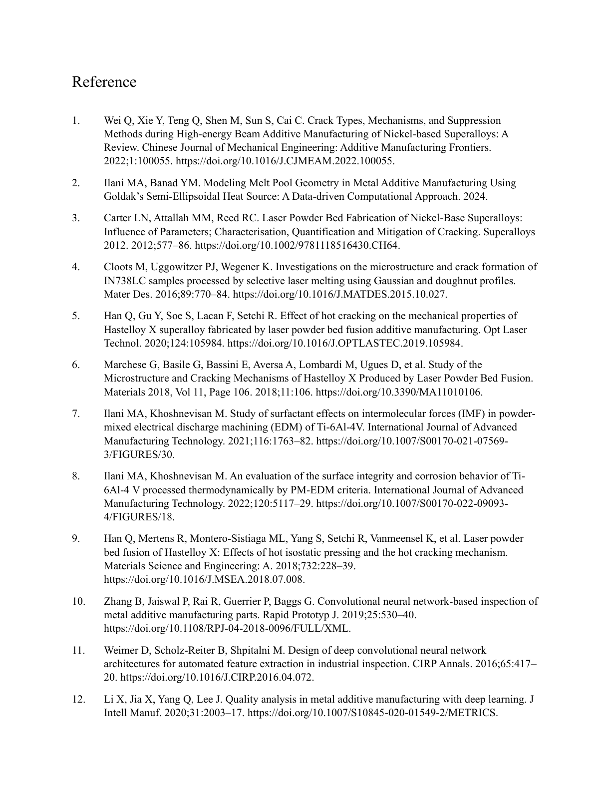

## 페이지 11

13.
Ahmadi, M., Gholizadeh Lonbar, A., Nouri, M., Sharifzadeh Javidi, A., Tarlani Beris, A., Sharifi,
A., & Salimi-Tarazouj, A. (2024). Supervised multi-regional segmentation machine learning
architecture for digital twin applications in coastal regions. Journal of Coastal Conservation, 28(2),
44.
14.
Huu PN, Van DP, Xuan TH, Ilani MA, Trong LN, Thanh HH, et al. Review: enhancing Additive
Digital Manufacturing with supervised classification machine learning algorithms. The
International Journal of Advanced Manufacturing Technology 2024. 2024;1–17.
https://doi.org/10.1007/S00170-024-13781-8.
15.
Wang Z, Liu Q, Chen H, Chu X. A deformable CNN-DLSTM based transfer learning method for
fault diagnosis of rolling bearing under multiple working conditions. Int J Prod Res.
2021;59:4811–25. https://doi.org/10.1080/00207543.2020.1808261.
16.
Li X, Li M, Wu Y, Zhou D, Liu T, Hao F, et al. Accurate screw detection method based on faster
R-CNN and rotation edge similarity for automatic screw disassembly. Int J Comput Integr Manuf.
2021;34:1177–95. https://doi.org/10.1080/0951192X.2021.1963476.
17.
Govindan, K., Asgari, F., Fard, F. S. N., & Mina, H. (2024). Application of IoT technology for
enhancing the consumer willingness to return E-waste for achieving circular economy: A
Lagrangian relaxation approach. Journal of Cleaner Production, 459, 142421.
18.
Hosseini Rad R, Baniasadi S, Yousefi P, Morabbi Heravi H, Shaban Al-Ani M, Asghari Ilani M.
Presented a Framework of Computational Modeling to Identify the Patient Admission Scheduling
Problem in the Healthcare System. J Healthc Eng. 2022;2022.
https://doi.org/10.1155/2022/1938719.
19.
Lemos CB, Farias PCMA, Filho EFS, Conceicao AGS. Convolutional neural network based object
detection for additive manufacturing. 2019 19th International Conference on Advanced Robotics,
ICAR 2019. 2019;420–5. https://doi.org/10.1109/ICAR46387.2019.8981618.
20.
Joshi D, Singh TP, Sharma G. Automatic surface crack detection using segmentation-based deep-
learning approach. Eng Fract Mech. 2022;268:108467.
https://doi.org/10.1016/J.ENGFRACMECH.2022.108467.
21.
Pandian AP, Palanisamy R, Ntalianis K, editors. Proceedings of International Conference on
Intelligent Computing, Information and Control Systems. 2021;1272. https://doi.org/10.1007/978-
981-15-8443-5.
22.
Zou Q, Cao Y, Li Q, Mao Q, Wang S. CrackTree: Automatic crack detection from pavement
images. Pattern Recognit Lett. 2012;33:227–38. https://doi.org/10.1016/J.PATREC.2011.11.004.
23.
Mohtasham Khani M, Vahidnia S, Ghasemzadeh L, Ozturk YE, Yuvalaklioglu M, Akin S, et al.
Deep-learning-based crack detection with applications for the structural health monitoring of gas
turbines. Https://DoiOrg/101177/1475921719883202. 2019;19:1440–52.
https://doi.org/10.1177/1475921719883202.
24.
Ilani MA, Tehran SM, Kavei A, Alizadegan H. Automatic Image Annotation (AIA) of AlmondNet-
20 Method for Almond Detection by Improved CNN-Based Model. 2024.
https://doi.org/10.20944/PREPRINTS202405.1234.V1.

### 페이지 11 전체 이미지

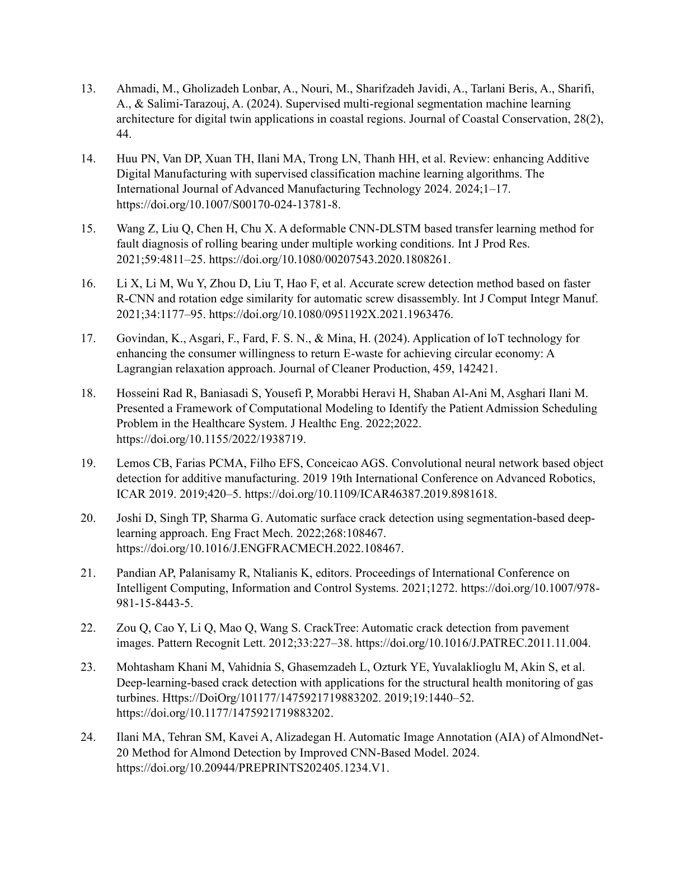

## 페이지 12

25.
Ahmadi, M., Lonbar, A. G., Sharifi, A., Beris, A. T., Nouri, M., & Javidi, A. S. (2023). Application
of segment anything model for civil infrastructure defect assessment. arXiv preprint
arXiv:2304.12600.
26.
Ahmadi, M., Javaheri, D., Khajavi, M., Danesh, K., & Hur, J. (2024). A deeply supervised
adaptable neural network for diagnosis and classification of Alzheimer’s severity using multitask
feature extraction. Plos one, 19(3), e0297996.
27.
Reihanifar, M., Takallou, A., Taheri, M., Lonbar, A. G., Ahmadi, M., & Sharifi, A. (2024).
Nanotechnology advancements in groundwater remediation: A comprehensive analysis of current
research and future prospects. Groundwater for Sustainable Development, 27, 101330.
28.
Ghoreishi, S. G. A., Moshfeghi, S., Jan, M. T., Conniff, J., Yang, K., Jang, J., ... & Zhai, J. (2023,
December). Anomalous behavior detection in trajectory data of older drivers. In 2023 IEEE 20th
International Conference on Smart Communities: Improving Quality of Life using AI, Robotics
and IoT (HONET) (pp. 146-151). IEEE.
29.
Moghim, S., & Takallou, A. (2023). An integrated assessment of extreme hydrometeorological
events in Bangladesh. Stochastic Environmental Research and Risk Assessment, 37(7), 2541-
2561.
30.
Asadi, S., Gharibzadeh, S., Zangeneh, S., Reihanifar, M., Rahimi, M., & Abdullah, L. (2024).
Comparative Analysis of Gradient-Based Optimization Techniques Using Multidimensional
Surface 3D Visualizations and Initial Point Sensitivity. arXiv preprint arXiv:2409.04470.
31.
Hussain, A., Reihanifar, M., Niaz, R., Albalawi, O., Maghrebi, M., Ahmed, A. T., & Danandeh
Mehr, A. (2024). Characterizing Inter-Seasonal Meteorological Drought Using Random Effect
Logistic Regression. Sustainability, 16(19), 8433.

### 페이지 12 전체 이미지

