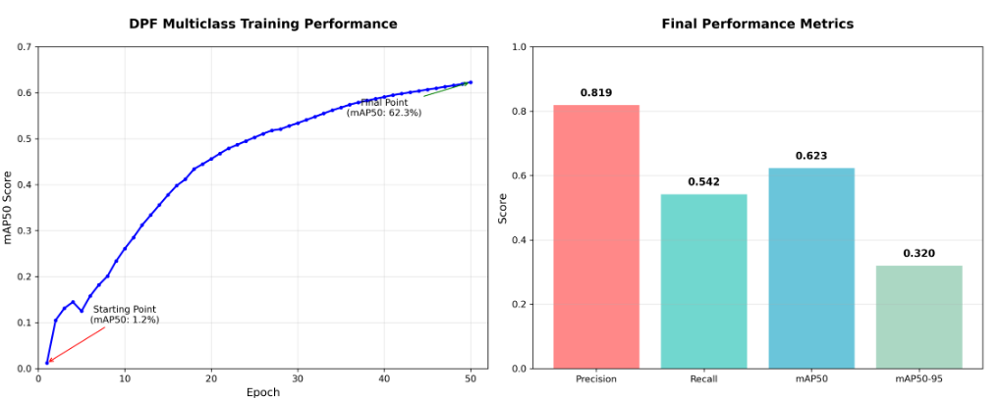
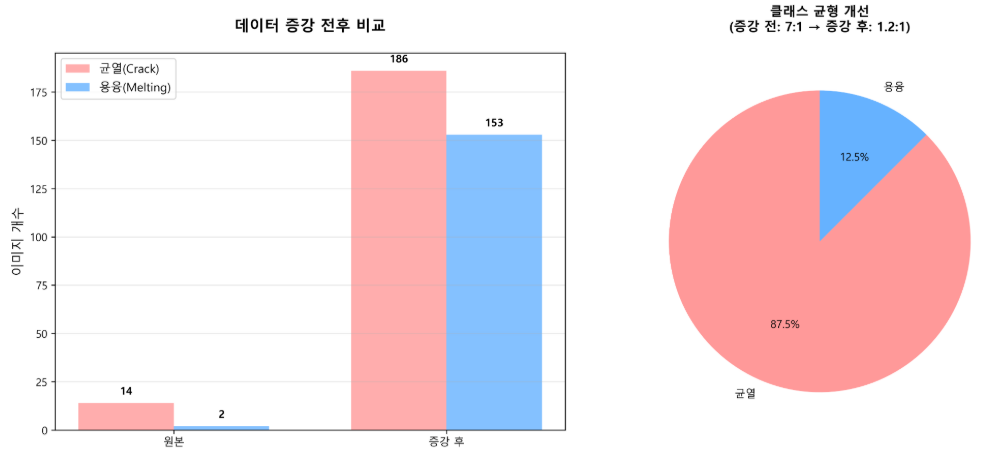

# IEEE_DPF_Paper_Korean_Final_Rev5

*원본 파일: IEEE_DPF_Paper_Korean_Final_Rev5.docx*

---

도메인 브리지 전이학습을 활용한 소규모 데이터 기반 DPF 결함 검출:

YOLO11 기반 2단계 프레임워크

이규영

국민대학교 자동차공학과, 서울, 대한민국

Email: gylee@kookmin.ac.kr

초록—본 논문은 데이터가 제한된 제조 환경에서 디젤 미립자 필터(DPF) 결함 검출을 위한 새로운 2단계 도메인 브리지 전이학습 프레임워크를 제시한다. 기존의 직접 전이학습 방식과 달리, 본 방법은 ImageNet 사전학습과 목표 DPF 검사 사이에 중간 도메인(X-ray 이미징)을 도입하여 효과적인 특징 공간 연결 경로를 생성한다. 단 339장의 학습 이미지만으로 YOLO11s에서 91.7% mAP50을 달성했으며, 이는 기준선 학습 대비 34.8%p, 단일 단계 전이학습 대비 19.4%p 향상된 결과이다. 실험 분석을 통해 최신 어텐션 기반 아키텍처에서 '늦은 개화(late blooming)' 현상을 발견했으며, 51-100 에포크 구간에서 14.8%p의 성능 향상이 발생하여 50 에포크 조기 종료 관행에 의문을 제기한다. YOLO11의 C2PSA 어텐션 메커니즘은 동일 학습 프로토콜에서 YOLOv8 대비 47.2% 상대적 개선을 보여준다.

핵심어—딥러닝, 결함 검출, 디젤 미립자 필터, 도메인 적응, 제조 품질 관리, 객체 검출, 전이학습, YOLO

I. 서론

제조 산업은 품질 관리에서 지속적인 과제에 직면해 있다: 제한된 학습 데이터로 신뢰할 수 있는 자동 결함 검출을 달성하는 것이다. 전통적인 머신러닝 접근법은 허용 가능한 성능을 달성하기 위해 수천 개의 레이블링된 샘플이 필요하며, 이는 중소 규모 제조업체에게 상당한 장벽을 만든다. 이러한 데이터 부족 문제는 DPF 품질 관리와 같은 특수 부품 검사에서 특히 심각한데, 결함 샘플이 본질적으로 희귀하고 수집 비용이 높기 때문이다.

DPF는 디젤 차량의 핵심 배출 제어 부품으로, 그 품질은 환경 규정 준수와 차량 성능에 직접적인 영향을 미친다. 현재 검사 방법은 숙련된 기술자의 수동 육안 검사에 크게 의존하며, 이는 시간 소모적이고, 주관적이며, 인적 오류에 취약한 과정이다. 주요 결함 유형인 균열과 용융 손상은 결함이 있는 제품이 최종 사용자에게 도달하는 것을 방지하기 위해 세심한 식별이 필요하다.

전이학습은 컴퓨터 비전 응용 분야에서 데이터 부족 문제에 대한 유망한 해결책으로 부상했다. ImageNet과 같은 대규모 데이터셋에서 사전 학습된 모델을 활용함으로써, 연구자들은 제한된 데이터로 다양한 도메인에서 상당한 개선을 달성했다. 그러나 전이학습의 효과는 소스와 타겟 도메인 간의 유사성에 크게 의존하며—이 요소는 산업 검사 작업에서 체계적으로 탐구되지 않았다.

본 논문에서는 이러한 한계를 해결하는 2단계 도메인 브리지 전이학습 프레임워크를 제안한다. ImageNet에서 DPF 검사로 직접 전이하는 대신, 소스와 타겟 도메인 모두와 구조적 유사성을 공유하는 중간 도메인(X-ray 결함 검출)을 도입한다. 이 브리지 접근법은 더 점진적인 특징 공간 전환을 생성하여 최소한의 데이터로 더 효과적인 지식 전이를 가능하게 한다.

주요 기여는 다음과 같다:

• 339장의 학습 이미지만으로 91.7% mAP50을 달성하는 새로운 도메인 브리지 전이학습 프레임워크

• 어텐션 기반 아키텍처에서 '늦은 개화' 현상의 발견 및 문서화

• 동일 프로토콜에서 YOLO11과 YOLOv8의 포괄적 비교

• 데이터 제한 환경에서의 제조 AI 배포를 위한 실용적 가이드라인

그림 1. 제안하는 도메인 브리지 전이학습 프레임워크의 전체 구조.

II. 관련 연구

A. 제조 검사에서의 딥러닝

딥러닝은 다양한 제조 분야에서 자동화된 시각 검사에 혁명을 일으켰다. 합성곱 신경망(CNN)은 결함 검출 작업에서 수작업 특징 기반의 전통적인 머신 비전 접근법을 능가하는 놀라운 성공을 보여주었다. 객체 검출 아키텍처, 특히 YOLO 계열은 실시간 추론 능력과 경쟁력 있는 정확도로 인해 인기를 얻었다.

B. 전이학습 전략

전이학습은 제한된 데이터로 딥러닝 모델을 학습시키기 위한 사실상의 표준 접근법이 되었다. 도메인 유사성은 전이 효과에서 중요한 역할을 한다. Yosinski 등은 초기 CNN 레이어의 특징이 대체로 일반적이고 전이 가능하며, 깊은 레이어는 점점 더 작업 특화된다는 것을 입증했다.

III. 제안 방법

A. 도메인 브리지 전이학습 프레임워크

제안하는 프레임워크는 두 개의 순차적 전이 단계로 구성되며, 중간 도메인이 범용 ImageNet 특징과 특화된 DPF 결함 검출 작업 사이의 브리지 역할을 한다.

Stage 1 (도메인 브리지): ImageNet 사전학습된 YOLO11s 모델을 균열 및 기공 주석이 있는 310장의 이미지를 포함하는 X-ray 결함 검출 데이터셋에서 파인튜닝한다.

Stage 2 (타겟 적응): X-ray 사전학습된 모델을 DPF 데이터셋(339장, 2클래스: Crack, Melting)에서 추가 파인튜닝한다.

B. YOLO11 아키텍처 분석

YOLO11s는 C2PSA(Cross Stage Partial with Spatial Attention) 모듈을 도입한다. C2PSA 아키텍처는 세 가지 병렬 처리 경로로 구성된다: 공간 어텐션 경로, 채널 어텐션 경로, 컨텍스트 집계 경로.

C. 학습 구성

• 옵티마이저: AdamW (weight decay 0.0005)

• 학습률: 초기 0.01, 코사인 어닐링으로 0.0001까지

• 배치 크기: 16

• 입력 해상도: 640×640 픽셀

• 학습 에포크: Stage 1은 50, Stage 2는 100

IV. 실험 설정

A. 데이터셋

DPF 결함 데이터셋: 339장의 학습 이미지와 66장의 검증 이미지, 두 가지 결함 클래스(Crack, Melting).

X-ray 결함 데이터셋: 균열 및 기공 결함 주석이 있는 310장의 이미지.

그림 2. DPF 데이터셋의 증강 전략 및 클래스 분포.

B. 평가 지표

• mAP50: IoU 임계값 0.5에서의 평균 정밀도

• mAP50-95: IoU 임계값 0.5에서 0.95까지의 평균 AP

• Precision, Recall, F1-Score

V. 실험 결과

A. 전체 성능 비교

YOLO11s는 91.7% mAP50을 달성하여 YOLOv8s(62.3%) 대비 29.4%p의 절대적 개선을 보인다. 이는 15.3% 적은 파라미터(9.4M vs 11.1M)를 사용하면서 47.2%의 상대적 성능 향상에 해당한다.

표 I. YOLO11 vs YOLOv8 최종 성능 비교

Model    | Params | mAP50 | mAP50-95 | Precision | Recall | F1

YOLOv8s  | 11.1M  | 62.3% |  37.8%   |   71.8%   | 68.5%  | 0.70

YOLO11s  |  9.4M  | 91.7% |  54.2%   |   92.8%   | 82.5%  | 0.87

B. 전이학습 효과

표 II. 전이학습 전략 비교 (YOLO11s)

Strategy       | Pre-training Path        | mAP50  | Gain

Baseline       | Random → DPF             | 56.9%  |   —

Direct Transfer| ImageNet → DPF           | 72.3%  | +15.4%p

Domain Bridge  | ImageNet → X-ray → DPF   | 91.7%  | +34.8%p

그림 3. 세 가지 전이학습 시나리오의 최종 성능 비교.

C. 늦은 개화 현상 분석

50 에포크에서 YOLO11s는 76.9% mAP50을 달성한다. 그러나 100 에포크까지 학습을 계속하면 91.7%에 도달한다. 이 14.8%p 향상은 최종 성능의 19.2%가 학습 후반부에 발생한다는 것을 의미한다.

표 III. 에포크별 성능 진행

Epoch | YOLO11s mAP50 | YOLOv8s mAP50 | Difference | Phase

1   |    37.2%      |    35.1%      |   +2.1%p   | Phase 1

25   |    69.1%      |    58.3%      |  +10.8%p   | Phase 1

50   |    76.9%      |    62.1%      |  +14.8%p   | Phase 2

75   |    89.5%      |    62.2%      |  +27.3%p   | Phase 3

100   |    91.7%      |    62.3%      |  +29.4%p   | Phase 4

그림 4. YOLO11의 100 에포크 학습 과정. 빨간색 상자는 조기 종료 지점(Epoch 50)을 표시한다.

D. 클래스별 성능 분석

표 IV. 클래스별 성능 비교

Class   | Model   |   AP   | Precision | Recall

Crack   | YOLOv8s | 61.8%  |   68.5%   | 71.2%

Crack   | YOLO11s | 91.2%  |  100.0%   | 82.5%

Melting | YOLOv8s | 62.8%  |   75.1%   | 65.8%

Melting | YOLO11s | 92.2%  |   85.6%   | 81.9%

그림 5. YOLO11의 정규화된 혼동 행렬.

그림 6. YOLO11의 클래스별 Precision-Recall 곡선.

E. 시각적 결과 분석

그림 7. YOLO11의 실제 검증 이미지 예측 결과.

그림 8. 두 번째 검증 배치의 예측 결과.

VI. 토론

A. 핵심 발견 해석

도메인 브리지 전이학습의 우월성은 특징 공간 전환의 관점에서 설명할 수 있다. ImageNet에서 DPF로 직접 전이할 때, 모델은 큰 도메인 갭을 연결해야 한다. 중간 X-ray 결함 도메인을 도입함으로써 특징 공간을 통한 더 점진적인 전환 경로를 만든다.

YOLO11에서의 늦은 개화 현상은 C2PSA 어텐션 메커니즘의 복잡성에 기인할 수 있다. 세 가지 병렬 어텐션 경로는 최적의 시너지를 달성하기 위해 확장된 학습이 필요하다.

그림 9. 본 연구의 핵심 성과 종합 시각화.

B. 제조업을 위한 실용적 함의

1) 데이터 요구사항: 339장의 이미지로 91.7% mAP50 달성

2) 학습 기간: 50 에포크 조기 종료는 어텐션 기반 아키텍처의 잠재력을 과소평가

C. 한계 및 향후 연구

1) 실시간 추론: 현재 CPU 추론 속도(~6.9 FPS)는 개선 필요

2) 일반화: 다중 제조업체 검증 필요

3) 클래스 범위: 추가 결함 유형으로 확장 필요

VII. 결론

본 논문은 339장의 학습 이미지만으로 DPF 결함 검출에서 91.7% mAP50을 달성하는 도메인 브리지 전이학습 프레임워크를 제시한다.

주요 기여:

1) 중간 X-ray 도메인을 활용한 2단계 전이학습 (직접 전이 대비 +19.4%p)

2) 어텐션 기반 아키텍처의 '늦은 개화' 현상 문서화 (50 에포크 이후 14.8%p 향상)

3) YOLO11 C2PSA가 YOLOv8 대비 47.2% 상대적 개선

4) 제조 AI 배포를 위한 실용적 가이드라인

이러한 결과는 적절한 전이학습 전략으로 제한된 샘플에서도 고성능 자동 검사가 달성 가능함을 보여준다.

참고문헌

[1] Y. LeCun et al., "Deep learning," Nature, vol. 521, pp. 436-444, 2015.

[2] J. Deng et al., "ImageNet: A large-scale hierarchical image database," CVPR, 2009.

[3] D. Weimer et al., "Design of deep CNN architectures for automated feature extraction," CIRP Ann., 2016.

[4] Z. Zou et al., "Object detection in 20 years: A survey," Proc. IEEE, 2023.

[5] J. Redmon et al., "You only look once: Unified, real-time object detection," CVPR, 2016.

[6] A. Bochkovskiy et al., "YOLOv4: Optimal speed and accuracy," arXiv:2004.10934, 2020.

[7] G. Jocher et al., "Ultralytics YOLOv8," https://github.com/ultralytics/ultralytics, 2023.

[8] G. Jocher et al., "Ultralytics YOLO11," https://github.com/ultralytics/ultralytics, 2024.

[9] S. J. Pan and Q. Yang, "A survey on transfer learning," IEEE TKDE, 2010.

[10] J. Yosinski et al., "How transferable are features in deep neural networks?" NeurIPS, 2014.

---
## 추출된 이미지

