# LoHi_WELD_Dataset_Paper

*원본 파일: LoHi-WELD_A_Novel_Industrial_Dataset_for_Weld_Defect_Detection_and_Classification_a_Deep_Learning_Study_and_Future_Perspectives.pdf*

---

## 페이지 1

Received 12 April 2024, accepted 23 May 2024, date of publication 29 May 2024, date of current version 7 June 2024.
Digital Object Identifier 10.1109/ACCESS.2024.3407019
LoHi-WELD: A Novel Industrial Dataset for Weld
Defect Detection and Classification, a Deep
Learning Study, and Future Perspectives
SYLVIO BIASUZ BLOCK
1, RICARDO DUTRA DA SILVA
1,
ANDRE EUGNIO LAZZARETTI
2, (Member, IEEE),
AND RODRIGO MINETTO
1, (Member, IEEE)
1Department of Computing, Federal University of Technology–Paraná (UTFPR), Curitiba 3165, Brazil
2Department of Electrical Engineering, Federal University of Technology–Paraná (UTFPR), Curitiba 3165, Brazil
Corresponding author: Rodrigo Minetto (rminetto@utfpr.edu.br)
This work was supported in part by the National Council for Scientific and Technological Development [Conselho Nacional de
Desenvolvimento Científico e Tecnológico (CNPq)] under Grant 312815/2023-9 and Grant 306569/2022-1 and in part by
Fundação Araucária (FA).
ABSTRACT The automated inspection of weld beads is of great importance for many industrial processes.
Failures may cause a loss of mechanical resistance of the weld bead and compromise the manufactured
part. Several methods have been proposed in the literature to address this problem, and recently, methods
based on deep learning have gained prominence in terms of performance and applicability. However, such
methods require vast and reliable datasets for different real defects, which have yet to be available in recent
literature. Hence, this paper presents LoHi-WELD, an original and public database to address the problem of
weld defect detection and classification of four common types of defects — pores, deposits, discontinuities,
and stains — with 3,022 real weld bead images manually annotated for visual inspection, composed by low
and high-resolution images, acquired from a Metal Active Gas robotic welding industrial process. We also
explore variations of a baseline deep architecture for the proposed dataset based on a YOLOv7 network and
discuss several case analyses. We show that a lightweight architecture, ideal for industrial edge devices, can
achieve up to 0.69 of mean average precision (mAP) considering a fine-grained defect classification and
0.77 mAP for a coarse classification. Open challenges are also presented, promoting future research and
enabling robust solutions for industrial scenarios. The proposed dataset, architecture, and trained models are
publicly available on https://github.com/SylvioBlock/LoHi-Weld.
INDEX TERMS Weld defect detection and classification, deep learning, gas metal arc welding (GMAW),
metal active gas welding (MAG), weld bead industrial, public dataset.
I. INTRODUCTION
Welding inspection is a critical process that evaluates
the quality of welded joints by looking for defects or
discontinuities. It involves various techniques and methods
depending on the inspection objectives, weld type, and
material properties. There are two main categories of welding
testing: those based on destructive methods and those based
on non-destructive methods.
The associate editor coordinating the review of this manuscript and
approving it for publication was Krishna Kant Singh
.
Destructive inspection relies on removing a sample of
the welded joint and subjecting it to various tests to
evaluate its quality. Tensile testing, bend testing, and Charpy
impact testing are the most common destructive tests. Non-
destructive inspection (NDI) techniques evaluate the welded
joint quality without damaging or altering it. NDI methods
are more frequently applied, for they are less expensive,
less time-consuming, and more convenient. As observed
by Thompson and Chimenti [1], the most common NDI
methods are visual testing, radiographic testing, ultrasonic
testing, magnetic particle testing, and liquid penetrant testing.
Visual testing by a human specialist is the simplest and most
77442
2024 The Authors. This work is licensed under a Creative Commons Attribution-NonCommercial-NoDerivatives 4.0 License.
For more information, see https://creativecommons.org/licenses/by-nc-nd/4.0/
VOLUME 12, 2024

### 페이지 1 전체 이미지

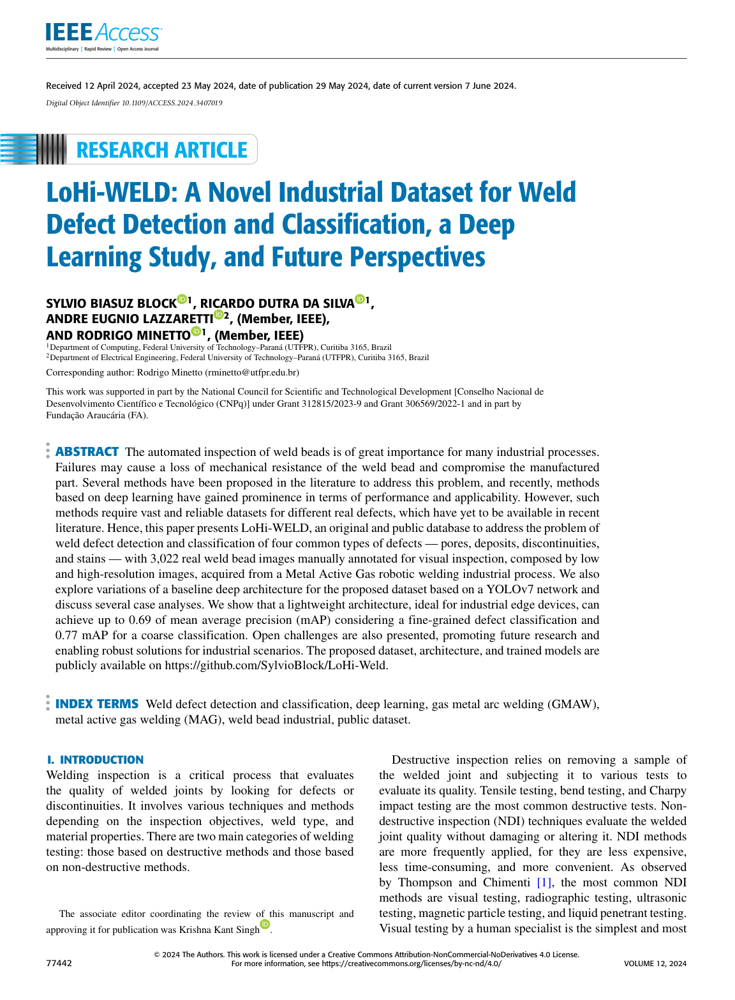

## 페이지 2

S. B. Block et al.: LoHi-WELD: A Novel Industrial Dataset
cost-effective NDI method, as it requires a trained inspector to
examine the weld. Radiography uses X-rays or gamma rays to
create an image of the welded joint, which can reveal internal
defects. Ultrasonic testing uses high-frequency sound waves
to detect flaws within the welded joint. Magnetic particle
testing detects surface and near-surface defects by applying
a magnetic field and observing the behavior of the magnetic
particles. Liquid penetrating testing detects surface defects by
applying a penetrating fluid that seeps into any cracks or pores
and removing it to examine the part under UV light.
For this research, we collected 3,022 real weld bead images
for visual inspection with an industrial partner. The weld
beads are obtained from a gas metal arc welding (GMAW)
process that uses an electrical arc, operated by a robot arm,
as an energy source to melt and fuse material into a joint
between two pieces of metal, as shown in Fig. 1. This
technique is used when joining two or more parts requires
great structural rigidity.
FIGURE 1. The weld beads of the proposed dataset were obtained from a
GMAW process, by using a metal active gas (MAG), with a carbon
magnesium steel (Mn/si alloy) wire, in steel sheet Dc04 (1.2mm
thickness). Image credits: Wikimedia Commons.
The compiled dataset is unique in terms of weld defects
as it was collected during an initial batch of fine-tuning tests
of the welding machine, and, as a consequence, there is a
considerable amount of defects, which are, many times, very
difficult to obtain in a sufficient quantity to carry out machine
learning training. In this paper, we explore four types of weld
defects, namely: pores, which are small fill gaps that occur
due to air bubbles in the process of melting the weld material;
deposits, an excess of welding material along the weld bead;
discontinuities, a partial absence of weld material along the
bead, forming regions with lack of expected thickness; and
stains, a slight alteration in the surface of the weld (a surface
defect), that may indicate a possible structural problem below
the surface of the bead. Image samples showing these defects
are shown in Fig. 2.
The main contributions of this paper can be summarized
as follows: (i) a novel dataset, referred here as LoHi-WELD,
composed of 3,022 images of regions containing real weld
beads and spanning more than 22,000 weld defects, one of
the largest in number of defects to the best of our knowledge;
the dataset is divided into low resolution images (lweld
dataset) and high resolution images (hweld dataset); it is
also associated with manual annotations of four categories of
defects for research purposes; (ii) an experimental evaluation
FIGURE 2. Different types of welding defects highlighted in red. A pore is
rarely an isolated occurrence, it is more likely there are groups of pores,
as the ones highlighted in pink (a).
of a state-of-the-art deep network, YOLOv7 [2], from 2022,
used as an architecture baseline to explore the proposed
dataset by comparing the results of a tiny architecture model
(YOLOv7-tiny), developed to run on edge devices with
limited computational resources, with those of a higher
computational cost model (YOLOv7); moreover, we evaluate
the impact of different parameters, such as image size and
data augmentation for the considered deep networks; and,
(iii) we explored cross-dataset experiments – a model trained
for low resolution weld images was used for inference
in high resolution weld images (and vice versa) – and
fusion, by combining the lweld and hweld datasets. These
contributions emerge from a comprehensive review of NDI
methods for weld defect inspection, presented in this paper,
that was organized into two branches of artificial intelligence
techniques widely used for this purpose (handcrafted and
deep learning methods), categorized by the sensor type used
during the image acquisition, and supplemented by a dataset
overview table, that indicates the weld defects addressed,
dataset size, total number of defects, availability, etc. As a
result of the comprehensive review and the contributions
presented in this paper, we draw some perspectives for future
research on the topic, as it is expected that the largest number
of real defects in the dataset is a step further towards the
improvement of other approaches.
The remainder of this paper is organized as follows.
In Section II, we systematically review NDI methods and
datasets for weld defect recognition. The proposed weld
defect dataset is detailed in Section III. The architecture
baseline is described in Section IV, and the experimental
evaluation is reported in Section V. Section VI points out
some future research directions. Finally, conclusions are
provided in Section VII.
II. RELATED WORK
Proposed methods closely related to the inspection of weld
defects range from those depending on multiple sensors
(audio and electric current) [3], [4], [5]; to more specific
VOLUME 12, 2024
77443

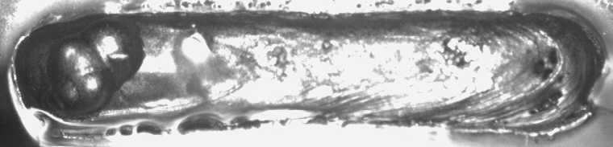

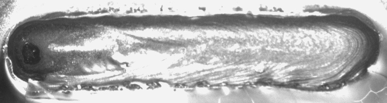

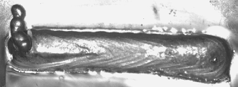

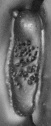

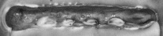

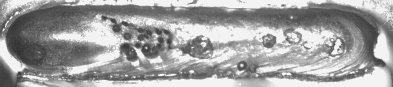

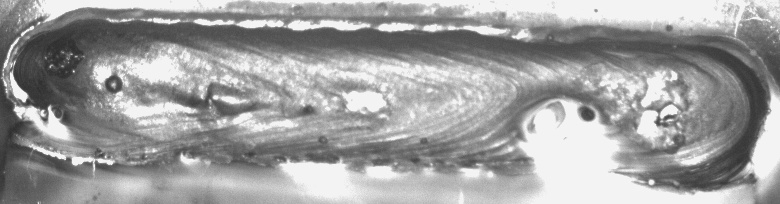

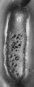

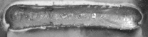

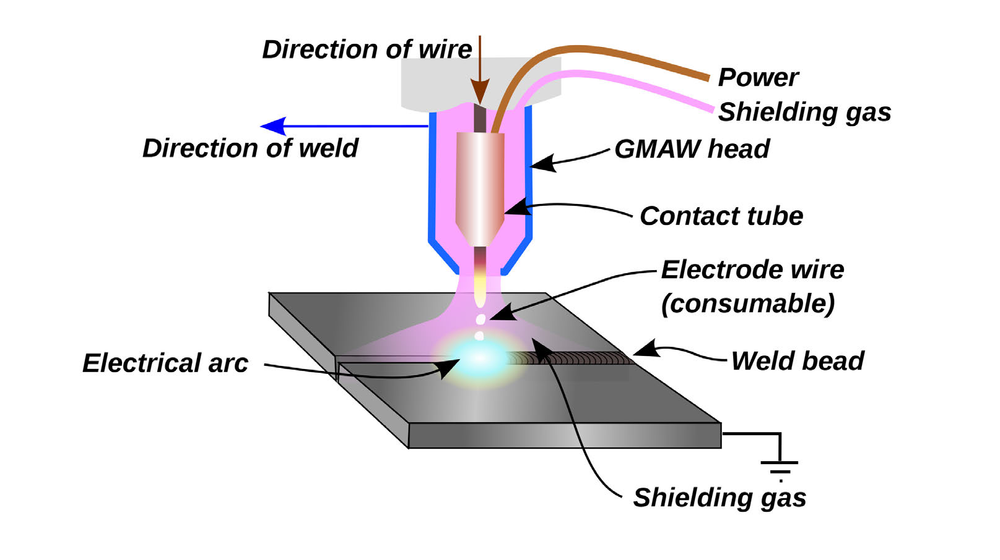

### 페이지 2 전체 이미지

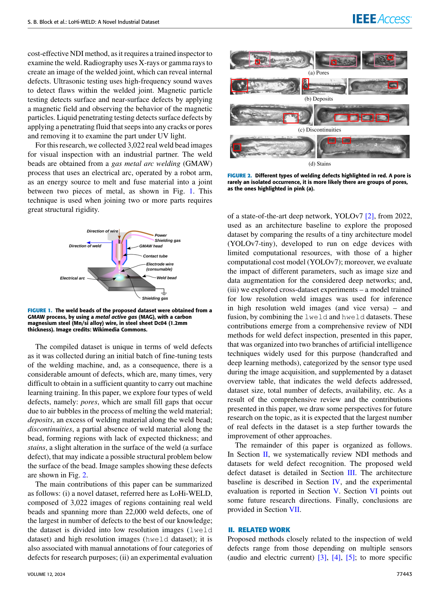

## 페이지 3

S. B. Block et al.: LoHi-WELD: A Novel Industrial Dataset
sensors, such as laser [6], ultrasound [7] and spectrum
components [8]. An early method was even proposed to
predict failures by learning welding process parameters [9].
In particular, we focus on techniques based on image
processing techniques and machine learning, which are
mostly NDI methods. We categorize the methods according
to the main techniques used – handcrafted or deep features –
and according to the processed data – mostly X-ray and
visible spectrum images. As shown in Fig. 3, handcrafted
methods were dominant before 2020. Since then, deep
learning techniques prevail, with NDI methods using CNNs
(Convolutional Neural Networks) and derived architectures,
such as GAN (Generative Adversarial Network) and Trans-
former. Table 1 complements and details the most recent and
relevant works that employ images as input data. To clearly
present and substantiate our contributions, some of those
works are detailed as follows.
We initially consider works based on X-ray data to analyze
Table 1 more objectively. A wide range of datasets and
classified faults can be observed, from significantly reduced
(e.g., [40]) to more extensive datasets (e.g., [41]). Works [39]
and [48] stand out, where up to 14 faults can be classified,
and, in [48], the defect regions are also segmented. Defects
such as cracks, lack of fusion, and lack of penetration are the
most evaluated. This may be related to these defects being
more evident in industrial radiographs [53]. An interesting
aspect of this group of works is the existence of a public
dataset for comparing results: GDXRay [54]. The dataset has
a wide range of defects. However, it presents a significant
imbalance and a relatively low number of images (less than
200 per class), which is particularly undesirable for models
based on deep learning.
Despite relevant results on the fronts of detection, classi-
fication, and segmentation, methods based on X-Ray images
have some limitations, such as (i) the need of an apparatus
for acquiring radiographic images on the production line;
(ii) the main focus of the works is on reducing the effect of
imbalance present in most datasets; (iii) despite presenting
detailed comparisons with the literature, they are, in most
cases, limited to the public GDXRay dataset; and (iv) there
is a lack of initiatives to build publicly available, more
comprehensive, and less unbalanced datasets.
Regarding visual methods, with grayscale or RGB images,
one can observe handcrafted and deep learning-based
approaches achieving state-of-the-art results. Generally, the
number of defects evaluated in visual methods is inferior to
those based on X-Ray images, however, due to the simplicity
of data acquisition, the average number of images is superior.
Similar to methods based on radiography, there are few
publicly available datasets. Notably, the datasets NEU-DET,
DeepPCB, KolektorS, DAGM2007, and Real-world Glass
Bottle, used in [51], are not explicitly designed for weld
defects. Others, as observed in [36], are designed for specific
industrial applications, such as printed circuit boards.
For handcrafted methods, one can emphasize the approach
presented in [3] and [17]. Different image processing stages
are applied to the image before extracting the features
for the classifiers. The main limitation of these methods
is the explicitness of the solution, typically well-adjusted
for a specific scenario of image acquisition, limiting the
generalization of the model for noisier scenarios or for
different conditions of data collection. In addition, pre-
processing considers specific aspects of the collected images
and cannot always be used in other contexts.
On the other hand, CNN-based methods can improve
generalization and present more generic solutions for dif-
ferent lines and products. In [24], the authors presented
methods based on the DenseNet to detect and classify
welding defects, known as blow holes, lack/excess of
material, misalignment, and thin/large joints. The methods
were expected to be adaptable to changes in the production
line. They reported achieving an accuracy of 96.30% in
classifying defects, even though the authors had to add
transfer learning and handcrafted techniques, such as image
filtering, to help overcome retraining samples’ limitations
due to scenario changes. Similarly, in [43], the researchers
proposed a semantic segmentation of weld contours. The
research includes detecting weld metal, background, and
defects (cracks and pores) using a pre-trained neural network.
The study produced a high-definition dataset containing
282 images for semantic segmentation models.
Deep learning methods have recently focused on GANs
and Visual Transformers (ViT). The work [32] proposed to
use a GAN to detect anomalies — patterns in data that do
not conform to a well-defined notion of normal behavior,
as defined in [55] – in a nuclear-fusion experiment known
as JET (Joint European Torus), which may suffer with weld
cracks, melting, and debris, where the goal was to model
the normal samples behavior using an adversarial training
and detecting the anomalies by using an anomaly pixel-wise
score. A similar approach was recently employed in [51]. The
ViT model was used by [49] for the task of automatic welding
penetration recognition in a robotic system. The authors
trained ViT models from scratch with different architectures
and showed the influence of model parameters in the
recognition performance. They also used transfer learning
from ViT architectures trained for ImageNet to address the
issue of modeling complexity and lack of training data.
The ViT model outperformed other CNN architectures in
classifying four penetration states: incomplete fusion, partial
penetration, full penetration, and excessive penetration. The
authors tested their ViT model in 42,229 gray-scale weld pool
images. Hybrid methods that combines wavelet features with
CNN are also described [5].
Although recent approaches point to visual images and
deep learning methods, currently available public datasets
still need to provide real and comprehensive cases to
validate weld defects detection and classification properly.
Furthermore, none of them have a specific annotation for
detecting defects in the image. Finally, resolution issues
for identifying defects still need to be addressed and
detailed in recent work on this subject. In this sense, this
77444
VOLUME 12, 2024

### 페이지 3 전체 이미지

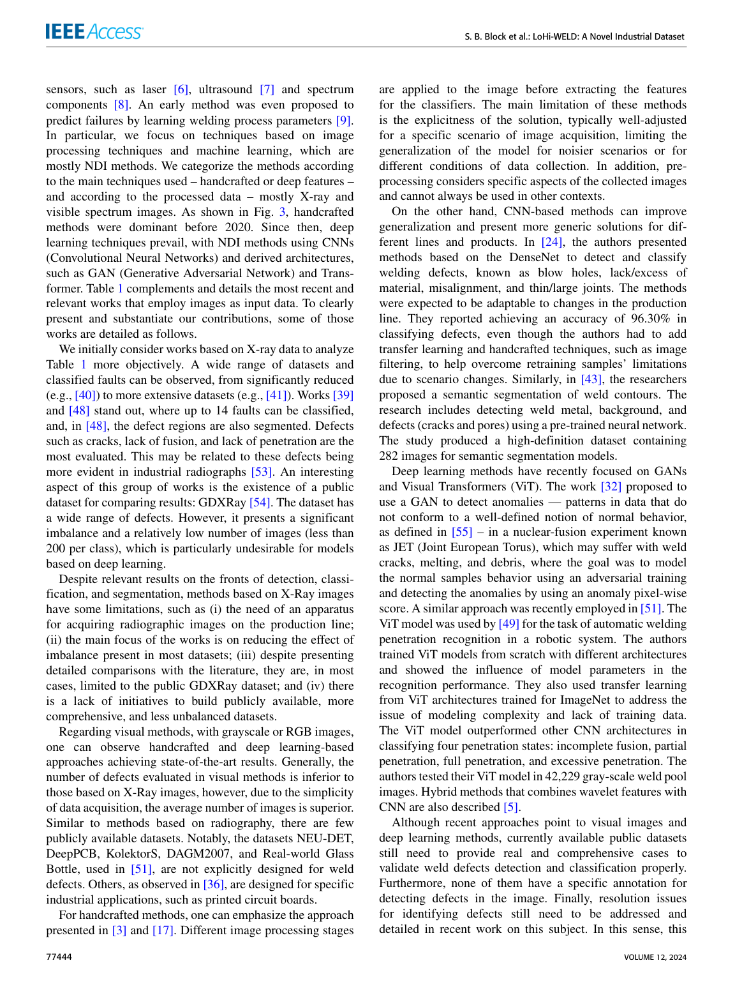

## 페이지 4

S. B. Block et al.: LoHi-WELD: A Novel Industrial Dataset
FIGURE 3. Timeline of NDI methods for weld defects detection and classification.
work’s main contribution is to provide a public dataset that
serves as a reference for detecting and classifying weld
defects, proposing two sets of data collected with different
resolutions. Additionally, we present a baseline with state-
of-the-art object detection methods based on deep learning,
pointing out possible paths and open points for a practical
and robust application in this field.
III. PROPOSED DATASET
The LoHi-WELD dataset comprises two subsets acquired
under distinct light exposure, image resolution, and cam-
era configurations. These subsets, named here as lweld
and hweld, were automatically recorded by two distinct
cameras. The lweld dataset consists of 2, 000 weld bead
images collected with a low-resolution image sensor (640 ×
480 pixels). In contrast, the hweld dataset consists of
1, 022 weld bead images collected with a high-resolution
image sensor (2048 × 1080 pixels). For both datasets,
the image acquisition was performed by using a camera
with a CMOS sensor and a global shutter, in gray-scale,
encoded in a JPEG image format, with an LED panel
with white light as illumination, thus ensuring adequate
sharpness for the inspection of the weld quality. As the
goal is defect detection and classification, we properly
oriented and cropped the weld beads from the original image
frames.
As shown in Fig. 4(a), the lweld dataset was obtained
focusing on two distinct welding region parts, one with
a width dimension of approximately 40 mm and another
one larger, with approximately 60 mm. We collected 1,000
distinct occurrences of each one in a series of experiments.
The hweld dataset is composed only of the larger weld
bead, acquired in a higher resolution (see Fig. 4(b)) because
it was observed that many defects were concentrated over
this bead due to the difficulty of positioning the robot
during the welding process. Furthermore, as part of the
proposed datasets, we provided a ground truth file for each
image – refer to Fig. 4(c). Ground truth entries correspond
to an axis-aligned rectangular box, manually annotated,
and associated with one of the four types of weld defects
addressed in this paper (pores, deposits, discontinuities,
and stains). A region of interest is also delimited by
an axis-aligned rectangle that encloses each weld bead.
These weld defects do not directly imply non-conformity
with industrial norms [56], the integrity of weld beads is
defined according to the manufacturer’s internal parameters,
considering the number of defects and their respective
extensions.
It is worth noting that the purpose of investigating the
lweld dataset is to reduce automation costs since we can
use a reduced network bandwidth to transmit the images (in
a robotic welding line, the network links can be limited) and
reduced computing power for image processing because the
high-resolution images have more than ten times pixels than
the low-resolution images.
The images for both datasets were obtained during the
standard production cycle of a robot line, with the camera
positioned on a support next to the welding device. The
image acquisition was triggered by a Programmable Logic
Controller (PLC) as soon as the robot left the capture scene.
VOLUME 12, 2024
77445

### 페이지 4 전체 이미지

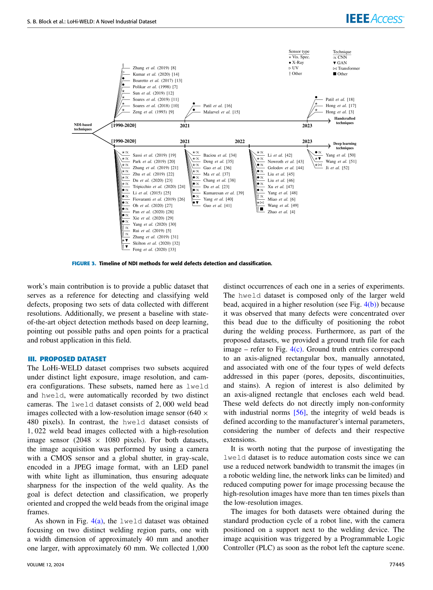

## 페이지 5

S. B. Block et al.: LoHi-WELD: A Novel Industrial Dataset
TABLE 1. Overview on welding defects classification using images. *mAP for low and high-resolution images considering a YOLOv7-tiny architecture for
detection and classification of the four defect types.
TABLE 2. Statistics for lweld and hweld welding datasets: the columns
indicate the total number of weld bead images and the number of
welding defects of each category identified in the manual annotation
process.
Despite guaranteeing a millimeter positioning accuracy of
the parts to be joined, the robotic welding process has
some variation in the moment of melting the weld material
(generating the bead). In this way, it is possible to observe a
variation in the weld beads’ size (width and length).
Table 2 and Figure 5 summarize the information regarding
both datasets.
IV. ARCHITECTURE BASELINE
The architecture scheme used for weld defect recognition is
shown in Fig. 6. The input is a batch of weld bead images, not
necessarily with the same dimensions. Each image is resized
to a square shape with a fixed size – this size is not changed
during training and testing – since the network restricts the
input to square images. For this purpose, a letterbox resizing
is applied to scale the original image while maintaining
the aspect ratio; more specifically, as the weld regions are
horizontally oriented, their long side is scaled to the selected
size while the resized shorter side is padded with a gray value.
We explored three image sizes: the 320×320 pixel resolution,
to evaluate whether scaling up the low-resolution images
(average width of 155 pixels as shown in Fig. 4(a)) to this
closer resolution is beneficial or not; the 640×640 resolution,
which is a standard dimension widely used in the literature for
77446
VOLUME 12, 2024

### 페이지 5 전체 이미지

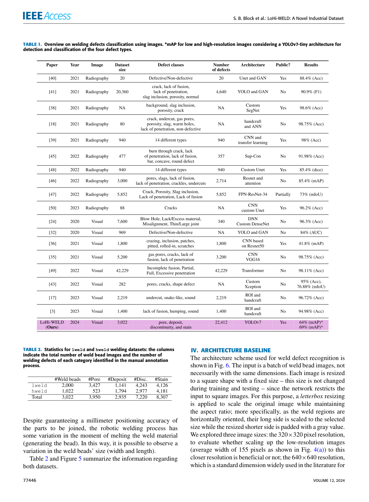

## 페이지 6

S. B. Block et al.: LoHi-WELD: A Novel Industrial Dataset
FIGURE 4. Image samples and annotations example: (a) images of two
distinct weld bead regions from the lweld dataset, with corresponding
physical dimensions; (b) image from the hweld dataset with
corresponding physical dimension; and (c) manual annotations of the
four types of defects and the manual delimitation of the weld bead
region. For display purposes, the images were independently re-scaled.
FIGURE 5. Defect size histogram according to average width and height
(in pixels).
the adopted deep model [2]; and the 1280 × 1280 resolution,
also standard and important to evaluate if a high resolution
hweld image (average width of 779 pixels as shown in
Fig. 4(b)) may suffer with up/down scaling effects for defect
recognition.
Data augmentation artificially increases the training set by
creating modified copies of the image samples to improve
model generalization (reduce overfitting). For our problem,
a classifier invariant to position, rotation, scale, and lighting
changes is important. Without a closed chamber, it may be
difficult to have absolute illumination control in a production
line, particularly in robotic welding processes. Also, depend-
ing on the region being inspected, the resolution and position
of weld beads can significantly vary, as the camera acquisition
setup needs to be adjusted to the robot’s space. Such changes
FIGURE 6. Architecture scheme for weld defect recognition.
can be noted by comparing the lweld and hweld image
samples. Therefore, we extensively experimented with image
transformations to evaluate the impact of data augmentation
on the architecture. The best parameters we found are shown
in Fig. 6 – e.g., 50% probability for flips, 100% probability for
mosaic (many weld beads are combined into a single image),
HSV (Hue, Saturation, and Value) variations, etc.
For the detection/classification problem, we used the
YOLOv7
[2]
network
from
2022,
a
state-of-the-art
deep architecture that surpassed all known object detec-
tors/classifiers in both speed and accuracy for real-time
applications. The YOLO (You Only Look Once) model
directly predicts bounding boxes and class probabilities for
objects in an image using an end-to-end model [57], unlike
other famous object detectors, such as R-CNN and Fast R-
CNN, which are multiple-stage methods. YOLO divides the
input image into a grid and predicts objects within cells.
For each cell, the model samples multiple bounding boxes,
defined by coordinates and a confidence score indicating the
likelihood of a box to contain an object. Additionally, class
probabilities are assigned to each bounding box (regression
task) to determine the object’s class (classification task). The
final output is a set of bounding boxes and associated class
probabilities that collectively represent the detected objects
in the image.
Over time, YOLO has undergone numerous modifica-
tions to improve performance and real-time operation for
different platforms. Notably, the Yolov7 model, used in our
VOLUME 12, 2024
77447

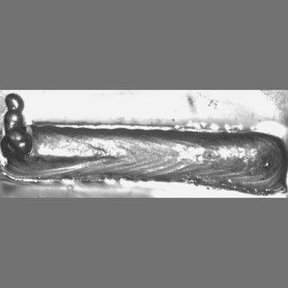

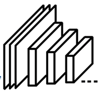

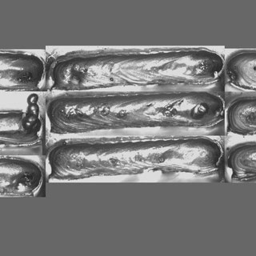

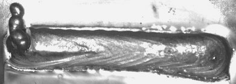

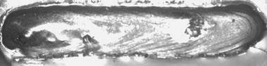

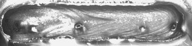

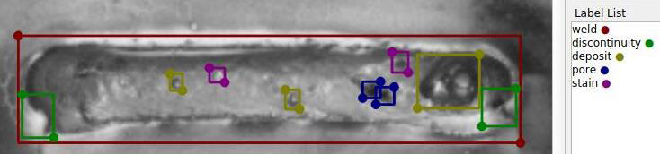

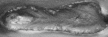

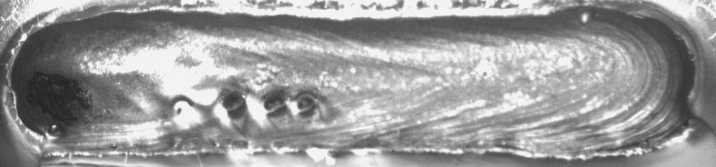

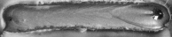

### 페이지 6 전체 이미지

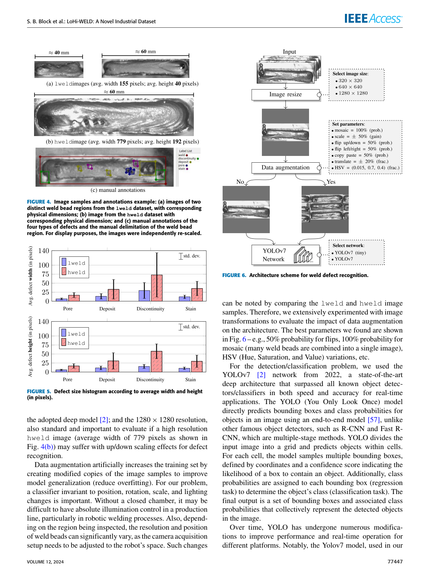

## 페이지 7

S. B. Block et al.: LoHi-WELD: A Novel Industrial Dataset
work, presents different contributions [2]: (i) it proposes
several trainable bag-of-freebies methods (i.e., a combination
of techniques such as data augmentation, learning rate
warmup, optimized anchor boxes, among others) so that
real-time object detection can significantly improve its
accuracy without increasing the inference cost; (ii) model re-
parameterization; (iii) a modification of the dynamic label
assignment strategy for different output layers; and (iv)
parameter reduction. YOLOv7 additionally uses CSPDarknet
as its backbone network and a head composed of Path
Aggregation Network (PANet) modules. This helps integrate
features from different network scales, enhancing the ability
of the model to detect objects of various sizes. It also
optimizes inference by employing the Complete Intersection
over Union (CIOU) loss to bounding box prediction. The
model incorporates anchor-free object detection to eliminate
the need for anchor box selection. Moreover, it includes
techniques like the Spatial Attention Module (SAM) to focus
on important spatial locations.
Finally, the YOLOv7 authors designed models for edge
GPU, normal GPU, and cloud GPU, respectively, YOLOv7-
tiny (6.2 million of parameters to optimize), YOLOv7
(36.9 million), and YOLOv7-W6 (70.4 million), as well
as other variations. We considered the YOLOv7-tiny and
YOLOv7 models since speed is crucial in industry.
V. EXPERIMENTS
A. SETTINGS
In our experiments, both lweld and hweld datasets were
partitioned into 80% of the image samples for training and
20% for testing (holdout subset). For training, we used a 5-
fold cross-validation technique, as shown in Fig. 7, saving the
best model in 50 epochs (based on the performance over the
validation fold) to be evaluated in the end with the testing set.
The hardware setup is an Intel i7-10700 2.9GHz, 128GB of
RAM, and a GPU NVIDIA RTX 3090 (24 GB).
FIGURE 7. Training/testing setup used in our experiments.
B. METRICS
The architecture performance is reported according to well-
known metrics, such as precision (P), recall (R), and F-score
(F) – the harmonic mean of precision and recall, that is,
F = 2/(1/P + 1/R). A detected region with an overlap,
according to the intersection over union (IoU) relation, of at
least 50% with a ground truth region is considered a true
positive; otherwise, it is a false positive. A region is also
a false positive when the class assigned differs from the
ground truth. Undetected ground truth regions are considered
TABLE 3. Architecture performance for lweld and hweld datasets using
a YOLOv7-tiny network, varying the image size, and with/without data
augmentation. The results are an average over the testing dataset for the
best models found during the optimization using the 5-fold technique.
The maximum standard deviation is 0.06 for experiments with an image
resolution of 320 × 320 pixels, and 0.01 for experiments with an image
resolution of 640 × 640 or 1280 × 1280 pixels.
false negatives. We also report the Mean Average Precision
(mAP) metric for an IoU of 50%, as defined in the PASCAL
VOC challenge, since it is widely used by other benchmark
challenges, such as ImageNET and Google Open Image
Challenge, and it is a standard metric to evaluate object
detection models. All metrics are weighted according to the
classification confidence score.
C. RESULTS
1) IMPACT OF IMAGE SIZE AND DATA AUGMENTATION
Table 3 summarizes the architecture results shown in
Fig. 6 with a YOLOv7-tiny network, by varying image
sizes and with/without data augmentation. As can be seen,
regardless of the image size and dataset resolution, the data
augmentation tends to effectively improve the performance
for all evaluating metrics – an exception occurred with the
hweld dataset and images of 320 × 320 pixels, which
may mostly be due to losing details in downsampling. The
improvement shows the importance of a greater diversity of
the augmented data during the training step.
In the lweld dataset, a weld bead region has an average
width of 115 pixels – refer to Fig. 4(a). Considering the results
using data augmentation and the image size variations, one
can see that an image resolution of 640×640 pixels achieved
a meaningful increase in metrics compared to a 320 ×
320 resolution. Images of 320×320 pixels lead to F-score and
mAP results of 0.57 and 0.54, respectively, while images of
640 × 640 lead to F-score and mAP results of 0.64 and 0.64.
Therefore, there were gains of 7 and 10 percentage points.
However, the performance kept relatively stable for images
of 1280 × 1280 pixels.
Regarding the hweld dataset, the performance improved
along with the increasing image sizes, reaching the best
results with an image resolution of 1280 × 1280 pixels.
It is worth noting that scaling down the weld bead images
below the original resolution size has a major negative
impact on performance, suggesting that the reduction of
77448
VOLUME 12, 2024

### 페이지 7 전체 이미지

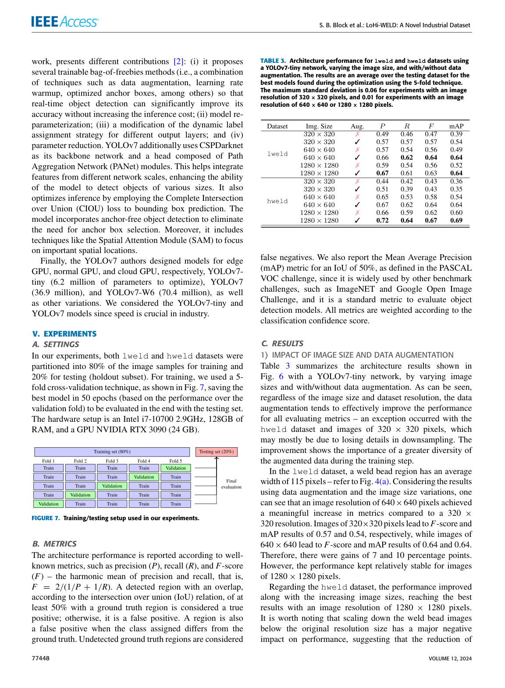

## 페이지 8

S. B. Block et al.: LoHi-WELD: A Novel Industrial Dataset
images can lead to the loss of important details of already
challenging small features in the images. As shown in
Fig. 4, a high-resolution weld bead region has an average
of 779 pixels width. Considering the results with data
augmentation for the hweld dataset, from 320 × 320 to
640×640 resolution, there were gains of 21 percentage points
in F-score (0.43 against 0.64, respectively) and 29 percentage
points in mAP (0.35 against 0.64). There are also percentage
point gains – 3% in F-score and 5% in mAP – comparing
resolution 640 × 640 against 1280 × 1280.
From this point on, the remaining experiments will concern
the best architectures shown in Table 3, namely a 640 × 640
image resolution with data augmentation for lweld dataset
(best F-score and mAP), and 1280 × 1280 image resolution
with data augmentation for hweld dataset (best F-score
and mAP).
2) PERFORMANCE ANALYSIS PER CLASS
Fig. 8 shows the confusion matrix for the lweld dataset.
There are not many misclassifications regarding pores and
other defects as well as discontinuities and other defects.
Misclassifications between stains and deposits are most likely
to happen – some light-colored stains can be similar to
deposits. In general, false positives and false negatives are
the main misclassifications occurring for each class – the
classes have similarities with the background (BG). Figure 9
show manual annotations, and correct and incorrect region
classifications for sample images from lweld and hweld
sets.
FIGURE 8. Confusion matrix for lweld dataset with a YOLOv7-tiny
network, image resolution of 640 × 640 pixels, and data augmentation.
The results are an average of 5-fold over the testing set.
The confusion matrix for the hweld dataset is shown in
Figure 10. The pore class is rare in the hweld dataset, only
5.5% according to Table 2, which may explain the decay in
the classification results, compared to the lweld dataset,
especially the confusion with the stain class. As in the lweld
dataset, the false positives and negatives account for most
misclassifications. The number of false positives was greatly
reduced for the pore class; even though there are few samples
for the class, this can be an effect of the higher dimension of
pores compared to the lweld dataset, so that the model can
FIGURE 9. Detection and classification results for hweld (a) and lweld
(b,c) sample images with a tiny network. For lweld images, we also show
the original image for a better visualization of the results.
capture better features to distinguish pores and background.
There was an increase of true positives for the deposit class,
from 0.51 (lweld) to 0.62 (hweld). This is also due to the
larger size of the deposits contained in the hweld dataset
in comparison to lweld, where the deposits are smaller. The
misclassification (false positives and false negatives) between
the stain class and the background has increased – that can be
a result of the reduction of samples for hweld combined with
greater detail of the irregularities on the surface of the weld
bead, which can be confused with stains.
FIGURE 10. Confusion matrix for hweld dataset using an architecture
with a YOLOv7-tiny network, image resolution of 1280 × 1280 pixels, and
data augmentation. The results are an average of 5-fold over the testing
set.
3) SMALL VERSUS LARGER MODELS
Table 4 shows the performance comparison between a
low cost YOLOv7-tiny network, with only 6.2 million
parameters to fine-tune, against a larger model, YOLOv7,
with 36.9 million parameters. As can be seen, a more
VOLUME 12, 2024
77449

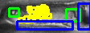

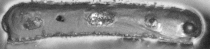

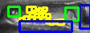

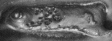

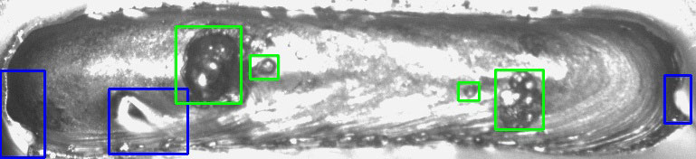

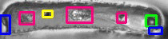

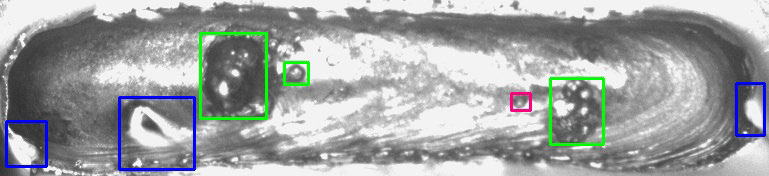

### 페이지 8 전체 이미지

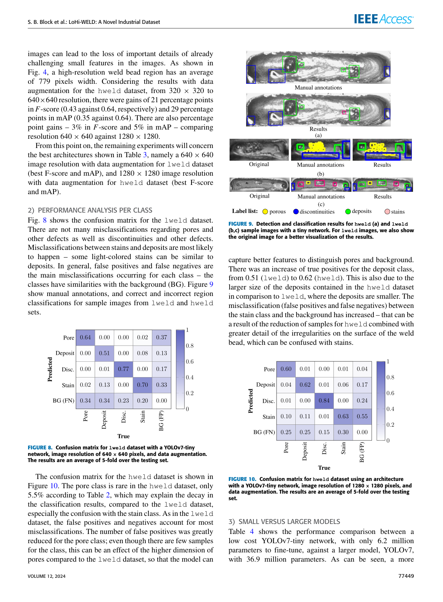

## 페이지 9

S. B. Block et al.: LoHi-WELD: A Novel Industrial Dataset
TABLE 4. Performance comparison between architectures with
YOLOv7-tiny and YOLOv7 for lweld and hweld datasets. For all values,
the maximum standard deviation is below or equal 0.01.
complex model for our problem did not bring a relevant gain.
Furthermore, as explored in [58], the tiny model is much
faster for inference in low-cost edge GPU devices, such as
those used in industrial processes. For instance, the authors
reported 40 FPS, for inference with a YOLOv7-tiny model,
against 17 FPS, with a YOLOv7 model, in an NVIDIA Jetson
AGX Xavier; and 16 FPS, for inference with a YOLOv7-tiny
model, against 3 FPS, with a YOLOv7 model, in an NVIDIA
Jetson Nano (both results for a 640 × 640 image resolution).
4) CROSS-VALIDATION AND DATASET FUSION
Fig. 11a shows an experimental setup that assesses the
architecture’s ability to generalize across different image
resolution size sets, measuring its robustness and reliability
beyond the initially used training data. For this purpose,
we trained on image samples from lweld dataset and
tested over hweld samples (and vice-versa). As reported in
rows Cross1 and Cross2 of Table 5, the best architectures
discussed in Sec. V-C1 seem to be highly dependent on
the scale of features learned, as we can note from the
poor performance results. Fig. 11b shows an experimental
setup with the lweld and hweld datasets merged into a
single set to assess the architecture’s ability to learn from
combined data of multiple sources. As seen in Table 5, the
Fusion1 experiment shows that the trained model maintained
similar results to the model trained specifically with the
lweld dataset and performed slightly worse when compared
to the model trained with the hweld dataset. Moreover, the
Fusion2 and Fusion3 experiments show that training with
merged samples did not compromise performance for any
particular set, whether from lweld and hweld samples.
In general, the results from fusion experiments indicate that
although the architecture dealt with differences in image
resolution between the datasets lweld and hweld, the
increase of training samples did not bring a performance gain.
5) COARSE VERSUS FINE-GRAINED DEFECT CLASSIFICATION
In another round of experiments, we grouped the four
categories of welding defects in our dataset (pore, deposit,
discontinuity, and stain) into a broad category referred to
here as defect — that is, the original multiclass classification
problem was modified into a more straightforward (coarse)
binary classification problem. In machine learning, coarse
classification involves grouping objects into broad categories
based on general features or characteristics, often sacrificing
FIGURE 11. Setup for cross-validation (a) and dataset fusion
(b) experiments regarding lweld and hweld datasets.
TABLE 5. Performance regarding cross-validation and dataset fusion
experiments, for architecture shown in Fig. 6, by using a YOLOv7-tiny
network. For these experiments, the same image size was used for
training and inference. For all values, the maximum standard deviation is
below or equal 0.02.
specificity for simplicity and efficiency. In contrast, fine
classification involves a more detailed analysis, where objects
are categorized by using a higher level of granularity [59].
The goal is to evaluate the overall architecture baseline
performance concerning the presence or absence of welding
defects rather than a granular differentiation between cat-
egories of defects. As shown in Table 6, the F-score and
mAP for lweld dataset increased by 8 and 11 percent
points, respectively. In contrast, the F-score and mAP for
hweld dataset increased 7 and 8 percent points, respectively,
showing that many errors are not due to non-detections
but assigning the defect to the incorrect category. In this
way, a hybrid method that first applies coarse classification
to group objects into broad categories before refining the
classification at finer levels of detail can be a promising
source of future research.
VI. FUTURE PERSPECTIVES
As demonstrated so far, more comprehensive and properly
annotated public databases are needed for real weld defect
detection problems. In this sense, the efforts of this work,
in addition to providing the dataset, promote a comparison
baseline for future analyses. We believe that there are
numerous open challenges for this database, such as:
77450
VOLUME 12, 2024

### 페이지 9 전체 이미지

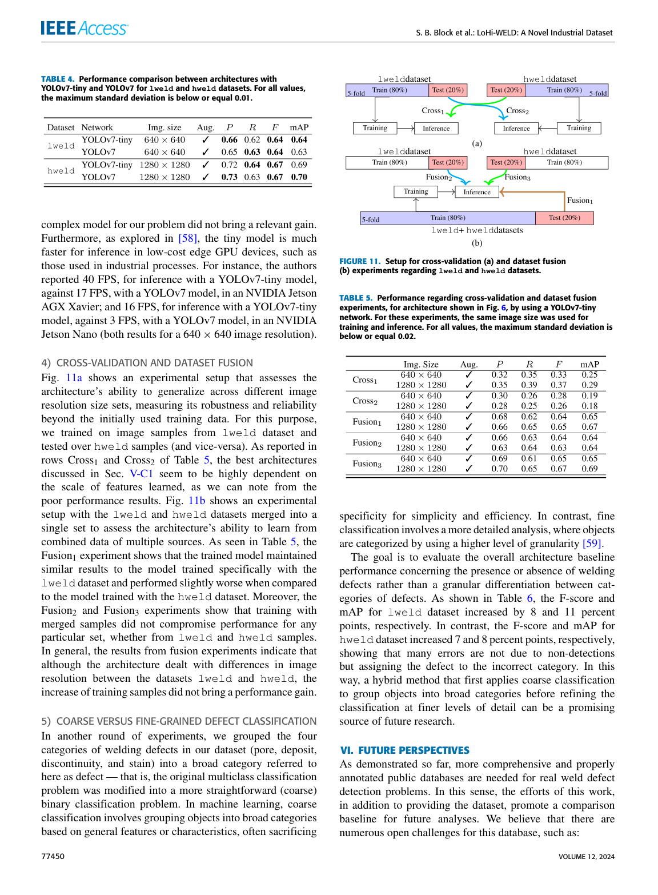

## 페이지 10

S. B. Block et al.: LoHi-WELD: A Novel Industrial Dataset
TABLE 6. Performance comparison between architectures trained for a
multiclass (fine) classification problem against a binary (coarse)
classification problem. For all experiments we used a YOLOv7-tiny
network, where the maximum standard deviation for all values is below
or equal 0.01.
FIGURE 12. Image scaling with traditional interpolation methods against
a Generative Adversarial Network (GAN) super-resolution method: (a,b)
two original image samples from lweld dataset; the original lweld
samples were scaled four times the original resolution size with a
bilinear interpolation algorithm; and the original lweld samples were
scaled four times with ESRGAN [61] (a Generative Adversarial Network
(GAN) for image super-resolution), trained only with hweld samples.
• the proposition of an ensemble or architecture dedicated
to the problem in question, aiming to increase general
detection performance;
• using the proposed dataset in conjunction with gen-
erative models, e.g., GAN, to create more extensive
databases and data augmentation procedures;
• exploring knowledge transfer between networks in more
detail, for example, using lweld or hweld as a starting
point for another network or model and avoiding the
need for a large set of samples for initial training;
• inspecting models like Visual Transformers [60] that
may be promising if the probability increases when a
defect appears, e.g., pores are usually associated with
some other type of defect;
• performing semantic annotation (with natural language)
of defects instead of labels to allow a more detailed
description and closer to a practical application for line
operators;
• augmenting the fine-grained annotations of the dataset
by subdivision of classes, e.g., partition the deposit class
into one covering larger and unique deposits and another
covering small and scattered deposits along the weld; or
subdivide the discontinuities into those found at the edge
of the bead and those positioned within the bead;
• further annotating the datasets by other specialists to
cover more subtle surface defects, generally relevant in
welds that are exposed in the final product;
• comparing other low-cost architectures aimed at detect-
ing and classifying objects in embedded systems, aiming
to develop an edge device;
• exploring the proposed dataset with transfer learning
from other welding datasets [28], [39].
• exploring super-resolution deep methods [61], as shown
in Fig. 12, to improve the quality of low-resolution
images in order to strike a balance between the speed in
acquiring images during a line production and a higher
performance for high-resolution images.
VII. CONCLUSION
In this work, we presented LoHi-WELD, a novel and public
dataset to address the problem of welding defect detection
and classification of typical types of failures in welding
industrial processes. This dataset presents a set of original
contributions, with subsets of different resolutions, different
types of real defects (with different degrees of detection
complexity), and a greater number of images. Furthermore,
we extensively explored the LoHi-WELD dataset with a
robust baseline architecture based on YOLOv7 (released
in 2022), a popular object detector known for its speed
and accuracy, with reported state-of-the-art performance in
many benchmarks. Specifically, we evaluated a YOLOv7-
tiny architecture against a larger model, YOLOv7, and we
found out that the former architecture produced a similar
performance compared to the latter, which is advantageous
in an industrial production line, as it indicates that it
is possible to use low-cost hardware (edge device) for
this task. We have shown that the tiny model achieved
0.64 of mean average precision (mAP) considering the low-
resolution dataset and 0.69 of mAP considering the high-
resolution dataset. These results are very promising, as the
5% percentage point gain from lweld to hweld was
obtained with nearly half the number of weld beads (1,022
high-resolution weld beads against 2,000 low-resolution
weld beads). Therefore, augmenting the high-resolution
weld beads by using deep learning models for super-
resolution and other data augmentation methods, e.g., GANs
VOLUME 12, 2024
77451

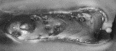

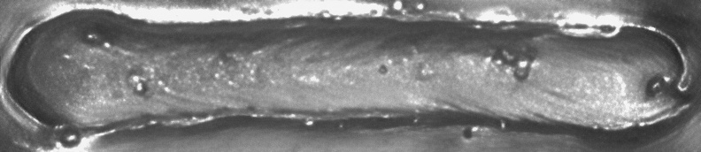

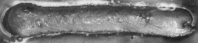

### 페이지 10 전체 이미지

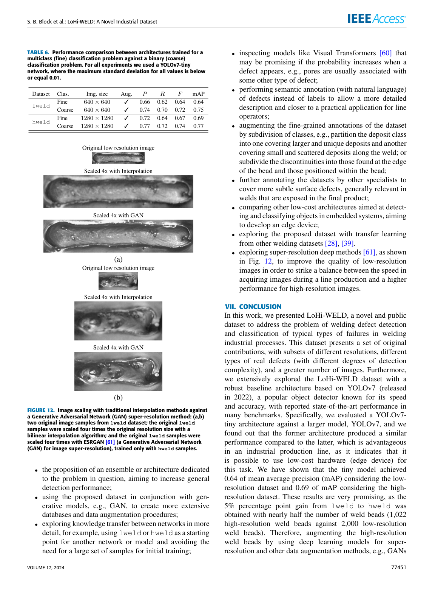

## 페이지 11

S. B. Block et al.: LoHi-WELD: A Novel Industrial Dataset
or similar models, can further improve these performances.
We have also shown that the detection of welding defects
and subsequent classification into defect/non-defect (binary
classification) achieved 0.75 of mean average precision
(mAP) considering the low-resolution dataset and 0.77 of
mAP considering the high-resolution dataset, which shows
that a hybrid approach that first applies coarse classification
to group objects into broad categories before refining the
classification at finer levels of detail can be a promising
source of future research. It is also worth noting that a
direct comparison of our dataset and reported performances,
with the literature summarized in Table 1 is not the most
appropriate, as some main aspects must be highlighted: (i)
our dataset can be considered more challenging due to the
greater number of defects and the combination of object
detection (the defect regions are not previously selected for
classification), something under-explored in the literature; (ii)
real defects collected on a real assembly line; and (iii) images
with different resolutions. Several generalization experiments
(fusion and cross-dataset) were also carried out, pointing
out that, in general, it is possible to maintain performance
in a fusion scenario. This type of analysis has not been
explored in recent literature and opens the way for other
models to use domain adaptation and transfer learning in
future applications. Finally, different open challenges were
detailed, highlighting that this is ongoing work that could
promote significant improvements in this research field due
to the scarcity of public data.
REFERENCES
[1] D. O. Thompson and D. E. Chimenti, Review of Progress in Quantitative
Nondestructive Evaluation. Springer, 2012.
[2] C.-Y. Wang, A. Bochkovskiy, and H.-Y.-M. Liao, ‘‘YOLOv7: Trainable
bag-of-freebies sets new state-of-the-art for real-time object detectors,’’ in
Proc. IEEE/CVF Conf. Comput. Vis. Pattern Recognit. (CVPR), Jun. 2023,
pp. 7464–7475.
[3] Y. Hong, M. Yang, Y. Jiang, D. Du, and B. Chang, ‘‘Real-time quality
monitoring of ultrathin sheets edge welding based on microvision
sensing and SOCIFS-SVM,’’ IEEE Trans. Ind. Informat., vol. 19, no. 4,
pp. 5506–5516, Apr. 2023.
[4] Z. Zhao, N. Lv, R. Xiao, and S. Chen, ‘‘A novel penetration state
recognition method based on LSTM with auditory attention during pulsed
GTAW,’’ IEEE Trans. Ind. Informat., vol. 19, no. 9, pp. 9565-9575,
Dec. 2022, doi: 10.1109/TII.2022.3229837.
[5] R. Miao, Y. Gao, L. Ge, Z. Jiang, and J. Zhang, ‘‘Online defect recognition
of narrow overlap weld based on two-stage recognition model combining
continuous wavelet transform and convolutional neural network,’’ Comput.
Ind., vol. 112, Nov. 2019, Art. no. 103115.
[6] R. Miao, Z. Shan, Q. Zhou, Y. Wu, L. Ge, J. Zhang , and H. Hu, ‘‘Real-
time defect identification of narrow overlap welds and application based
on convolutional neural networks,’’ J. Manuf. Syst., vol. 62, pp. 800–810,
Jan. 2022.
[7] R. Polikar, L. Udpa, S. S. Udpa, and T. Taylor, ‘‘Frequency invariant clas-
sification of ultrasonic weld inspection signals,’’ IEEE Trans. Ultrason.,
Ferroelectr., Freq. Control, vol. 45, no. 3, pp. 614–625, May 1998.
[8] Z. Zhang, Z. Yang, W. Ren, and G. Wen, ‘‘Random forest-based real-time
defect detection of al alloy in robotic arc welding using optical spectrum,’’
J. Manuf. Proc., vol. 42, pp. 51–59, Jan. 2019.
[9] X. Zeng, J. Lucas, and M. Fang, ‘‘Use of neural networks for parameter
prediction and quality inspection in TIG welding,’’ Trans. Inst. Meas.
Control, vol. 15, no. 2, pp. 87–95, 1993.
[10] L. B. Soares, Á. A. Weis, B. de V. Guterres, R. N. Rodrigues, and
S. S. da C. Botelho, ‘‘Computer vision system for weld bead geometric
analysis,’’ in Proc. ACM Symp. Appl. Comput., 2018, pp. 292–299.
[11] L. B. Soares, Á. A. Weis, R. N. Rodrigues, and S. S. da C. Botelho, ‘‘A
robotic passive vision system for texture analysis in weld beads,’’ in Proc.
IEEE 17th Int. Conf. Ind. Informat. (INDIN), vol. 1, Jul. 2019, pp. 535–540.
[12] J. Sun, C. Li, X.-J. Wu, V. Palade, and W. Fang, ‘‘An effective method of
weld defect detection and classification based on machine vision,’’ IEEE
Trans. Ind. Informat., vol. 15, no. 12, pp. 6322–6333, Dec. 2019.
[13] N. Boaretto and T. M. Centeno, ‘‘Automated detection of welding defects in
pipelines from radiographic images DWDI,’’ NDT E Int., vol. 86, pp. 7–13,
Mar. 2017.
[14] R. P. Kumar, R. Deivanathan, and R. Jegadeeshwaran, ‘‘Welding defect
identification with machine vision system using machine learning,’’ J.
Phys., Conf. Ser., vol. 1716, pp. 12–23, Dec. 2020.
[15] M. Malarvel and H. Singh, ‘‘An autonomous technique for weld defects
detection and classification using multi-class support vector machine in
x-radiography image,’’ Optik, vol. 231, Apr. 2021, Art. no. 166342.
[16] R. Patil and Y. Reddy, ‘‘An autonomous technique for multi class weld
imperfections detection and classification by support vector machine,’’ J.
Nondestruct. Eval., vol. 40, p. 76, Sep. 2021.
[17] Y. Hong, M. Yang, B. Chang, and D. Du, ‘‘Filter-PCA-based process
monitoring and defect identification during climbing helium arc welding
process using DE-SVM,’’ IEEE Trans. Ind. Electron., vol. 70, no. 7,
pp. 7353–7362, Jul. 2023.
[18] R. Patil and Y. Reddy, ‘‘Multiform weld joint flaws detection and
classification by sagacious artificial neural network technique,’’ Int. J. Adv.
Manuf. Tech., vol. 125, pp. 1–31, Jan. 2023.
[19] P. Sassi, P. Tripicchio, and C. A. Avizzano, ‘‘A smart monitoring system for
automatic welding defect detection,’’ IEEE Trans. Ind. Electron., vol. 66,
no. 12, pp. 9641–9650, Dec. 2019.
[20] J.-K. Park, W.-H. An, and D.-J. Kang, ‘‘Convolutional neural network
based surface inspection system for non-patterned welding defects,’’ Int.
J. Precis. Eng. Manufac., vol. 20, pp. 363–374, Feb. 2019.
[21] Z. Zhang, G. Wen, and S. Chen, ‘‘Weld image deep learning-based on-line
defects detection using convolutional neural networks for al alloy in robotic
arc welding,’’ J. Manuf. Proc., vol. 45, pp. 208–216, Sep. 2019.
[22] M. Zhu, W. Ge, and J. Liu, ‘‘Deep learning-based classification of weld
surface defects,’’ Appl. Sci., vol. 9, p. 3312, Aug. 2019.
[23] W. Du, H. Shen, and J. Fu, ‘‘Automatic defect segmentation in X-ray
images based on deep learning,’’ IEEE Trans. Ind. Electron., vol. 68, no. 12,
pp. 12912–12920, Dec. 2021.
[24] P. Tripicchio, G. Camacho-Gonzalez, and S. D’Avella, ‘‘Welding defect
detection: Coping with artifacts in the production line,’’ Int. J. Adv. Manuf.
Technol., vol. 111, pp. 1659–1669, Oct. 2020.
[25] M. Liu, Y. Chen, J. Xie, L. He, and Y. Zhang, ‘‘LF-YOLO: A lighter and
faster YOLO for weld defect detection of X-ray image,’’ IEEE Sensors J.,
vol. 23, no. 7, pp. 7430–7439, Apr. 2023.
[26] C. C. B. Fioravanti, T. M. Centeno, and M. R. De Biase Da Silva
Delgado, ‘‘A deep artificial immune system to detect weld defects in
DWDI radiographic images of petroleum pipes,’’ IEEE Access, vol. 7,
pp. 180947–180964, 2019.
[27] S. Oh, M.-j. Jung, C. Lim, and S. Shin, ‘‘Automatic detection of welding
defects using faster R-CNN,’’ Appl. Sci., vol. 10, p. 8629, Dec. 2020.
[28] H. Pan, Z. Pang, Y. Wang, Y. Wang, and L. Chen, ‘‘A new image
recognition and classification method combining transfer learning algo-
rithm and MobileNet model for welding defects,’’ IEEE Access, vol. 8,
pp. 119951–119960, 2020.
[29] L. Xie, X. Xiang, H. Xu, L. Wang, L. Lin, and G. Yin, ‘‘FFCNN: A deep
neural network for surface defect detection of magnetic tile,’’ IEEE Trans.
Ind. Electron., vol. 68, no. 4, pp. 3506–3516, Apr. 2021.
[30] L. Yang and H. Jiang, ‘‘Weld defect classification in radiographic images
using unified deep neural network with multi-level features,’’ J. Intell.
Manuf., vol. 32, no. 2, pp. 459–469, Feb. 2020.
[31] Y. Zhang, D. You, X. Gao, N. Zhang, and P. P. Gao, ‘‘Welding defects
detection based on deep learning with multiple optical sensors during
disk laser welding of thick plates,’’ J. Manuf. Syst., vol. 51, pp. 87–94,
Apr. 2019.
[32] R. Skilton and Y. Gao, ‘‘Combining object detection with generative
adversarial networks for in-component anomaly detection,’’ Fusion Eng.
Des., vol. 159, Oct. 2020, Art. no. 111736.
[33] Y. Feng, Z. Chen, D. Wang, J. Chen, and Z. Feng, ‘‘DeepWelding: A deep
learning enhanced approach to GTAW using multisource sensing images,’’
IEEE Trans. Ind. Informat., vol. 16, no. 1, pp. 465–474, Jan. 2020.
[34] D. Bacioiu, G. Melton, M. Papaelias, and R. Shaw, ‘‘Automated defect
classification of aluminium 5083 TIG welding using hdr camera and neural
networks,’’ J. Manuf. Proc., vol. 45, pp. 603–613, Jan. 5083.
77452
VOLUME 12, 2024

### 페이지 11 전체 이미지

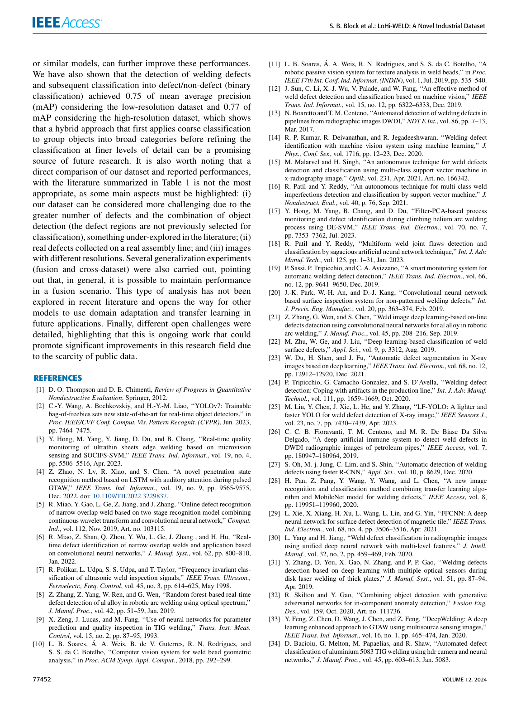

## 페이지 12

S. B. Block et al.: LoHi-WELD: A Novel Industrial Dataset
[35] H. Deng, Y. Cheng, Y. Feng, and J. Xiang, ‘‘Industrial laser welding defect
detection and image defect recognition based on deep learning model
developed,’’ Symmetry, vol. 13, no. 9, p. 1731, 2021.
[36] Y. Gao, J. Lin, J. Xie, and Z. Ning, ‘‘A real-time defect detection method
for digital signal processing of industrial inspection applications,’’ IEEE
Trans. Ind. Informat., vol. 17, no. 5, pp. 3450–3459, May 2021.
[37] G. Ma, L. Yu, H. Yuan, W. Xiao, and Y. He, ‘‘A vision-based method for
lap weld defects monitoring of galvanized steel sheets using convolutional
neural network,’’ J. Manuf. Processes, vol. 64, pp. 130–139, Apr. 2021.
[38] Y. Chang and W. Wang, ‘‘A deep learning-based weld defect classification
method using radiographic images with a cylindrical projection,’’ IEEE
Trans. Instrum. Meas., vol. 70, pp. 1–11, 2021.
[39] S. Kumaresan, K. S. J. Aultrin, S. S. Kumar, and M. D. Anand, ‘‘Transfer
learning with CNN for classification of weld defect,’’ IEEE Access, vol. 9,
pp. 95097–95108, 2021.
[40] L. Yang, H. Wang, B. Huo, F. Li, and Y. Liu, ‘‘An automatic welding
defect location algorithm based on deep learning,’’ NDT E Int., vol. 120,
Jun. 2021, Art. no. 102435.
[41] R. Guo, H. Liu, G. Xie, and Y. Zhang, ‘‘Weld defect detection
from imbalanced radiographic images based on contrast enhancement
conditional generative adversarial network and transfer learning,’’ IEEE
Sensors J., vol. 21, no. 9, pp. 10844–10853, May 2021.
[42] Z. Li, H. Chen, X. Ma, H. Chen, and Z. Ma, ‘‘Triple pseudo-Siamese
network with hybrid attention mechanism for welding defect detection,’’
Mater. Des., vol. 217, May 2022, Art. no. 110645.
[43] C. Nowroth, T. Gu, J. Grajczak, S. Nothdurft, J. Twiefel, J. Hermsdorf,
S. Kaierle, and J. Wallaschek, ‘‘Deep learning-based weld contour and
defect detection from micrographs of laser beam welded semi-finished
products,’’ Appl. Sci., vol. 12, no. 9, p. 4645, 2022.
[44] V. Golodov and A. Maltseva, ‘‘Approach to weld segmentation and defect
classification in radiographic images of pipe welds,’’ NDT & E Int.,
vol. 127, Apr. 2022, Art. no. 102597.
[45] X. Liu, J. Liu, Z. Wang, L. Wang, and H. Zhang, ‘‘Basic-class and
cross-class hybrid feature learning for class-imbalanced weld defect
recognition,’’ IEEE Trans. Ind. Informat., vol. 19, no. 9, pp. 9436–9446,
Sep. 2022, doi: 10.1109/TII.2022.3228702.
[46] W. Liu, S. Shan, H. Chen, R. Wang, J. Sun, and Z. Zhou, ‘‘X-ray weld
defect detection based on AF-RCNN,’’ Weld. World, vol. 66, pp. 1–13,
Mar. 2022.
[47] H. Xu, Z. Yan, B. Ji, P. Huang, J. Cheng, and X. Wu, ‘‘Defect detection in
welding radiographic images based on semantic segmentation methods,’’
Measurement, vol. 188, Jan. 2022, Art. no. 110569.
[48] L. Yang, S. Song, J. Fan, B. Huo, E. Li, and Y. Liu, ‘‘An automatic
deep segmentation network for pixel-level welding defect detection,’’ IEEE
Trans. Instrum. Meas., vol. 71, pp. 1–10, 2022.
[49] Z. Wang, H. Chen, Q. Zhong, S. Lin, J. Wu, M. Xu, and Q. Zhang,
‘‘Recognition of penetration state in GTAW based on vision transformer
using weld pool image,’’ Int. J. Adv. Manuf. Technol., vol. 119, pp. 1–14,
Apr. 2022.
[50] L. Yang, S. Xu, J. Fan, E. Li, and Y. Liu, ‘‘A pixel-level deep segmentation
network for automatic defect detection,’’ Expert Syst. Appl., vol. 215,
Jan. 2023, Art. no. 119388.
[51] Y. Wang, W. Hu, L. Wen, and L. Gao, ‘‘A new foreground-perception
cycle-consistent adversarial network for surface defect detection with
limited high-noise samples,’’ IEEE Trans. Ind. Informat., vol. 19, no. 12,
pp. 11742–11751, Dec. 2023, doi: 10.1109/TII.2023.3252410.
[52] C. Ji, H. Wang, and H. Li, ‘‘Defects detection in weld joints based on
visual attention and deep learning,’’ NDT & E Int., vol. 133, Jan. 2023,
Art. no. 102764.
[53] N. Nacereddine, A. B. Goumeidane, and D. Ziou, ‘‘Unsupervised
weld defect classification in radiographic images using multivariate
generalized Gaussian mixture model with exact computation of mean
and shape parameters,’’ Comput. Ind., vol. 108, pp. 132–149, Jun. 2019.
[Online].
Available:
https://www.sciencedirect.com/science/article/pii/
S0166361518305967
[54] D. Mery, V. Riffo, U. Zscherpel, G. Mondragón, I. Lillo, I. Zuccar,
H. Lobel, and M. Carrasco, ‘‘GDXray: The database of X-ray images for
nondestructive testing,’’ J. Nondestruct. Eval., vol. 34, pp. 1–12, 2015.
[55] V. Chandola, A. Banerjee, and V. Kumar, ‘‘Anomaly detection: A survey,’’
ACM Comput. Surv., vol. 41, no. 3, pp. 1–58, Jul. 2009.
[56] T. Lienert, T. Siewert, S. Babu, V. Acoff, and S. W. P. Specifications,
ASM Handbook, Volume 6A: Welding Fundamentals and Processes. ASM
International, 2011, p. 920.
[57] J. Redmon, S. Divvala, R. Girshick, and A. Farhadi, ‘‘You only look once:
Unified, real-time object detection,’’ in Proc. IEEE CVPR, Jun. 2016.
[58] H.-V. Nguyen, J.-H. Bae, Y.-E. Lee, H.-S. Lee, and K.-R. Kwon,
‘‘Comparison of pre-trained YOLO models on steel surface defects
detector based on transfer learning with GPU-based embedded devices,’’
Sensors, vol. 22, no. 24, pp. 1–13, 2022.
[59] Y. Zheng, D. Huang, S. Liu, and Y. Wang, ‘‘Cross-domain object detection
through coarse-to-fine feature adaptation,’’ in Proc. IEEE/CVF Conf.
Comput. Vis. Pattern Recognit. (CVPR), Jun. 2020, pp. 13763–13772.
[60] A. Dosovitskiy, L. Beyer, A. Kolesnikov, D. Weissenborn, X. Zhai,
T. Unterthiner, M. Dehghani, M. Minderer, G. Heigold, S. Gelly,
J. Uszkoreit, and N. Houlsby, ‘‘An image is worth 16x16 words:
Transformers for image recognition at scale,’’ in Proc. Int. Conf. Learn.
Represent. (ICLR), 2021, pp. 1–21.
[61] X. Wang, L. Xie, C. Dong, and Y. Shan, ‘‘Real-ESRGAN: Training real-
world blind super-resolution with pure synthetic data,’’ in Proc. IEEE/CVF
Int. Conf. Comput. Vis. Workshops (ICCVW), Oct. 2021, pp. 1905–1914.
SYLVIO BIASUZ BLOCK is currently pursuing
the Ph.D. degree with the Federal University
of Technology–Paraná (UTFPR), Brazil. He is
also a System Analyst with IDS Software. His
main research interests include the development
of computer vision systems for inspection and
automation of the automotive industry.
RICARDO DUTRA DA SILVA received the Ph.D.
degree in computer science from the University of
Campinas (UNICAMP), Brazil, in 2014. He is cur-
rently an Assistant Professor with the Federal Uni-
versity of Technology–Paraná (UTFPR), Brazil.
His research interests include image processing,
computer vision, and machine learning.
ANDRE EUGNIO LAZZARETTI (Member, IEEE)
received the B.Sc., M.Sc., and D.Sc. degrees in
electrical engineering from the Federal University
of Technology–Paraná (UTFPR), in 2007, 2010,
and 2015, respectively. He is currently a Professor
with the Department of Electronics, UTFPR. His
research interests include machine learning, deep
learning, and digital signal processing.
RODRIGO MINETTO (Member, IEEE) received
the Ph.D. degree in computer science from the
University of Campinas (UNICAMP), Brazil, and
Sorbonne University, France, in 2012. He was
a Visiting Scholar with the University of South
Florida, Tampa, FL, USA, in 2018. He is currently
an Associate Professor with the Federal University
of Technology–Paraná (UTFPR), Brazil. He was
awarded by the European Space Agency (ESA),
Pentagon, and Intelligence Advanced Research
Projects Activity (IARPA) for the development of state-of-the-art algorithms
for analyzing images.
VOLUME 12, 2024
77453

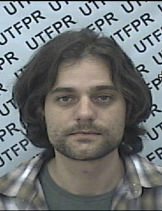

### 페이지 12 전체 이미지

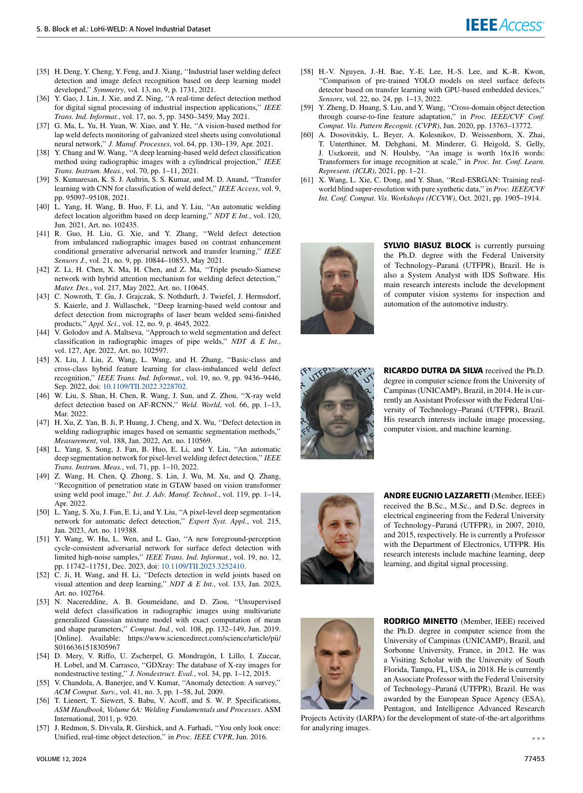
